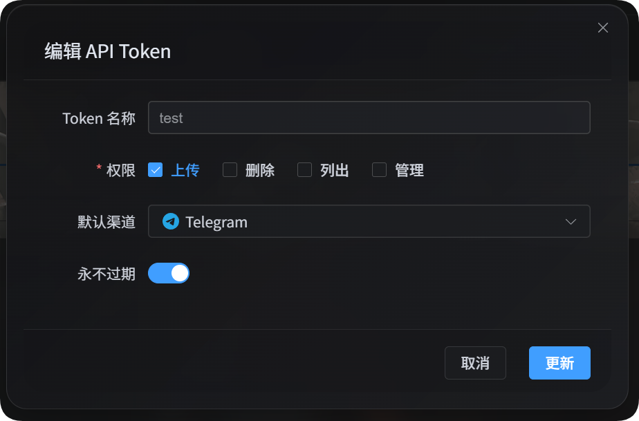

# رفع الملفات باستخدام API Token

رفع الملفات عبر API Token مخصص للسكربتات، ومهام الأتمتة، وبرامج الجهات الخارجية. لا تحتاج إلى فتح واجهة الويب. ما دمت توفّر عنوان الموقع، والرمز، ومسار الملف المحلي، وقناة رفع فعلية، يمكن رفع الملف إلى ImgBed وستتضمن الاستجابة عنوان URL الخاص بالملف.



## قبل البدء

افتح لوحة الإدارة، ثم انتقل إلى:

```text
System Settings -> Security Settings -> API Token
```

عند إنشاء API Token أو تعديله، تأكد من أنه يملك صلاحية الرفع ويستخدم قناة رفع افتراضية فعلية. لا تستخدم عمليات الرفع عبر API Token مدخل التوزيع الذكي، ويجب أن تمرّر السكربتات قناة فعلية أيضًا.

## تنزيل سكربتات الرفع

توفر حزمة الوثائق سكربتين مبنيين على Node.js:

| السكربت | الغرض |
| --- | --- |
| <a href="/tools/imgbed-token-single-upload.mjs" download>سكربت الرفع بطلب واحد</a> | يستدعي `/upload` مرة واحدة. مفيد للملفات الصغيرة واختبارات الاتصال. |
| <a href="/tools/imgbed-token-chunk-upload.mjs" download>سكربت الرفع المجزأ</a> | يستخدم التجزئة عبر API Token أو الرفع المباشر أو جلسات الرفع الخاصة بالمنصة. موصى به للملفات الكبيرة. |

يتطلب ذلك Node.js 18 أو إصدارًا أحدث.

## عرض القنوات المتاحة

يستطيع كلا السكربتين عرض قنوات الرفع المتاحة لـ API Token الحالي:

```powershell
node imgbed-token-single-upload.mjs --base-url "https://your-domain" --token "your API Token" --list-channels
node imgbed-token-chunk-upload.mjs --base-url "https://your-domain" --token "your API Token" --list-channels
```

عند عرض القنوات، لا تكون `--file` و`--channel` مطلوبتين. تتضمن الاستجابة قناة الرفع الافتراضية، ومفاتيح قنوات الرفع، وأسماء القنوات الفرعية، وحالة موازنة الحمل. ولا تُعاد الأسرار أو رموز التحديث أو أي قيم إعدادات حساسة أخرى.

## اختيار وضع الرفع

| الوضع | الأنسب لـ | الوصف |
| --- | --- | --- |
| الرفع بطلب واحد | الملفات الصغيرة، السكربتات البسيطة، اختبارات الاتصال | يرسل الملف كاملًا إلى `/upload` في طلب واحد. |
| الرفع المجزأ | الملفات الكبيرة أو الملفات المعرضة لانتهاء المهلة | يختار السكربت مسار التجزئة أو الرفع المباشر أو جلسة الرفع الخاصة بالقناة. |

للملفات الأكبر حجمًا، استخدم سكربت الرفع المجزأ أولًا. تتأثر عمليات الرفع بطلب واحد بحجم طلب Cloudflare، وذاكرة Worker، وحدود كل منصة.

## الرفع بطلب واحد

يرسل سكربت الرفع بطلب واحد طلبًا واحدًا إلى `/upload`.

```powershell
node imgbed-token-single-upload.mjs `
  --base-url "https://your-domain" `
  --token "your API Token" `
  --file "D:\test\image.png" `
  --channel s3 `
  --folder "photos/2026"
```

يمكنك أيضًا وضع الرمز في متغير بيئة:

```powershell
$env:IMGBED_API_TOKEN="your API Token"
node imgbed-token-single-upload.mjs --base-url "https://your-domain" --file "D:\test\image.png" --channel s3
```

### معلمات الرفع بطلب واحد

| المعلمة | إلزامية | الوصف |
| --- | --- | --- |
| `--base-url <url>` | نعم | عنوان موقع ImgBed، مثل `https://image.ai6.me`. |
| `--token <token>` | نعم | API Token. يمكنك أيضًا استخدام متغير البيئة `IMGBED_API_TOKEN`. |
| `--file <path>` | نعم | مسار الملف المحلي. |
| `--channel <key>` | نعم | قناة الرفع. |
| `--folder <path>` | لا | مجلد الرفع، مثل `photos/2026` أو `/user/`. |
| `--name-type <type>` | لا | وضع التسمية، ويطابق `uploadNameType` في الخادم الخلفي. القيمة الافتراضية `default`. |
| `--channel-name <name>` | لا | يحدد قناة فرعية أو حسابًا فرعيًا. إذا تُرك فارغًا، يقرر إعداد القناة في الخادم الخلفي. |
| `--retries <n>` | لا | عدد إعادة المحاولة عند الفشل المؤقت. القيمة الافتراضية `3`. |
| `--timeout-ms <n>` | لا | مهلة الطلب. القيمة الافتراضية `180000`. |
| `--output <pretty\|json>` | لا | صيغة الإخراج. القيمة الافتراضية `pretty`. |
| `--save-response <path>` | لا | حفظ استجابة JSON النهائية في ملف. |
| `--list-channels` | لا | عرض القنوات المتاحة للرمز الحالي ثم الخروج. |

### قنوات الرفع بطلب واحد

| مفتاح القناة | القناة |
| --- | --- |
| `telegram` / `tg` | Telegram |
| `discord` / `dc` | Discord |
| `cfr2` / `r2` | Cloudflare R2 |
| `s3` | S3 |
| `webdav` / `wd` | قناة تخزين WebDAV |
| `github` / `gh` | GitHub Releases |
| `gitlab` / `gl` | GitLab Packages |
| `huggingface` / `hf` | Hugging Face |
| `onedrive` / `od` | OneDrive |
| `googledrive` / `google` / `gd` | Google Drive |
| `dropbox` / `db` | Dropbox |
| `yandex` / `yx` | Yandex Disk |
| `pcloud` / `pd` | pCloud |

### حدود حجم الرفع بطلب واحد

أبقِ ملفات الرفع بطلب واحد أقل من 100 MB كلما أمكن.

للقنوات التالية عتبات حظر صريحة لطلب `/upload` الواحد:

| القناة | حد الرفع بطلب واحد |
| --- | ---: |
| Telegram | 20 MiB |
| Discord | 10 MiB |
| S3 | 64 MiB |
| WebDAV | 64 MiB |
| GitHub Releases | 64 MiB |
| GitLab Packages | 64 MiB |

عندما يتجاوز الملف أحد هذه الحدود، يبلغ السكربت عن الخطأ المطابق محليًا. أما القنوات الأخرى فلا يطبق السكربت عليها فحصًا محليًا ثابتًا عند 100 MB. إذا تجاوز جسم الطلب قدرة Cloudflare أو المنصة، فستعيد Cloudflare أو المنصة البعيدة الخطأ.

## الرفع المجزأ

يطلب سكربت الرفع المجزأ أولًا من الخادم الخلفي تحديد الملف الهدف، ثم يتبع مسار الملفات الكبيرة للقناة المحددة. لا تحتاج إلى كتابة طلبات جلسة التجزئة أو الدمج أو الإكمال بنفسك.

```powershell
node imgbed-token-chunk-upload.mjs `
  --base-url "https://your-domain" `
  --token "your API Token" `
  --file "D:\test\video.zip" `
  --channel github `
  --folder "photos/2026" `
  --concurrency 3
```

### معلمات الرفع المجزأ

| المعلمة | إلزامية | الوصف |
| --- | --- | --- |
| `--base-url <url>` | نعم | عنوان موقع ImgBed. |
| `--token <token>` | نعم | API Token. يمكنك أيضًا استخدام متغير البيئة `IMGBED_API_TOKEN`. |
| `--file <path>` | نعم | مسار الملف المحلي. |
| `--channel <key>` | نعم | قناة الرفع. |
| `--folder <path>` | لا | مجلد الرفع. |
| `--name-type <type>` | لا | وضع التسمية، ويطابق `uploadNameType` في الخادم الخلفي. القيمة الافتراضية `default`. |
| `--channel-name <name>` | لا | يحدد قناة فرعية أو حسابًا فرعيًا. إذا تُرك فارغًا، يقرر إعداد القناة في الخادم الخلفي. |
| `--concurrency <n>` | لا | عمليات الرفع المتزامنة. القيمة الافتراضية `1`، والحد الأقصى `3`. |
| `--retries <n>` | لا | عدد إعادة المحاولة عند الفشل المؤقت. القيمة الافتراضية `3`. |
| `--timeout-ms <n>` | لا | مهلة كل طلب. القيمة الافتراضية `180000`. |
| `--output <pretty\|json>` | لا | صيغة الإخراج. القيمة الافتراضية `pretty`. |
| `--save-response <path>` | لا | حفظ استجابة JSON النهائية في ملف. |
| `--list-channels` | لا | عرض القنوات المتاحة للرمز الحالي ثم الخروج. |

### قنوات الرفع المجزأ

| مفتاح القناة | مسار الرفع |
| --- | --- |
| `telegram` / `tg` | جلسة `/upload` مجزأة فعلية |
| `discord` / `dc` | جلسة `/upload` مجزأة فعلية |
| `cfr2` / `r2` | جلسة `/upload` مجزأة فعلية |
| `github` / `gh` | جلسة `/upload` مجزأة فعلية |
| `gitlab` / `gl` | جلسة `/upload` مجزأة فعلية |
| `webdav` / `wd` | جلسة `/upload` مجزأة فعلية |
| `s3` | رفع S3 متعدد الأجزاء |
| `onedrive` / `od` | جلسة رفع OneDrive |
| `googledrive` / `google` / `gd` | رفع Google Drive قابل للاستئناف |
| `dropbox` / `db` | جلسة رفع Dropbox |
| `yandex` / `yx` | عنوان URL للرفع المباشر من Yandex |
| `pcloud` / `pd` | رابط رفع pCloud |
| `huggingface` / `hf` | رفع Hugging Face LFS |

كانت عينات الملفات المضغوطة على Yandex غير مستقرة أثناء الاختبار. وقد تم التحقق من نجاح رفع الملفات غير المضغوطة.

## استجابة الرفع

بعد نجاح الرفع، يطبع السكربت:

```text
success
src: /file/photos/2026/example.png
url: https://your-domain/file/photos/2026/example.png
fileId: photos/2026/example.png
```

| الحقل | الوصف |
| --- | --- |
| `src` | مسار الملف الداخلي في الموقع. |
| `url` | عنوان URL العام الكامل، وهو مناسب لسكربتاتك أو سجلات قاعدة البيانات. |
| `fileId` | معرّف الملف، ويفيد في الاستعلامات أو الإدارة أو السجلات لاحقًا. |
| `channelName` | قد يعيد سكربت الرفع المجزأ القناة الفرعية أو الحساب الفعلي المستخدم. |

مع `--output json`، يطبع السكربت استجابة JSON الكاملة للاستخدام البرمجي.

## استدعاء API الرفع بطلب واحد مباشرة

إذا لم تستخدم السكربت، يمكنك استدعاء نقطة نهاية الرفع بطلب واحد مباشرة:

```text
POST https://your-domain/upload?uploadChannel=s3&uploadFolder=photos/2026&uploadNameType=default
Authorization: Bearer your API Token
Content-Type: multipart/form-data
```

حقل النموذج:

| الحقل | إلزامي | الوصف |
| --- | --- | --- |
| `file` | نعم | الملف المراد رفعه. |

معلمات الاستعلام:

| المعلمة | إلزامية | الوصف |
| --- | --- | --- |
| `uploadChannel` | نعم | قناة رفع فعلية. |
| `uploadFolder` | لا | مجلد الرفع. |
| `uploadNameType` | لا | وضع التسمية. |
| `channelName` | لا | يحدد قناة فرعية أو حسابًا فرعيًا. |

تبدو الاستجابات الناجحة كما يلي:

```json
{
  "success": true,
  "src": "/file/photos/2026/example.png",
  "url": "https://your-domain/file/photos/2026/example.png",
  "fileId": "photos/2026/example.png"
}
```

## الأسئلة الشائعة

### تفشل عمليات الرفع الكبيرة بطلب واحد

يرسل `/upload` بطلب واحد الملف كاملًا في طلب واحد. وقد تحظر Cloudflare أو المنصة البعيدة الملفات الكبيرة. استخدم سكربت الرفع المجزأ للملفات الكبيرة.

### تم ضبط `--channel-name` لكن الرفع ما زال يفشل

تحقق من أن القناة المحددة تحتوي فعلًا على قناة فرعية بهذا الاسم وأنها مفعّلة. إذا لم يتم تمرير `--channel-name`، يختار الخادم الخلفي حسابًا متاحًا وفق إعدادات تلك القناة.

### أريد استخدام النتيجة في برنامج آخر

استخدم `--output json`، أو أضف `--save-response result.json`. اقرأ الحقل `url` للحصول على عنوان URL الكامل للملف.

### لا يستطيع Yandex رفع الأرشيفات

لا يدعم Yandex صيغ الأرشيف. قد يكون ذلك بسبب سياسة المنصة. عند استخدام Yandex، ارفع ملفات غير أرشيفية كلما أمكن.

