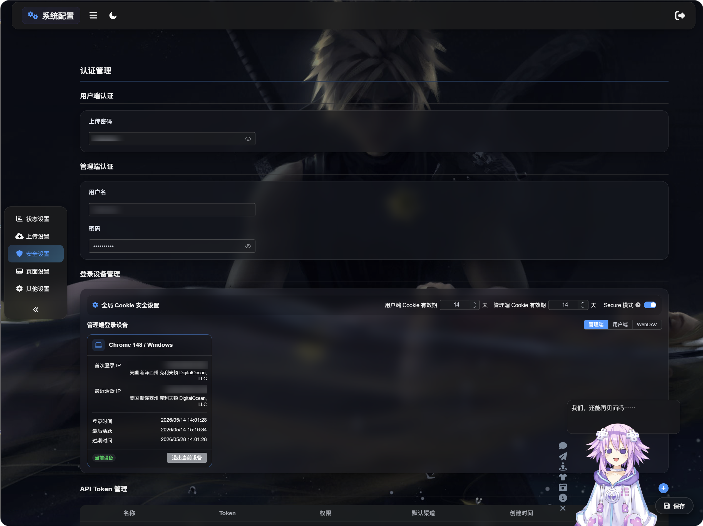

# প্রমাণীকরণ ও লগইন ডিভাইস ব্যবস্থাপনা

প্রমাণীকরণ ব্যবস্থাপনা এবং লগইন ডিভাইস ব্যবস্থাপনা আপনার ImgBed অ্যাডমিন প্যানেল, প্রকাশ্য আপলোড প্রবেশপথ এবং WebDAV প্রবেশাধিকার সুরক্ষিত রাখে.

এই পাতায় প্রবেশাধিকার পরিচয়পত্র সেট করা, লগইন করা ডিভাইস পর্যালোচনা করা এবং প্রয়োজন হলে পুরোনো সেশন বাতিল করা যায়.

## কোথায় কনফিগার করবেন

অ্যাডমিন প্যানেল খুলে যান:

```text
System Settings -> Security Settings
```

পাতায় দুটি প্রধান অংশ আছে:

- প্রমাণীকরণ ব্যবস্থাপনা
- লগইন ডিভাইস ব্যবস্থাপনা



## প্রমাণীকরণ ব্যবস্থাপনা কী করে

প্রমাণীকরণ ব্যবস্থাপনা প্রবেশাধিকার পরিচয়পত্র সংরক্ষণ করে.

এটি দুই ধরনের:

- ব্যবহারকারী-পক্ষের প্রমাণীকরণ
- অ্যাডমিন-পক্ষের প্রমাণীকরণ

## ব্যবহারকারী-পক্ষের প্রমাণীকরণ

ব্যবহারকারী-পক্ষের প্রমাণীকরণ হলো আপলোড পাসওয়ার্ড.

আপলোড পাসওয়ার্ড সেট করলে সাধারণ দর্শকদের আপলোড পাতা ব্যবহার করার আগে পাসওয়ার্ড দিতে হবে. আপনি প্রকাশ্য আপলোড পাতা সবার জন্য খোলা রাখতে না চাইলে এটি কার্যকর.


### আপলোড পাসওয়ার্ড সেট করা

আপলোড পাসওয়ার্ড কনফিগার করা হলে:

- দর্শকদের আপলোড পাতা ব্যবহার করার আগে পাসওয়ার্ড দিতে হবে.
- পাসওয়ার্ড গ্রহণ হওয়ার পরই আপলোড ব্যবহার করা যাবে.
- ব্যবহারকারী-পক্ষের ডিভাইস সেশন চালু থাকলে ImgBed সেই ব্যবহারকারী-পক্ষের ডিভাইস রেকর্ড করবে.

আপলোড পাসওয়ার্ড বদলালে পুরোনো ব্যবহারকারী-পক্ষের সেশন বাতিল হয়ে যায়. দর্শকদের নতুন পাসওয়ার্ড আবার দিতে হবে.

## অ্যাডমিন-পক্ষের প্রমাণীকরণ

অ্যাডমিন-পক্ষের প্রমাণীকরণ অ্যাডমিন ব্যবহারকারীর নাম এবং পাসওয়ার্ড ব্যবহার করে.

এটি অ্যাডমিন প্যানেল সুরক্ষিত রাখে. উৎপাদন পরিবেশে এটি সবসময় কনফিগার করা উচিত.


### অ্যাডমিন পরিচয়পত্র সেট করা

অ্যাডমিন ব্যবহারকারীর নাম এবং পাসওয়ার্ড কনফিগার করা হলে:

- অ্যাডমিন প্যানেল খুলতে লগইন করতে হবে.
- সফল লগইন একটি অ্যাডমিন ডিভাইস রেকর্ড তৈরি করে.
- লগইন ডিভাইস ব্যবস্থাপনায় ডিভাইস পর্যালোচনা, পরিষ্কার বা জোর করে অফলাইন করা যায়.

অ্যাডমিন ব্যবহারকারীর নাম বা পাসওয়ার্ড বদলালে পুরোনো অ্যাডমিন সেশন বাতিল হয়ে যায়. আবার সাইন ইন করতে হবে.

## লগইন ডিভাইস ব্যবস্থাপনা কী করে

লগইন ডিভাইস ব্যবস্থাপনা সাইন ইন করা ডিভাইস দেখায়.

এটি দিয়ে যাচাই করা যায়:

- কোন ডিভাইস অ্যাডমিন প্যানেলে প্রবেশ করেছে.
- কোন ডিভাইস ব্যবহারকারী-পক্ষের আপলোড পাতায় প্রবেশ করেছে.
- কোন WebDAV ক্লায়েন্ট সংযুক্ত হয়েছে.
- কোনো ডিভাইস সেশন এখনও বৈধ কি না.
- পুরোনো ডিভাইস জোর করে অফলাইন করা দরকার কি না.

পাতায় তিনটি ট্যাব আছে:

- অ্যাডমিন
- ব্যবহারকারী
- WebDAV

## সার্বিক Cookie নিরাপত্তা

লগইন ডিভাইস ব্যবস্থাপনার ওপরের অংশে সার্বিক Cookie আচরণ কনফিগার করা যায়.

### ব্যবহারকারী Cookie-এর মেয়াদ

ব্যবহারকারী-পক্ষের লগইন কত দিন সক্রিয় থাকবে তা নিয়ন্ত্রণ করে.

যেমন 14 দিন সেট করলে, দর্শকদের সাধারণত 14 দিনের মধ্যে আবার আপলোড পাসওয়ার্ড দিতে হবে না.

### অ্যাডমিন Cookie-এর মেয়াদ

অ্যাডমিন লগইন কত দিন সক্রিয় থাকবে তা নিয়ন্ত্রণ করে.

যেমন 14 দিন সেট করলে, অ্যাডমিনদের সাধারণত 14 দিনের মধ্যে আবার সাইন ইন করতে হবে না.

### Secure মোড

Secure মোড চালু থাকলে ব্রাউজার শুধু HTTPS-এ লগইন Cookie পাঠায়.

উৎপাদন HTTPS সাইটের জন্য এটি চালু করুন. স্থানীয় HTTP পরীক্ষায় এটি চালু করবেন না; নইলে “লগইন সফল হয়েছে, কিন্তু রিফ্রেশ করলে লগআউট হয়ে যায়” ধরনের আচরণ দেখা যেতে পারে.

## অ্যাডমিন লগইন ডিভাইস

অ্যাডমিন ট্যাব অ্যাডমিন প্যানেলে সাইন ইন করা ডিভাইস দেখায়.

অ্যাডমিন পরিচয়পত্র কনফিগার করার পর এবং লগইনের মাধ্যমে অ্যাডমিন প্যানেলে প্রবেশ করলে তবেই ডিভাইস রেকর্ড দেখা যায়.

প্রতিটি ডিভাইস কার্ডে দেখা যেতে পারে:

- ডিভাইস এবং ব্রাউজারের তথ্য
- প্রথম লগইনের IP
- শেষ সক্রিয় IP
- লগইনের সময়
- শেষ সক্রিয় সময়
- মেয়াদ শেষ হওয়ার সময়
- বর্তমান অবস্থা

অপরিচিত ডিভাইস দেখলে সেটি বাতিল করতে "জোর করে অফলাইন" ব্যবহার করুন.

## পুরোনো ডিভাইস পরিষ্কার করা

"পুরোনো ডিভাইস পরিষ্কার করা" বর্তমান ট্যাবের পুরোনো লগইন রেকর্ডগুলো একসঙ্গে সরিয়ে দেয়.

অন্য ডিভাইসে পুরোনো সেশন এখনও সক্রিয় থাকতে পারে সন্দেহ হলে এটি ব্যবহার করুন.

## জোর করে অফলাইন

"জোর করে অফলাইন" একটি ডিভাইস সেশন বাতিল করে.

কোনো ডিভাইস জোর করে অফলাইন করার পর:

- অ্যাডমিন ডিভাইসকে আবার সাইন ইন করতে হবে.
- ব্যবহারকারী-পক্ষের ডিভাইসকে আবার আপলোড পাসওয়ার্ড দিতে হবে.
- WebDAV ক্লায়েন্টকে আবার প্রমাণীকরণ করতে হবে.

মেয়াদোত্তীর্ণ বা অকার্যকর ডিভাইসও সরানো যায়.

## বর্তমান ডিভাইস থেকে সাইন আউট

বর্তমান ডিভাইস কার্ডে "বর্তমান ডিভাইস" চিহ্ন থাকে.

বর্তমান ডিভাইস থেকে সাইন আউট করলে:

- বর্তমান অ্যাডমিন সেশন সাইন আউট হবে.
- বর্তমান ব্যবহারকারী-পক্ষের সেশন সাইন আউট হবে.

সেই অংশ ব্যবহার চালিয়ে যেতে আবার সাইন ইন করতে হবে.

