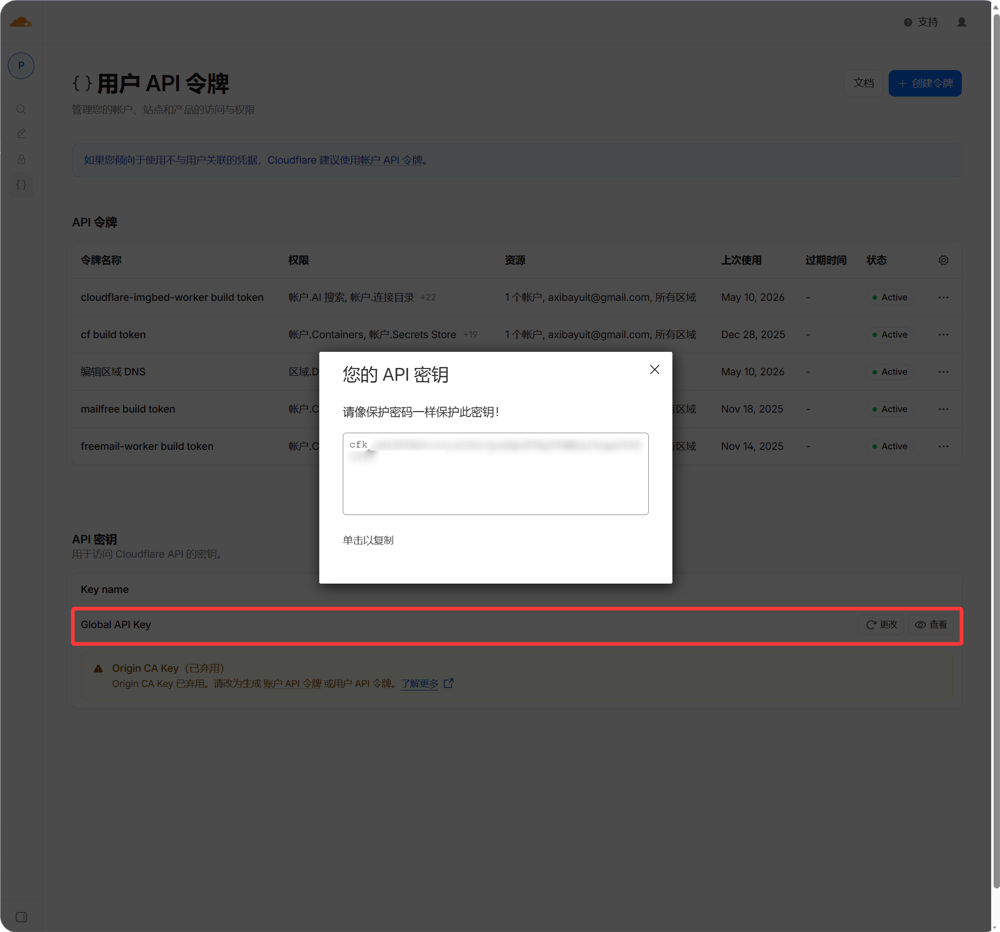

# Cloudflare API Token

Cloudflare API credentials থাকলে files বদলানোর পর ImgBed Cloudflare CDN cache purge করতে পারে।


## কোথায় Configure করবেন

Admin panel খুলে যান:

```text
System Settings -> Security Settings -> Cloudflare API Token
```

আপনাকে এগুলো পূরণ করতে হবে:

- Zone ID
- Account email
- API Key

## এই Setting কী করে

Cloudflare public image URLs cache করতে পারে।

Caching image delivery দ্রুত করে, কিন্তু file delete, block, replace বা move করার পরও পুরোনো content কিছু সময় visible থাকতে পারে।

Cloudflare API credentials configured থাকলে ওই operations শেষ হওয়ার পর ImgBed related Cloudflare cache purge করার চেষ্টা করে।

এটি কাজে লাগে যখন:

- Image delete করেছেন এবং public link যত দ্রুত সম্ভব বন্ধ হোক চান।
- Image block করেছেন এবং visitors যেন original file না দেখে চান।
- একই নামের file replace করেছেন এবং visitors যেন দ্রুত নতুন version দেখে চান।
- Files move বা rename করেছেন এবং old path cache দ্রুত refresh করতে চান।
- Public access rules বদলেছেন এবং public gallery বা random image cache দ্রুত update করতে চান।

## Empty রাখলে কী হবে

এই setting ছাড়া ImgBed normalভাবে কাজ করবে।

ফারাক হলো ImgBed Cloudflare CDN cache actively purge করবে না। Cloudflare cache নিজে expire না হওয়া পর্যন্ত visitors পুরোনো content দেখতে পারে।

## Zone ID কীভাবে পাবেন

Zone ID হলো আপনার ImgBed domain যে site ব্যবহার করছে, সেই site-এর Cloudflare Zone ID।

1. Cloudflare dashboard-এ sign in করুন।
2. আপনার ImgBed domain থাকা site খুলুন।
3. Site overview page-এ `Zone ID` খুঁজুন।
4. ImgBed-এর `Zone ID` field-এ copy করুন।

এটি site Zone ID, account ID নয়।

## Account Email

Cloudflare-এ sign in করতে যে email address ব্যবহার করেন সেটি দিন।

এটি নিচে দেওয়া API Key-এর সঙ্গে match করতে হবে।

## API Key

আপনার Cloudflare Global API Key দিন।

1. Cloudflare dashboard-এ sign in করুন।
2. Profile খুলুন।
3. API Tokens page-এ যান।
4. `Global API Key` খুঁজুন।
5. View করে copy করুন।
6. ImgBed-এর `API Key` field-এ paste করুন।



## কখন কার্যকর হয়

Fields পূরণ করার পর settings save করুন।

এরপর future file changes হলে ImgBed automatically Cloudflare cache purge করার চেষ্টা করবে। Past operations retroactively purge হয় না। Setup-এর আগে file delete বা replace করে থাকলে Cloudflare cache expire হওয়া পর্যন্ত অপেক্ষা করুন, অথবা Cloudflare-এ manually purge করুন।

## FAQ

### এটি কি Required?

না।

আপনার domain Cloudflare ব্যবহার না করলে, বা CDN cache delay নিয়ে সমস্যা না থাকলে empty রাখতে পারেন।

### Wrong Credentials কি Uploads ভেঙে দেবে?

সাধারণত না।

Wrong credentials শুধু ImgBed-কে Cloudflare cache purge করা থেকে আটকাবে। Upload এবং normal file access চলতে থাকা উচিত।

### Deleted Image এখনও কেন খোলে?

সবচেয়ে common কারণ হলো Cloudflare-এর কাছে পুরোনো file cached আছে।

সঠিক Cloudflare API credentials থাকলে file delete করার সময় ImgBed related URL cache purge করে।

### File replace করার পরও পুরোনো Image কেন দেখাচ্ছে?

এটিও সাধারণত CDN cache-এর কারণে হয়।

এই setting configured হলে একই নামের file overwrite করার সময় ImgBed old URL cache purge করার চেষ্টা করে।
