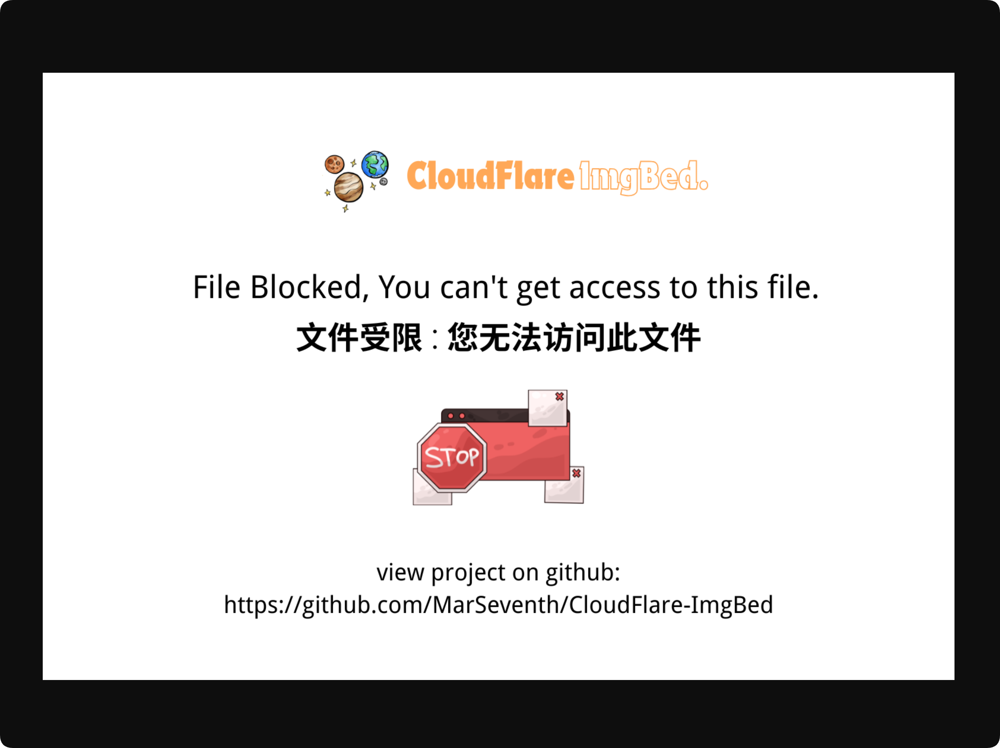

# ছবি পর্যালোচনা ও প্রবেশাধিকার মোড

ছবি পর্যালোচনা আপলোড করা ছবিতে বয়সভিত্তিক রেটিং নির্ধারণ করে. প্রবেশাধিকার মোড নির্ধারণ করে কোন রেটিংগুলো প্রকাশ্য প্রবেশাধিকার দিয়ে দেখা যাবে.

এটি প্রকাশ্য গ্যালারি, প্রকাশ্য ফাইল URL এবং র‍্যান্ডম ছবি API-তে প্রভাব ফেলে. এটি অ্যাডমিন প্যানেল সীমিত করে না. অ্যাডমিনরা এখনও সব ফাইল দেখতে ও পরিচালনা করতে পারেন.

## কোথায় কনফিগার করবেন

অ্যাডমিন প্যানেল খুলে যান:

```text
System Settings -> Security Settings -> Upload Management -> Image Moderation
```

প্রধান সেটিংগুলো হলো:

- প্রবেশাধিকার মোড
- পর্যালোচনা চালু করা
- পর্যালোচনা সরবরাহকারী

## প্রবেশাধিকার মোড কী করে

প্রবেশাধিকার মোড নির্ধারণ করে কোন বয়সভিত্তিক রেটিং প্রকাশ্যে দেখানো যাবে.

বর্তমান মোড:

| প্রবেশাধিকার মোড | প্রকাশ্যে দৃশ্যমান রেটিং |
| --- | --- |
| প্রাপ্তবয়স্ক মোড | সাধারণ, R12, R16, R18 |
| তরুণ মোড | সাধারণ, R12, R16 |
| কিশোর মোড | সাধারণ, R12 |
| শিশু মোড | শুধু সাধারণ |

ডিফল্ট হলো প্রাপ্তবয়স্ক মোড.

ব্যক্তিগত সাইট বা প্রাপ্তবয়স্ক কনটেন্ট থাকা সাইটের জন্য প্রাপ্তবয়স্ক মোড উপযুক্ত হতে পারে. বেশি সংযত প্রকাশ্য গ্যালারির জন্য তরুণ, কিশোর বা শিশু মোড বেছে নিন.

## পর্যালোচনা চালু করলে কী হয়

পর্যালোচনা চালু থাকলে ImgBed আপলোডের সময় নির্বাচিত পর্যালোচনা সরবরাহকারীকে ডাকে এবং শনাক্ত করা বয়সভিত্তিক রেটিং সংরক্ষণ করে.

প্রধান রেটিং:

| রেটিং | অর্থ |
| --- | --- |
| সাধারণ | নিরাপদ প্রকাশ্য কনটেন্ট |
| R12 | হালকা সংবেদনশীল কনটেন্ট |
| R16 | মাঝারি সংবেদনশীল কনটেন্ট |
| R18 | প্রাপ্তবয়স্ক কনটেন্ট |

প্রকাশ্য প্রবেশাধিকার নির্ধারণের সময় পর্যালোচনার ফল ব্যবহার করা হয়.

পর্যালোচনা চালু না থাকলে, অথবা পুরোনো ফাইলে রেটিং না থাকলে, সেগুলোকে অরেটেড ফাইল হিসেবে ধরা হয়. শুধু রেটিং নেই বলে অরেটেড ফাইল প্রকাশ্য গ্যালারি বা র‍্যান্ডম ছবি API থেকে স্বয়ংক্রিয়ভাবে সরানো হয় না.

## পর্যালোচনা সরবরাহকারী বেছে নেওয়া

উপলব্ধ সরবরাহকারীর মধ্যে আছে:

- moderatecontent.com
- nsfwjs
- Sightengine

প্রতিটি সরবরাহকারীর প্রয়োজন আলাদা:

- moderatecontent.com সাধারণত API Key চায়.
- nsfwjs সাধারণত API এন্ডপয়েন্ট URL চায়.
- Sightengine API user এবং API secret চায়.

আপনার অ্যাকাউন্ট, প্রাপ্যতা এবং শনাক্তকরণের মান অনুযায়ী বেছে নিন. পর্যালোচনা চালু এবং সঠিকভাবে কনফিগার থাকলে ImgBed আপলোডের সময় ছবির রেটিং লিখতে চেষ্টা করে.

## প্রকাশ্য গ্যালারিতে প্রভাব

প্রকাশ্য গ্যালারি প্রবেশাধিকার মোড অনুযায়ী ফাইল ফিল্টার করে.

উদাহরণ:

- প্রাপ্তবয়স্ক মোড: R18 ছবি দেখা যেতে পারে.
- তরুণ মোড: R18 ছবি লুকানো হয়.
- কিশোর মোড: R16 এবং R18 ছবি লুকানো হয়.
- শিশু মোড: শুধু সাধারণ রেটিংয়ের ছবি দেখানো হয়.

এটি শুধু স্বাভাবিক প্রকাশ্য প্রবেশাধিকারকে প্রভাবিত করে. অ্যাডমিন প্যানেল এখনও সব ফাইল দেখায়.

## প্রকাশ্য ফাইল URL-এ প্রভাব

প্রকাশ্য ফাইল URL হলো দর্শকদের খোলা সরাসরি ছবির লিংক.

ফাইলের রেটিং বর্তমান প্রবেশাধিকার মোডে অনুমোদিত হলে ImgBed মূল ছবি ফেরত দেয়.

রেটিং অনুমোদিত মাত্রার বেশি হলে স্বাভাবিক প্রকাশ্য প্রবেশাধিকার মূল ছবি ফেরত দেয় না. এর বদলে ImgBed কনফিগার করা ব্লক ফলাফল বা placeholder ছবি ফেরত দেয়.

উদাহরণ:

- বর্তমান মোড শিশু মোড.
- একটি ছবি R18 হিসেবে রেট করা.
- একজন দর্শক প্রকাশ্য URL সরাসরি খুলেছে.
- ImgBed সেই দর্শককে R18 মূল ছবি ফেরত দেয় না.



অ্যাডমিন প্যানেলে ফাইল দেখার সময় অ্যাডমিনরা এই সীমাবদ্ধতায় প্রভাবিত হন না.

## র‍্যান্ডম ছবি API-তে প্রভাব

র‍্যান্ডম ছবি API-ও প্রবেশাধিকার মোড অনুযায়ী প্রার্থী ফাইলের তালিকা ফিল্টার করে.

শিশু মোডে র‍্যান্ডম ছবি শুধু সাধারণ রেটিংয়ের ফাইল থেকে বেছে নেওয়া হয়.

তরুণ মোডে র‍্যান্ডম ছবি সাধারণ, R12 এবং R16 ফাইল থেকে আসতে পারে, কিন্তু R18 ফাইল থেকে নয়.

এতে র‍্যান্ডম ছবি API প্রকাশ্য গ্যালারির সীমাবদ্ধতা পাশ কাটাতে পারে না.

## তালিকা নিয়মের সঙ্গে সম্পর্ক

প্রবেশাধিকার মোড একমাত্র প্রকাশ্য প্রবেশাধিকার নিয়ম নয়. এটি allow/block তালিকার নিয়মের সঙ্গে কাজ করে.

সহজভাবে:

- Allowlist-এ থাকা কনটেন্ট আগে প্রকাশ্য.
- Blocklist-এ থাকা কনটেন্ট সাধারণ দর্শকরা সরাসরি দেখতে পারে না.
- কোনো তালিকায় না থাকা কনটেন্ট এরপর প্রবেশাধিকার মোড দিয়ে পরীক্ষা করা হয়.

বয়সভিত্তিক রেটিং এবং তালিকা নিয়ম উভয় কারণে কোনো ছবি সীমাবদ্ধ হলে সাধারণ দর্শক এখনও মূল ফাইল সরাসরি দেখতে পারবে না.

## সুপারিশকৃত সেটিংস

প্রকাশ্য সাইটের জন্য:

- পর্যালোচনা চালু করুন.
- সাইটের দর্শক অনুযায়ী প্রবেশাধিকার মোড বেছে নিন.
- সব বয়সের দর্শকের জন্য শিশু মোড বা কিশোর মোড ব্যবহার করুন.
- প্রাপ্তবয়স্ক কনটেন্ট প্রকাশ্যে দেখাতে না চাইলে প্রাপ্তবয়স্ক মোড এড়িয়ে চলুন.
- অ্যাডমিন প্যানেলে ফাইল রেটিং পর্যালোচনা করুন এবং দরকার হলে হাতে ঠিক করুন.

ব্যক্তিগত বা নিজস্ব সাইটের জন্য:

- প্রাপ্তবয়স্ক মোড সাধারণত ঠিক আছে.
- কাজে লাগলে পর্যালোচনা চালু করুন.
- প্রয়োজন অনুযায়ী অ্যাডমিন প্যানেলে রেটিং পর্যালোচনা ও ঠিক করুন.

## সাধারণ প্রশ্ন

### প্রবেশাধিকার মোড বদলালে কি অ্যাডমিন প্যানেল থেকে ফাইল হারিয়ে যাবে?

না.

প্রবেশাধিকার মোড শুধু স্বাভাবিক প্রকাশ্য প্রবেশাধিকারকে প্রভাবিত করে. এটি অ্যাডমিন প্যানেলে প্রভাব ফেলে না.

### শিশু মোডে যাওয়ার পর প্রকাশ্য গ্যালারিতে কম ছবি দেখা যাচ্ছে কেন?

শিশু মোড শুধু সাধারণ রেটিংয়ের ফাইল প্রকাশ্যে দেখায়. R12, R16 এবং R18 ফাইল ফিল্টার হয়ে যায়.

### প্রকাশ্য URL কি এখনও প্রাপ্তবয়স্ক ছবি খুলতে পারে?

বর্তমান প্রবেশাধিকার মোড সেই রেটিং অনুমোদন না করলে স্বাভাবিক প্রকাশ্য URL মূল ছবি ফেরত দেয় না.

### র‍্যান্ডম ছবি API কি সীমাবদ্ধ ছবি ফেরত দিতে পারে?

না.

র‍্যান্ডম ছবি API বর্তমান প্রবেশাধিকার মোড অনুযায়ী প্রার্থী ফাইল ফিল্টার করে.

### পুরোনো অরেটেড ছবির কী হবে?

শুধু পর্যালোচনার ফল নেই বলে অরেটেড ছবি স্বয়ংক্রিয়ভাবে লুকানো হয় না. পরে অ্যাডমিন প্যানেলে তাদের রেটিং ঠিক করতে পারেন.

