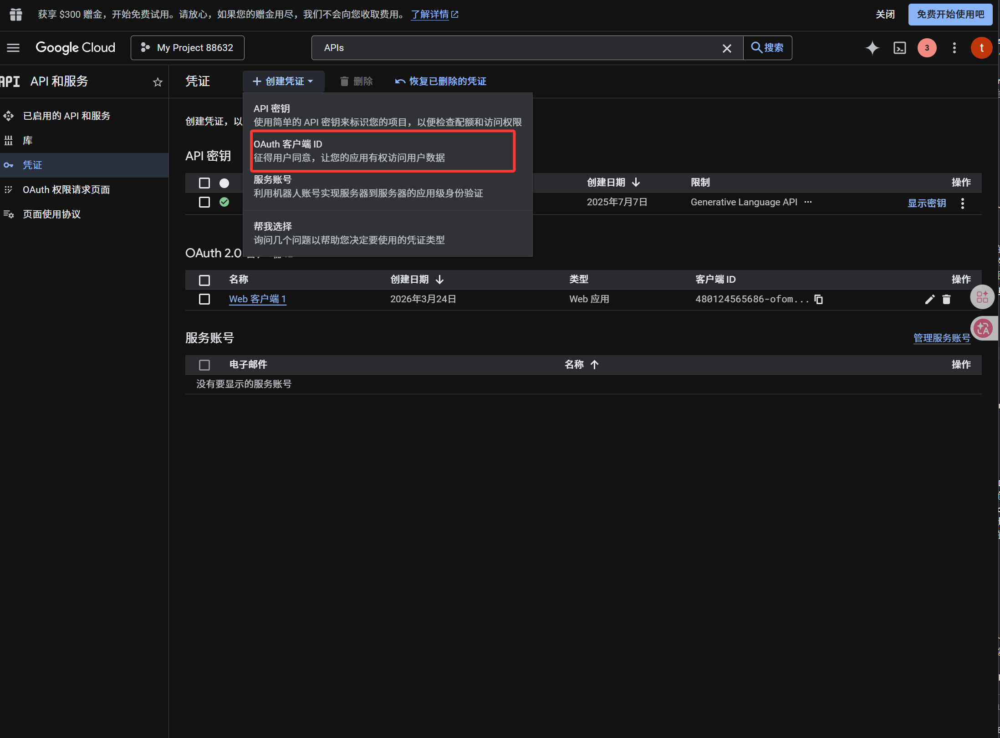
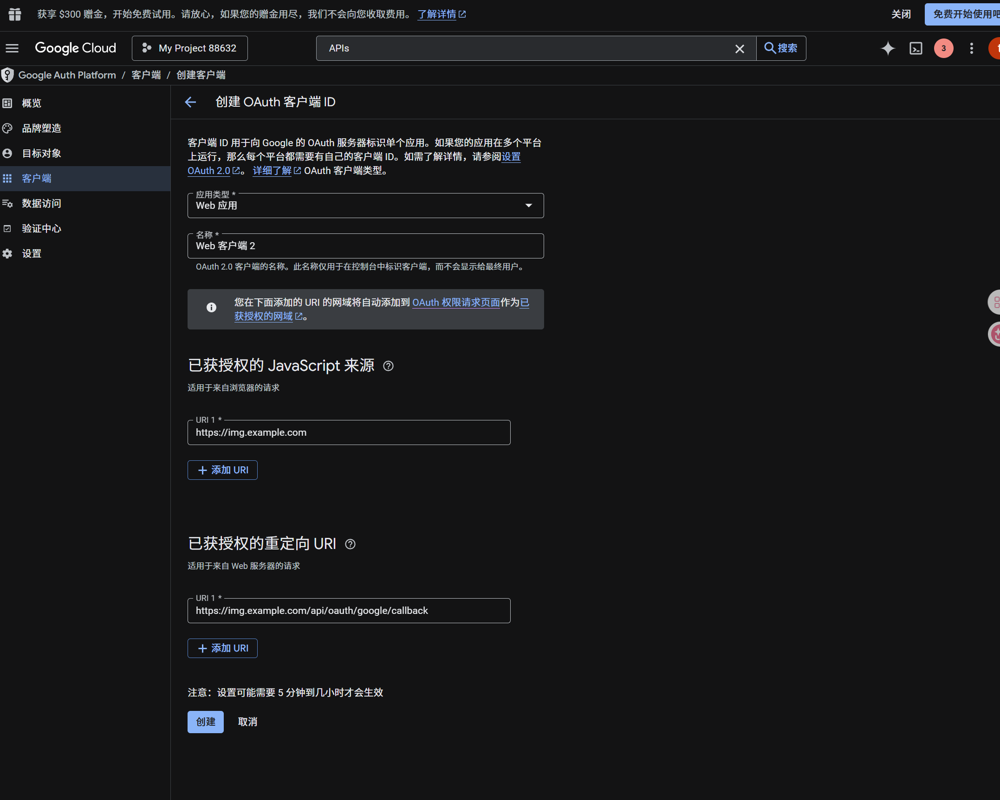
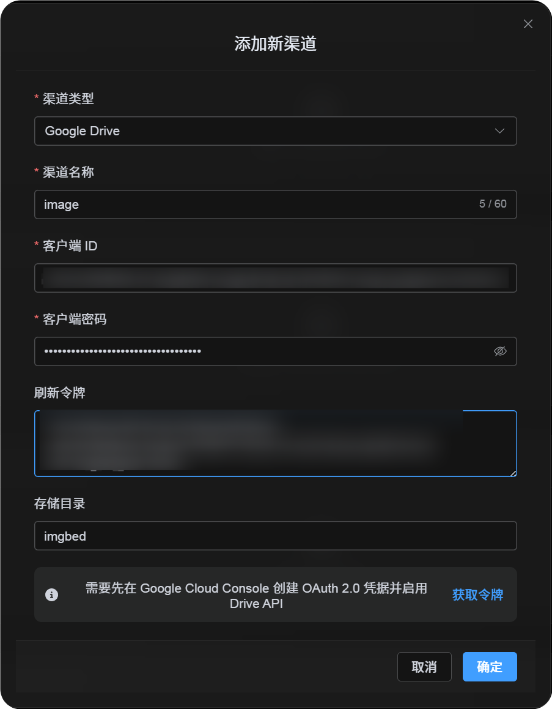
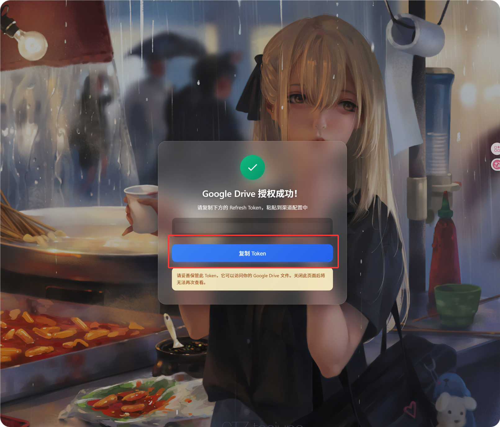

# Google-Drive-Kanal hinzufügen

## Was du vorher brauchst

Bereite vor dem Start diese Dinge vor:

| Voraussetzung | Wofür sie gebraucht wird |
| --- | --- |
| Google-Konto | Für Google Cloud und die Autorisierung von Google Drive |
| Google-Cloud-Projekt | Aktiviert die Drive API und erstellt OAuth-Zugangsdaten |
| OAuth-2.0-Client | Damit ImgBed `Client ID`, `Client Secret` und `Refresh Token` erhalten kann |
| Deine ImgBed-Domain | Für die OAuth-Redirect-URI. Sie muss zur tatsächlich genutzten Domain passen. |

## Einrichtung

### Schritt 1: Google Drive API aktivieren

1. Öffne die Google Cloud Console.
2. Erstelle ein neues Projekt oder wähle ein bestehendes aus.
3. Gehe zu `APIs & Services`.
4. Klicke auf `Enable APIs and Services`.
5. Suche nach `Google Drive API`.
6. Öffne sie und aktiviere sie.

### Schritt 2: OAuth-Zustimmungsbildschirm konfigurieren

1. Öffne in Google Cloud die `Google Auth Platform`.
2. Fülle die grundlegenden Angaben unter `Branding` aus, z. B. App-Name, Support-E-Mail und Entwicklerkontakt.
3. Öffne `Audience`.
4. Für die meisten selbst betriebenen privaten Installationen passt `External`.
5. Wenn du `External` wählst, füge unter `Test users` das Google-Konto hinzu, das du autorisieren möchtest.
6. Öffne `Data Access`.
7. Füge die benötigten Google-Drive-Berechtigungen hinzu.

### Schritt 3: OAuth-2.0-Client erstellen

1. Öffne in der `Google Auth Platform` den Bereich `Clients`.
2. Erstelle einen neuen Client.
3. Setze den Anwendungstyp auf `Web application`.
4. Gib dem Client einen gut erkennbaren Namen.
5. Trage bei den autorisierten JavaScript-Ursprüngen deine ImgBed-URL ein, zum Beispiel:

```text
https://img.example.com
```

6. Trage bei den autorisierten Redirect-URIs ein:

```text
https://img.example.com/api/oauth/google/callback
```





Nach dem Erstellen kopierst du diese Werte:

| Erstellter Wert | ImgBed-Feld |
| --- | --- |
| Client ID | `Client ID` |
| Client Secret | `Client Secret` |

## Schritt 4: Google-Drive-Kanal ausfüllen

Wähle in den Upload-Einstellungen `Google Drive` und fülle aus:

| ImgBed-Feld | Eingabe |
| --- | --- |
| Kanalname | Ein gut erkennbarer Name, z. B. `Main Google Drive` |
| Client ID | Die Client ID aus Google Cloud |
| Client Secret | Das Client Secret aus Google Cloud |
| Refresh Token | Erst einmal leer lassen. Das Token holst du im nächsten Schritt. |
| Stammverzeichnis | Optional. Standard ist `imgbed`. |



## Schritt 5: Refresh Token abrufen

1. Klicke auf `Get Token`.
2. Wähle das Google-Konto aus, das du verbinden möchtest.
3. Schließe die Autorisierung ab.
4. Die Callback-Seite zeigt ein `Refresh Token`.
5. Kopiere es.
6. Kehre zu ImgBed zurück und füge es in das Feld `Refresh Token` ein.



Wenn du später das Google-Konto wechselst, den OAuth-Client änderst oder die alte Autorisierung abläuft, musst du den Kanal nicht löschen. Öffne die Bearbeitungsseite und klicke auf `Reauthorize`.

## Schritt 6: Kanal speichern

Speichere den Kanal, sobald alle Felder ausgefüllt sind.

## Kurzablauf

```text
Google Cloud öffnen
-> Projekt erstellen oder auswählen
-> Google Drive API aktivieren
-> Google Auth Platform konfigurieren
-> Bei Audience = External das eigene Google-Konto zu Test users hinzufügen
-> OAuth-Client vom Typ Web application erstellen
-> https://your-domain.com/api/oauth/google/callback als Redirect-URI eintragen
-> Client ID und Client Secret in ImgBed eintragen
-> Get Token klicken
-> Mit Google anmelden und autorisieren
-> Refresh Token von der Callback-Seite kopieren
-> In ImgBed einfügen und speichern
-> Testbild hochladen
```

## Referenzen

1. Google OAuth Web Server Applications: https://developers.google.com/identity/protocols/oauth2/web-server
2. Google Workspace OAuth Consent Configuration: https://developers.google.com/workspace/guides/configure-oauth-consent
3. Google Drive API Auth Scopes: https://developers.google.com/workspace/drive/api/guides/api-specific-auth
