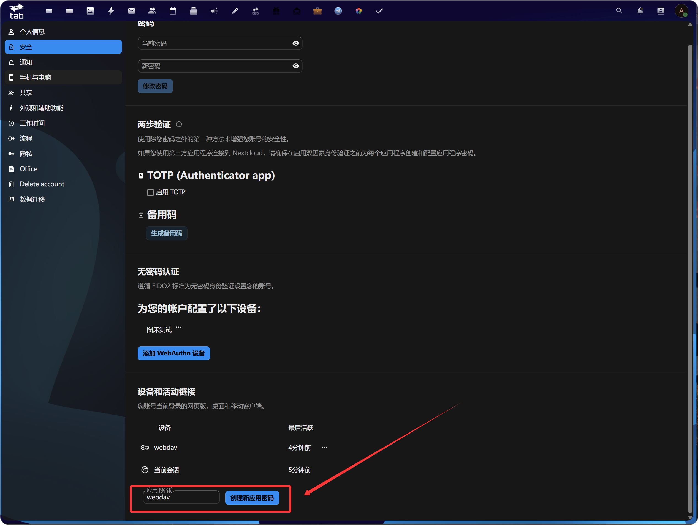
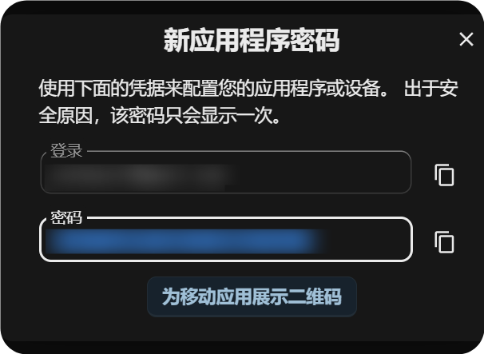
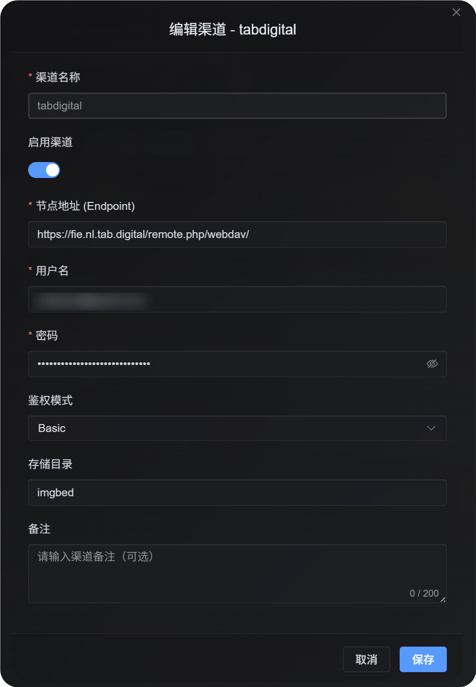
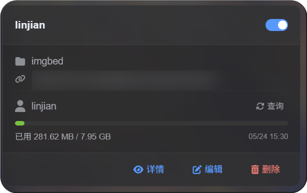

# Add a WebDAV Channel

## Best Fit

Use the WebDAV channel when:

- You have a NAS, cloud drive, or object storage service that provides a WebDAV endpoint.
- You want uploaded images to be stored in your own WebDAV directory.
- You want credentials to be saved in the D1 `upload_channels` table instead of being exposed long-term in the frontend.

## What You Need Before You Start

| Requirement | Purpose |
| --- | --- |
| WebDAV Endpoint | The server-side WebDAV URL, for example `https://nas.example.com/dav`. |
| Username | Used to sign in to the WebDAV service. |
| Password | Used to sign in to the WebDAV service. |
| Authentication mode | Default is `Basic`. Use `Digest` or auto negotiation only if required by the server. |
| Storage directory | Directory used to store files. Default is `imgbed`. |

## Where to Add It

1. Open System Settings.
2. Go to Upload Settings.
3. Click Add Channel in the upper-right corner.
4. Select `WebDAV`.

## Field Reference

| Field | What It Does | Required |
| --- | --- | --- |
| Channel name | A friendly name for this WebDAV channel, such as `koofr` or `nas`. | Yes |
| Endpoint | Full WebDAV endpoint, including `https://`. | Yes |
| Username | WebDAV login username. | Yes |
| Password | WebDAV login password. | Yes |
| Authentication mode | Usually `Basic`; use `Digest` if the server requires digest authentication. | Yes |
| Storage directory | Directory where files are stored. Default is `imgbed`. | No |

## Example: fie.nl.tab.digital

### 1. Create an App Password

Open your account security settings, find application passwords, and create a new app password.



After it is created, copy and save the new app password. It is usually shown only once.



### 2. Fill in the WebDAV Configuration in ImgBed

Return to ImgBed and add a WebDAV channel:

| UI Field | Value |
| --- | --- |
| Endpoint | The WebDAV URL provided by `https://fie.nl.tab.digital/`. |
| Username | Your WebDAV username. |
| Password | The app password you just created. |
| Authentication mode | Start with `Basic` in most cases. |
| Storage directory | Default is `imgbed`; you can also use a custom directory. |



## Large File Upload Behavior

The WebDAV channel now uses real session-based chunked upload.

Small files are uploaded as a single complete file. Files larger than 64 MiB are automatically split into chunks of around 10 MiB and uploaded into a remote chunk directory.

The WebDAV service does not need to support `partial update` or offset-based writes. ImgBed does not merge chunks into a single large file on the remote server. Instead, it stores a chunk manifest and reads the chunks in order when the file is requested.

In practice:

| File Size | Upload Method | Remote Storage Layout |
| --- | --- | --- |
| 64 MiB or smaller | Normal upload | One complete file |
| Larger than 64 MiB | Real session chunked upload | A chunk directory containing multiple chunk files |

The chunk directory only affects the remote storage layout. It does not change the file URL in ImgBed. Users still access the file through the original `/file/...` link.

## Setup Steps

1. Open Upload Settings.
2. Click Add Channel.
3. Select `WebDAV`.
4. Enter a channel name you can recognize, for example `koofr`.
5. Enter the WebDAV endpoint, for example `https://app.koofr.net/dav/Koofr`.
6. Enter the username and password.
7. Keep authentication mode as `Basic` by default.
8. Keep the storage directory as `imgbed`, or change it to your own directory.
9. Click Save.
10. After saving, check the channel card, query capacity if available, and upload a test file.

## How to Verify It

| Check | How to Verify |
| --- | --- |
| Channel card appears | After saving, the Upload Settings page should show a WebDAV channel card. |
| Channel is enabled | The switch in the upper-right corner of the card should stay on. |
| Credentials are saved | The detail view should show Endpoint, username, authentication mode, and storage directory. |
| Small file upload works | Upload a test image and confirm that the file appears in the WebDAV directory. |
| Large file rule works | Files larger than 64 MiB use chunked upload and create a remote chunk directory. |
| Capacity query works | If the server supports capacity information, the query will show used and total capacity. |



## FAQ

### Why do large WebDAV files create a chunk directory?

This is the current storage method for large files.

Files larger than 64 MiB are not merged into one large remote file. They are stored as a chunk directory. ImgBed records the chunk manifest and returns the complete content by reading the chunks in order.

### What should I check first if large file upload fails?

Check the Endpoint, username, password, and storage directory first. Then confirm that the WebDAV service allows directory creation, file writing, and file reading.

If capacity query fails but small file upload works, the server may simply not support or may restrict capacity reporting. That does not necessarily mean upload is unavailable.

### Which authentication mode should I use?

Start with `Basic`.

If the server explicitly requires digest authentication, use `Digest`.

If you are not sure, use automatic negotiation.

## Quick Checklist

```text
Prepare WebDAV endpoint, username, and password
-> Open Upload Settings
-> Add Channel
-> Select WebDAV
-> Enter Endpoint / username / password
-> Keep authentication mode as Basic by default
-> Keep storage directory as imgbed by default
-> Save
-> Query capacity
-> Upload a test file
```
