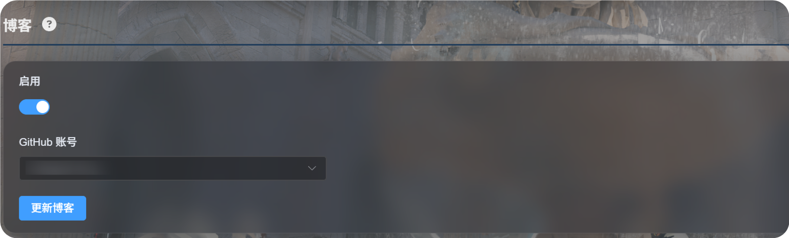
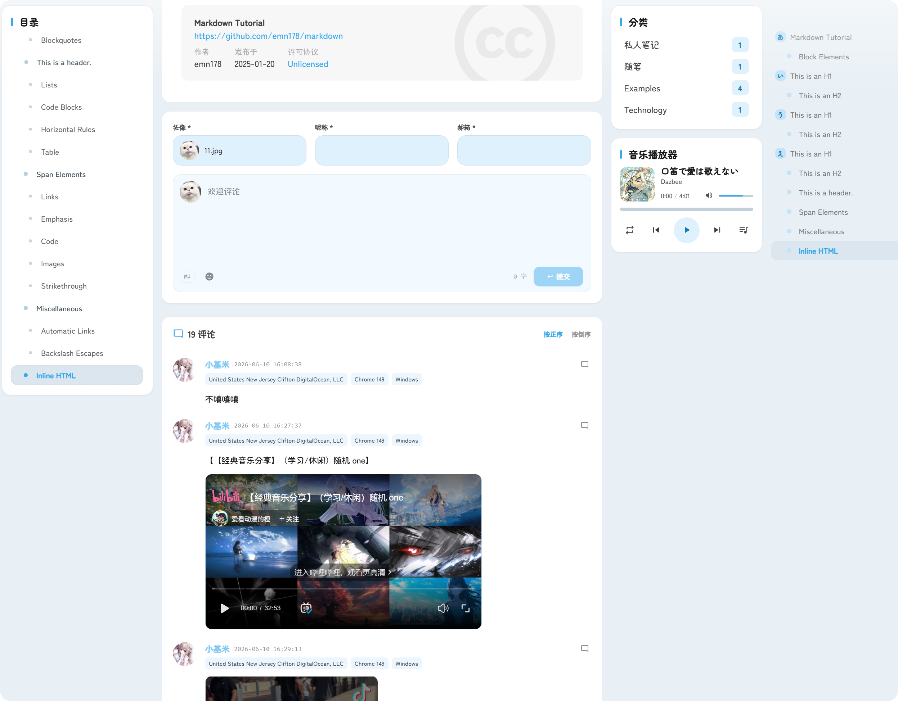

# Uso del blog

La función de blog añade una página de blog independiente a tu sitio ImgBed.

Cuando esté activada, los visitantes podrán entrar desde:

```text
https://tu-dominio/blog/
```


El blog está adaptado a partir del proyecto de código abierto [LyraVoid/Mizuki](https://github.com/LyraVoid/Mizuki). ImgBed lo reescribe e integra con Vue para que funcione como parte del sitio de alojamiento de archivos.

## Dónde se configura

```text
Configuración del sistema -> Otros ajustes -> Blog
```



## Primer uso

1. Activa el interruptor `Habilitar`.
2. Elige la cuenta de GitHub donde se guardará la configuración del blog.
3. Haz clic en `Actualizar blog`.
4. Espera el mensaje de actualización correcta.
5. Abre `https://tu-dominio/blog/` para comprobar el resultado.

En el primer uso, ImgBed prepara un repositorio privado en la cuenta de GitHub seleccionada:

```text
imgbed-blog-config
```

Ese repositorio guarda la configuración del blog y el contenido de los artículos.

## Cómo escribir artículos

Los artículos se editan en tu repositorio privado de GitHub:

```text
imgbed-blog-config
```

Flujo habitual:

1. Abre GitHub.
2. Entra en el repositorio `imgbed-blog-config`.
3. Crea o modifica archivos de artículos.
4. Guarda los cambios con un commit.
5. Vuelve al panel de administración de ImgBed y pulsa `Actualizar blog`. También puedes hacer clic tres veces en el logotipo de la esquina superior izquierda del blog para forzar la actualización.

`Actualizar blog` no sobrescribe los artículos que ya escribiste. Se usa sobre todo para inicializar el repositorio o refrescar la caché del blog.

## Funciones disponibles

El blog incluye listado de artículos, categorías, etiquetas, archivo, búsqueda, modo oscuro y cambio de idioma.

También admite comentarios y estadísticas de visitas.



Los comentarios aparecen debajo de cada artículo. El visitante puede enviar avatar, apodo, correo electrónico y contenido del comentario.

Las estadísticas muestran visitas de artículos y visitas del sitio, útiles para entender el tráfico del blog.

## Dirección de acceso

El blog siempre se publica bajo `/blog/`.

Si tu dominio de ImgBed es:

```text
https://image.example.com
```

la dirección del blog será:

```text
https://image.example.com/blog/
```

Si desactivas el blog, los visitantes ya no podrán acceder a esa página.
