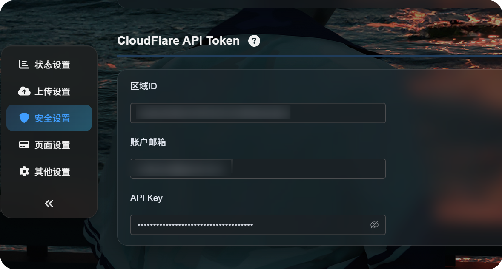

# Configuración del Cloudflare API Token

Algunas funciones de ImgBed necesitan un Cloudflare API Token. Por ejemplo, se usa al trabajar con recursos como R2, Workers, D1 o KV.

## Qué preparar

| Requisito | Uso |
| --- | --- |
| Cuenta de Cloudflare | Crear el API Token |
| Account ID | Identificar la cuenta donde están R2, Workers u otros recursos |
| Permisos necesarios | Dar solo los permisos requeridos por la función |

## Crear un API Token

1. Inicia sesión en Cloudflare Dashboard.
2. Abre `My Profile` desde el perfil de la esquina superior derecha.
3. Entra en `API Tokens`.
4. Haz clic en `Create Token`.
5. Selecciona los permisos necesarios.
6. Limita el token a la cuenta o zona correspondiente.
7. Copia el token generado.

El token puede mostrarse solo una vez. Guárdalo en un lugar seguro.

## Diferencia con Global API Key

Cloudflare también ofrece Global API Key, pero para ImgBed suele ser mejor usar API Token.

| Tipo | Característica |
| --- | --- |
| API Token | Permite limitar permisos y alcance |
| Global API Key | Tiene permisos muy amplios sobre la cuenta |

Un API Token con permisos mínimos reduce riesgos en operación.

## Introducirlo en ImgBed

Pega el Cloudflare API Token en la pantalla de configuración correspondiente de ImgBed y guarda.

Después, usa la función relacionada para comprobar conexión o capacidad y confirmar que el token funciona.

## Buenas prácticas

- No pongas el token en repositorios públicos ni en código frontend.
- Limita permisos y recursos todo lo posible.
- Elimina en Cloudflare los tokens que ya no uses.
- Si sospechas que se filtró, revócalo y crea uno nuevo.
