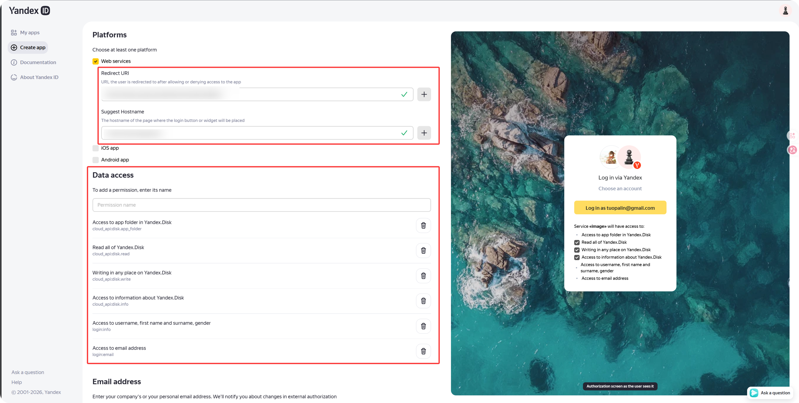
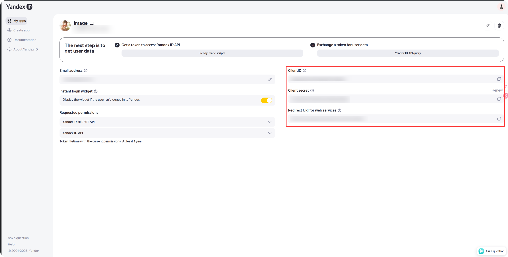
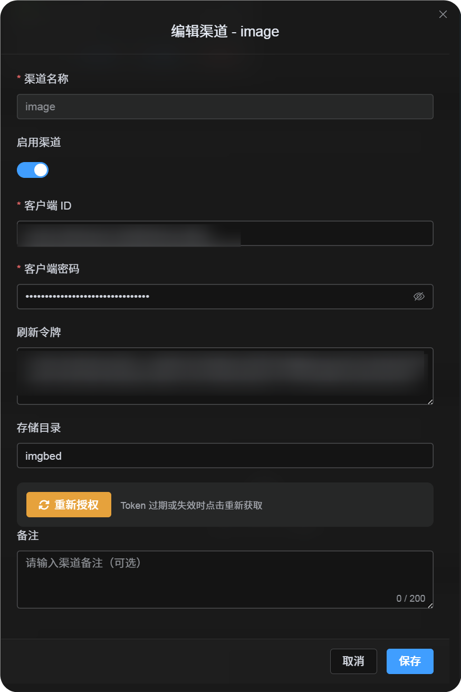
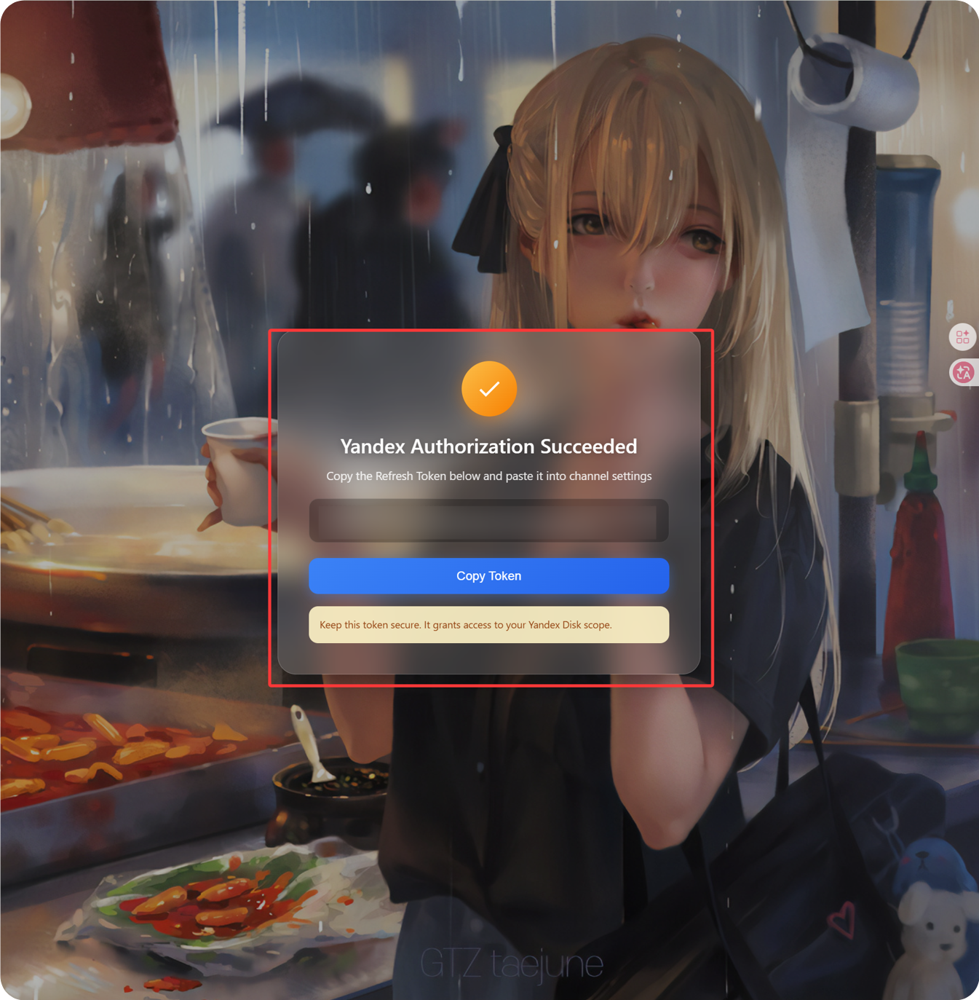

# Añadir un canal Yandex

El canal Yandex usa Yandex Disk como destino de almacenamiento.

## Qué preparar

| Requisito | Uso |
| --- | --- |
| Cuenta de Yandex | Autorizar Yandex Disk |
| Yandex OAuth App | Obtener Client ID y Client Secret |
| Dominio ImgBed | Configurar callback OAuth |
| Yandex Disk | Guardar los archivos |

## Crear Yandex OAuth App

Abre:

```text
https://oauth.yandex.com/client/new
```

Si pide inicio de sesión, entra con la cuenta de Yandex que vas a usar como almacenamiento.

Crea una aplicación y ponle un nombre reconocible:

```text
imgbed-yandex
```

En callback URL, introduce:

```text
https://tu-dominio/api/oauth/yandex/callback
```

## Permisos

ImgBed usa estos permisos de `Yandex.Disk REST API`:

| Permiso | Uso |
| --- | --- |
| `cloud_api:disk.app_folder` | Guardar archivos en la carpeta de la app |
| `cloud_api:disk.read` | Leer archivos y enlaces de descarga |
| `cloud_api:disk.write` | Subir, crear carpetas y borrar |
| `Access to information about Yandex.Disk` | Leer capacidad y uso |

Los permisos de nombre o correo dentro de `Yandex ID API` son opcionales. Las funciones principales dependen de los permisos de Disk.



## Copiar Client ID y Secret

Tras crear la aplicación, copia:

| Campo Yandex | Campo ImgBed |
| --- | --- |
| `Client ID` | `Client ID` |
| `Client Secret` | `Client Secret` |



## Rellenar en ImgBed

En Configuración de subida, elige `Yandex`.

| Campo | Valor |
| --- | --- |
| Nombre del canal | Por ejemplo `Yandex Main` |
| Client ID | Client ID de la app |
| Client Secret | Client Secret de la app |
| Refresh Token | Déjalo vacío al principio |
| Directorio raíz | Opcional, normalmente `imgbed` |



## Obtener Refresh Token

1. En ImgBed, pulsa `Obtener Token`.
2. Inicia sesión con la cuenta de Yandex de destino.
3. Acepta los permisos.
4. Copia el `Refresh Token` mostrado en la página de callback.
5. Pégalo en ImgBed.



## Flujo rápido

```text
Abrir Yandex OAuth Console
-> Crear App
-> Configurar https://tu-dominio/api/oauth/yandex/callback
-> Confirmar permisos Disk
-> Copiar Client ID / Client Secret
-> Rellenar en ImgBed
-> Obtener Token
-> Pegar Refresh Token y guardar
```

## Referencias

1. Registrar app Yandex: https://yandex.com/dev/id/doc/en/register-client
2. Código de autorización por URL: https://yandex.com/dev/id/doc/en/codes/code-url
3. API de token OAuth: https://yandex.com/dev/id/doc/en/tokens/token
