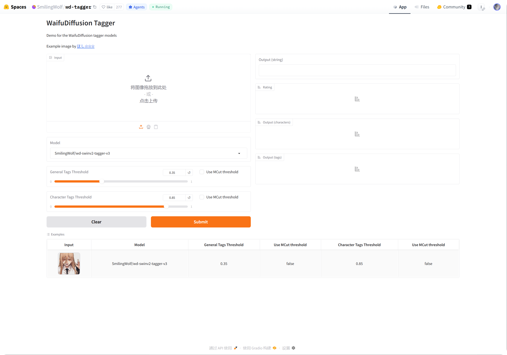

# Auto Tagging

Auto tagging از این مسیر configure می‌شود:

```text
System Settings -> Other Settings -> Auto Tagging
```

این قابلیت image tags را به‌صورت خودکار می‌سازد. این tags برای search، random image filtering، public gallery filtering و age-rating access control مفید هستند.

## Auto Tagging چه کارهایی می‌تواند انجام دهد

| Feature | Description |
| --- | --- |
| ساخت content tags | tags مربوط به people، scenes، objects، art style و content visual مشابه را اضافه می‌کند. |
| ساخت character tags | برای anime images و illustrations کاربرد دارد. |
| افزودن orientation tags | `landscape`، `portrait` یا `square` را اضافه می‌کند. |
| افزودن image rating | نتایج rating به‌شکل `G/S/Q/E` را برای general، sensitive، questionable یا explicit content ذخیره می‌کند. |
| auto-tag هنگام upload | images تازه upload شده خودکار وارد tagging flow می‌شوند. |
| Batch tagging | به images قدیمی در همه folders یا selected folders tags اضافه می‌کند. |

## ابتدا چه چیزی لازم است

حداقل یک Hugging Face Space URL قابل دسترس آماده کنید.

روش پیشنهادی این است که Space مربوط به `wd-tagger` از SmilingWolf را داخل Hugging Face account خودتان duplicate کنید:

```text
https://huggingface.co/spaces/SmilingWolf/wd-tagger
```

می‌توانید موقتاً از public Space استفاده کنید، اما public Spaces بین کاربران زیادی مشترک هستند و ممکن است queue، کندی یا unavailable شدن داشته باشند. duplicated Space داخل account خودتان برای auto tagging طولانی‌مدت پایدارتر است.

## Duplicate کردن Space SmilingWolf

1. وارد Hugging Face شوید.
2. `https://huggingface.co/spaces/SmilingWolf/wd-tagger` را باز کنید.



3. از گوشه بالا سمت راست منوی سه‌نقطه را بزنید.
4. `Duplicate this Space` را انتخاب کنید.
5. نام پیش‌فرض Space را نگه دارید یا نام دلخواه بدهید، مثل `wd-tagger`.
6. visibility را `Public` بگذارید. Public Spaces برای call شدن توسط ImgBed ساده‌تر هستند.
7. برای شروع، default free hardware را نگه دارید. فقط وقتی queue واضحاً مشکل‌ساز شد upgrade کنید.
8. Space را create کنید و منتظر بمانید build تمام شود.

پس از پایان build، صفحه Space خودتان را باز کنید. URL معمولاً شبیه این است:

```text
https://huggingface.co/spaces/your-name/wd-tagger
```

URL مرورگر را copy کنید و در `Space URLs` داخل ImgBed paste کنید.

## وارد کردن چند Space URL

در هر line یک Space URL وارد کنید.

نمونه‌ها:

| Value | Description |
| --- | --- |
| `https://huggingface.co/spaces/SmilingWolf/wd-tagger` | public Space مربوط به SmilingWolf. مناسب برای تست موقت. |
| `https://huggingface.co/spaces/lintonxue00/wd-tagger` | URL صفحه Space کپی‌شده. |
| `https://huggingface.co/spaces/your-name/wd-tagger` | duplicated Space خودتان. |

می‌توانید چند URL وارد کنید. ImgBed چند Space را با هم استفاده می‌کند و این می‌تواند سرعت را بهتر کند.

اگر یکی از Spaceها موقتاً unavailable باشد، بقیه می‌توانند processing را ادامه دهند.

## Settings

| Option | Recommendation |
| --- | --- |
| `Space URLs` | Space URLs آماده‌شده را وارد کنید. حداقل یکی لازم است. |
| Target folder | برای همه folders خالی بگذارید. فقط وقتی directory خاصی می‌خواهید، folder انتخاب کنید. |
| Recognition model | پیش‌فرض `wd-swinv2-tagger-v3` را نگه دارید. |
| General tag threshold | مقدار پیش‌فرض برای بیشتر images مناسب است. مقدار کمتر tags بیشتری می‌دهد؛ مقدار بیشتر tags کمتری می‌دهد. |
| Character tag threshold | پیش‌فرض محافظه‌کارانه است و کمک می‌کند character tags اشتباه کمتر شود. |
| `MCut` automatic threshold | ابتدا off بگذارید. وقتی می‌خواهید model خودش تعداد tags را تعیین کند، on کنید. |
| Auto-tag on upload | اگر images جدید باید خودکار tag بگیرند، on کنید. |
| Start tagging | batch-tagging دستی برای images قدیمی. |

## مقادیر شروع پیشنهادی

| Option | Recommended Value |
| --- | --- |
| Recognition model | `wd-swinv2-tagger-v3` |
| General tag threshold | `0.35` |
| Character tag threshold | `0.85` |
| `MCut` | ابتدا Off |
| Auto-tag on upload | در صورت نیاز Enable |

اگر tags خیلی زیاد است، general threshold را کمی بالا ببرید.

اگر tags خیلی کم است، general threshold را کمی پایین بیاورید.

## Batch Tagging

1. `Space URLs` را پر کنید.
2. target folder انتخاب کنید.
3. start tagging را بزنید.
4. منتظر بمانید progress تمام شود.

اگر target folder خالی باشد، ImgBed همه folders را process می‌کند.

Batch tagging برای images قدیمی بهتر است. برای images جدید، auto-tag on upload را enable کنید تا هر بار manual اجرا نکنید.

## Auto-Tag هنگام Upload

پس از enable شدن auto-tag on upload، images تازه upload شده خودکار `Space URLs` configured را call می‌کنند.

این حالت برای استفاده طولانی‌مدت مناسب است.

اگر Space در queue باشد، upload می‌تواند اول finish شود و tagging بعداً ادامه پیدا کند.

## کدام Images پردازش می‌شوند

Auto tagging عمدتاً image files را process می‌کند.

images که tags، orientation، rating، width و height کامل دارند، skip می‌شوند تا Space calls غیرضروری انجام نشود.

ImgBed تا حد ممکن فقط اطلاعات missing را پر می‌کند. مثلاً اگر فقط orientation missing باشد، سعی می‌کند بدون call کردن full content tag flow، orientation را اضافه کند.

## FAQ

### چرا Space خودم را Duplicate کنم؟

Public Spaces بین کاربران زیادی مشترک هستند. duplicated Space شما معمولاً فقط توسط ImgBed site شما استفاده می‌شود، بنابراین اغلب سریع‌تر و قابل‌اعتمادتر است.

### Space مدام Starting Up می‌شود

بعد از اولین creation یا پس از idle طولانی، Space ممکن است برای start شدن زمان لازم داشته باشد.

اول صفحه Space خودتان را باز کنید. وقتی توانست image را عادی recognize کند، به ImgBed برگردید و tagging را شروع کنید.

### Space URL را چطور Copy کنم؟

صفحه Hugging Face Space خود را باز کنید و address مرورگر را copy کنید.

نمونه‌ها:

```text
https://huggingface.co/spaces/lintonxue00/wd-tagger
https://huggingface.co/spaces/SmilingWolf/wd-tagger
```

### می‌توانم چند Space اضافه کنم؟

بله. در هر line یک Space URL وارد کنید.

چند Space با هم images را process می‌کنند و وقتی images زیاد دارید مفید است.

### چرا Tags انگلیسی هستند؟

مدل‌های SmilingWolf خروجی tags را انگلیسی می‌دهند. این مورد طبیعی است.

tags بیشتر برای search، filtering، random image API و public gallery filters استفاده می‌شوند.

### Rating Tags برای چیست؟

rating results همراه access mode در Security Settings کار می‌کنند.

مثلاً وقتی visitor access بر اساس age rating محدود باشد، public browsing و random image features طبق همان rules images را filter می‌کنند.

## Quick Flow

```text
وارد Hugging Face شوید
-> SmilingWolf/wd-tagger را باز کنید
-> Duplicate this Space
-> منتظر build شدن Space بمانید
-> Space URL خودتان را copy کنید
-> Space URLs را در ImgBed وارد کنید
-> model و thresholds را انتخاب کنید
-> Start tagging یا auto-tag on upload را enable کنید
```
