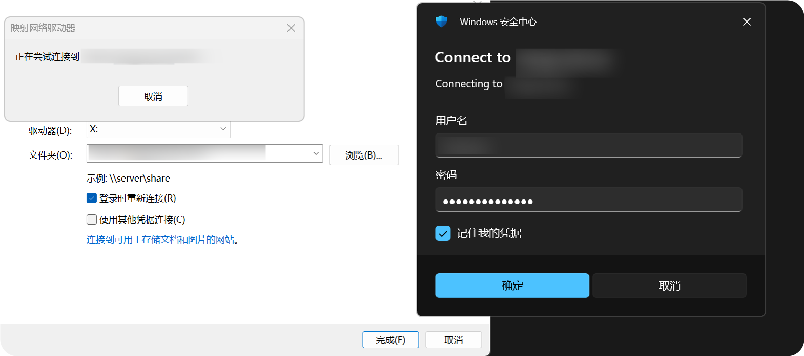
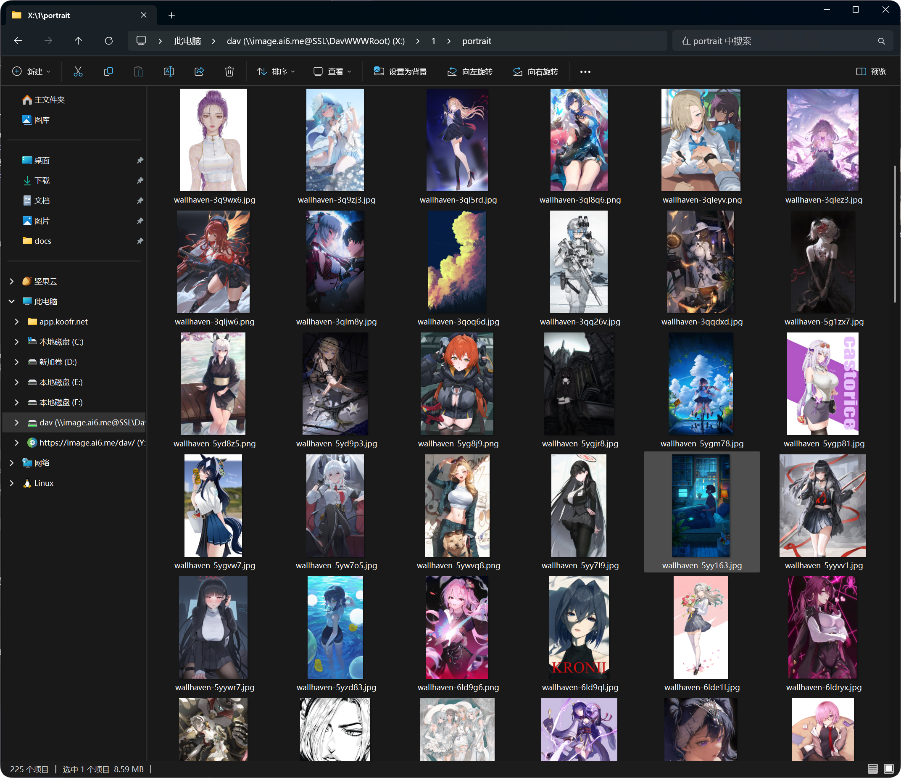

# Configuration et accès WebDAV

ImgBed peut exposer un accès WebDAV pour consulter les fichiers depuis l’explorateur du système ou un client compatible.

## Quand l’utiliser

- Vous souhaitez consulter les fichiers depuis Windows ou macOS.
- Vous utilisez un client WebDAV pour organiser des fichiers.
- Vous devez accéder aux fichiers hors du panneau d’administration.

## Connexion depuis Windows 11

1. Ouvrez l’Explorateur de fichiers.
2. Faites un clic droit sur `Ce PC`.
3. Choisissez `Ajouter un emplacement réseau`.
4. Saisissez l’URL WebDAV.
5. Entrez l’utilisateur et le mot de passe.
6. Vérifiez que le contenu s’ouvre comme un dossier.

Si la connexion est correcte, le contenu apparaît dans l’Explorateur.

## Identifiants

Utilisez les identifiants WebDAV configurés dans ImgBed. Pour plus de sécurité, préférez un compte aux droits limités plutôt qu’un compte principal partagé.

## En cas d’échec de connexion

| Point | À vérifier |
| --- | --- |
| URL | Elle contient `https://` et correspond à la bonne adresse WebDAV |
| Identifiants | Utilisateur et mot de passe corrects |
| Permissions | Lecture et écriture autorisées dans le dossier cible |
| Client | Windows ou le client WebDAV ne bloque pas la connexion |

Si seule la consultation de capacité échoue alors que les uploads fonctionnent, le serveur WebDAV peut simplement ne pas fournir d’information de quota.
