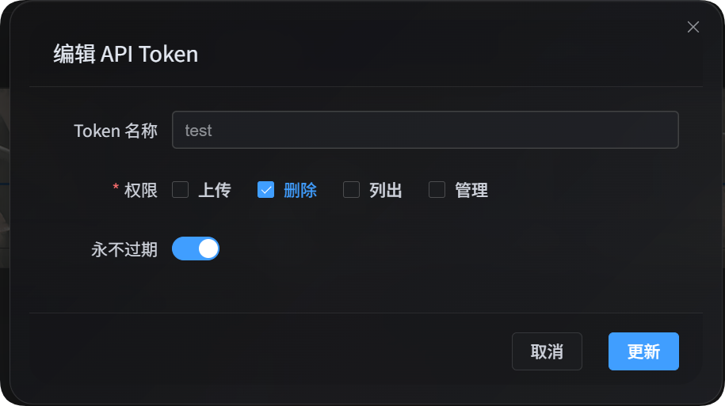

# API Token से फ़ाइल हटाना

API Token से फ़ाइल हटाना स्क्रिप्ट, स्वचालन कार्यों और बाहरी प्रोग्रामों के लिए उपयुक्त है। प्रशासन पैनल खोलने की ज़रूरत नहीं होती; साइट का पता, API Token और स्पष्ट फ़ाइल ID देने पर ImgBed से एक या कई फ़ाइलें हटाई जा सकती हैं।

हटाना एक लिखने वाली क्रिया है, इसलिए कमांड चलने के बाद डेटा सचमुच हट जाएगा। पहले `imgbed-token-list.mjs` से यह पक्का कर लें कि किन `fileId` को हटाना है, फिर वे ID हटाने वाली स्क्रिप्ट को दें।



## तैयारी

प्रशासन पैनल में खोलें:

```text
System Settings -> Security Settings -> API Token
```

API Token बनाते या संपादित करते समय पक्का करें कि इस Token में हटाने की अनुमति है। इस स्क्रिप्ट को केवल `delete` अनुमति चाहिए।

API Token को परिवेश चर में भी रखा जा सकता है:

```powershell
$env:IMGBED_API_TOKEN="your API Token"
```

## स्क्रिप्ट डाउनलोड करें

| स्क्रिप्ट | उपयोग |
| --- | --- |
| <a href="/tools/imgbed-token-delete.mjs" download>फ़ाइल हटाने वाली स्क्रिप्ट</a> | स्पष्ट रूप से दी गई एक या कई फ़ाइल ID हटाती है |

स्क्रिप्ट चलाने के लिए स्थानीय मशीन पर Node.js 18 या उससे नया संस्करण चाहिए।

## हटाने वाले API का व्यवहार

हटाने वाली स्क्रिप्ट सर्वर के हटाने वाले इंटरफ़ेस को बुलाती है:

```text
POST /api/manage/delete/batch
```

अनुरोध में API Token होना चाहिए:

```text
Authorization: Bearer <token>
```

अनुरोध बॉडी का उदाहरण:

```json
{
  "fileIds": ["photos/2026/a.txt"],
  "deleteStrictness": "strict"
}
```

अगर `fileIds` में केवल एक फ़ाइल है, तो यह एकल फ़ाइल हटाना है। अगर कई फ़ाइलें हैं, तो यह बैच हटाना है। सर्वर एक अनुरोध में अधिकतम 15 फ़ाइलें संभालता है, और स्क्रिप्ट `--batch-size` के अनुसार काम को अपने आप कई अनुरोधों में बाँट देती है।

इंटरफ़ेस NDJSON प्रगति स्ट्रीम लौटाता है। सामान्य घटनाओं में `batch_start`, `file_step`, `file_done`, `batch_complete` और `batch_error` शामिल हैं। स्क्रिप्ट इन घटनाओं को पढ़कर उन्हें पढ़ने योग्य परिणाम या JSON परिणाम में संक्षेपित करती है।

हटाना सफल होने के बाद सर्वर फ़ाइल अनुक्रमणिका, फ़ोल्डर आँकड़े, क्षमता आँकड़े और कैश सफ़ाई अपने आप संभालता है।

## हटाने वाली स्क्रिप्ट के पैरामीटर

| पैरामीटर | आवश्यक | विवरण |
| --- | --- | --- |
| `--base-url <url>` | हाँ | ImgBed साइट का पता, जैसे `https://image.ai6.me` |
| `--token <token>` | हाँ | API Token; `IMGBED_API_TOKEN` परिवेश चर भी उपयोग कर सकते हैं |
| `--file-id <id>` | हाँ | हटाई जाने वाली फ़ाइल ID; इसे कई बार दिया जा सकता है |
| `--strictness <strict\|soft>` | नहीं | हटाने की कठोरता; डिफ़ॉल्ट `strict` |
| `--batch-size <n>` | नहीं | हर अनुरोध में हटाई जाने वाली फ़ाइलों की संख्या; डिफ़ॉल्ट `15`, अधिकतम `15` |
| `--retries <n>` | नहीं | अस्थायी त्रुटि पर दोबारा प्रयासों की संख्या; डिफ़ॉल्ट `3` |
| `--timeout-ms <n>` | नहीं | एक अनुरोध की समयसीमा; डिफ़ॉल्ट `180000` |
| `--output <pretty\|json>` | नहीं | आउटपुट का रूप; डिफ़ॉल्ट `pretty` |
| `--save-response <path>` | नहीं | अंतिम परिणाम JSON फ़ाइल में सहेजता है |
| `-h` / `--help` | नहीं | स्क्रिप्ट की सहायता दिखाता है |

यह स्क्रिप्ट केवल वही `--file-id` मान हटाती है जिन्हें आपने स्पष्ट रूप से दिया है। यह धुँधली मिलान खोज नहीं करती, किसी फ़ोल्डर को एक साथ खाली नहीं करती, और कॉमा से अलग सूची या स्थानीय फ़ाइल से हटाने वाली ID नहीं पढ़ती।

## कठोर हटाना और नरम हटाना

| मोड | विवरण |
| --- | --- |
| `strict` | डिफ़ॉल्ट मोड। दूरस्थ भंडारण से हटाना विफल होने पर ImgBed रिकॉर्ड बचा रहता है, ताकि बाद में फिर कोशिश या जाँच की जा सके |
| `soft` | दूरस्थ भंडारण से हटाना विफल होने पर भी ImgBed रिकॉर्ड साफ़ कर दिया जाता है, और परिणाम में चेतावनी लौटती है |

अगर आप चाहते हैं कि “दूरस्थ फ़ाइल हटे तभी सफलता मानी जाए”, तो डिफ़ॉल्ट `strict` उपयोग करें। अगर किसी दूरस्थ प्लेटफ़ॉर्म पर अब हटाना संभव नहीं है और आप केवल ImgBed रिकॉर्ड साफ़ करना चाहते हैं, तो `soft` उपयोग करें।

## उपयोग के उदाहरण

एक फ़ाइल हटाना:

```powershell
node imgbed-token-delete.mjs `
  --base-url "https://your-domain" `
  --token "your API Token" `
  --file-id "photos/2026/a.txt"
```

परिवेश चर से API Token उपयोग करना:

```powershell
$env:IMGBED_API_TOKEN="your API Token"

node imgbed-token-delete.mjs `
  --base-url "https://your-domain" `
  --file-id "photos/2026/a.txt"
```

कई फ़ाइलें हटाना:

```powershell
node imgbed-token-delete.mjs `
  --base-url "https://your-domain" `
  --file-id "photos/2026/a.txt" `
  --file-id "photos/2026/b.txt" `
  --file-id "photos/2026/c.txt"
```

दूरस्थ भंडारण से हटाना विफल होने पर भी ImgBed रिकॉर्ड साफ़ करना:

```powershell
node imgbed-token-delete.mjs `
  --base-url "https://your-domain" `
  --file-id "photos/2026/a.txt" `
  --strictness soft
```

JSON आउटपुट देकर परिणाम सहेजना:

```powershell
node imgbed-token-delete.mjs `
  --base-url "https://your-domain" `
  --file-id "photos/2026/a.txt" `
  --output json `
  --save-response ".\delete-result.json"
```

हर अनुरोध को 5 फ़ाइलों तक सीमित करना:

```powershell
node imgbed-token-delete.mjs `
  --base-url "https://your-domain" `
  --file-id "photos/2026/a.txt" `
  --file-id "photos/2026/b.txt" `
  --batch-size 5
```

## हटाने से पहले `fileId` जाँचें

हटाने वाली स्क्रिप्ट को ImgBed फ़ाइल ID चाहिए। पहले सूची वाली स्क्रिप्ट से किसी फ़ोल्डर की फ़ाइलें देखी जा सकती हैं:

```powershell
node imgbed-token-list.mjs `
  --base-url "https://your-domain" `
  --token "your API Token" `
  --files `
  --dir "photos/2026" `
  --count 10 `
  --output json
```

लौटे हुए परिणाम में `name` फ़ील्ड आम तौर पर वही `fileId` होती है जिसे हटाने वाली स्क्रिप्ट को दिया जा सकता है।

## सामान्य प्रश्न

### हटाना विफल हुआ, फिर भी फ़ाइल सूची में क्यों है?

डिफ़ॉल्ट `strict` मोड में, अगर दूरस्थ भंडारण से हटाना विफल होता है, तो ImgBed रिकॉर्ड बचा रहता है। इससे यह स्थिति टलती है कि स्थानीय अनुक्रमणिका तो हट जाए लेकिन दूरस्थ फ़ाइल मौजूद रहे। जब यह पक्का हो जाए कि केवल ImgBed रिकॉर्ड साफ़ करना है, तब उसी `fileId` पर `soft` के साथ दोबारा प्रयास करें।

### परिणाम में चेतावनी क्यों है?

चेतावनी आम तौर पर दूरस्थ भंडारण से हटाने, कैश साफ़ करने या आँकड़ों को पूरा करने में किसी गैर-घातक समस्या को दिखाती है। स्क्रिप्ट चेतावनी को एक जगह संक्षेपित करती है, ताकि आप तय कर सकें कि दोबारा प्रयास करना है या नहीं।

### क्या पूरा फ़ोल्डर एक साथ हटाया जा सकता है?

यह स्क्रिप्ट पूरा फ़ोल्डर खाली करने की सुविधा नहीं देती। पहले सूची वाली स्क्रिप्ट से स्पष्ट `fileId` चुनें, फिर हटाई जाने वाली फ़ाइलों को एक-एक करके हटाने वाली स्क्रिप्ट को दें।


