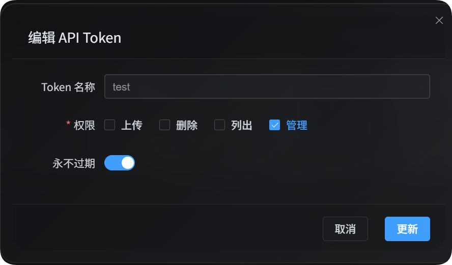

# Mengelola Konfigurasi dengan API Token

Pengelolaan konfigurasi melalui API Token ditujukan untuk skrip otomatis, alat operasional, dan panel kendali eksternal. API Token dengan izin `manage` dapat membaca dan mengubah konfigurasi kanal unggahan, pengaturan keamanan, pengaturan halaman, pengaturan lain, serta sebagian relasi federasi ringan tanpa membuka panel admin.

Izin pengelolaan ini hanya membuka operasi ringan yang cocok untuk skrip. Operasi berat yang memerlukan konfirmasi di peramban, pekerjaan bertahap di antarmuka web, atau pembersihan indeks federasi tetap harus dilakukan dari panel admin di peramban.



## Persiapan

Buka panel admin:

```text
System Settings -> Security Settings -> API Token
```

Saat membuat atau mengedit API Token, aktifkan izin pengelolaan. Izin ini dapat mengubah konfigurasi situs, jadi berikan hanya kepada skrip atau pengguna yang tepercaya.

Semua aksi tulis pada tiga skrip pengelolaan hanya menampilkan pratinjau secara bawaan. Setelah pratinjau diperiksa, tambahkan `--apply` agar perubahan benar-benar disimpan.

API Token juga dapat disimpan dalam variabel lingkungan:

```powershell
$env:IMGBED_API_TOKEN="your API Token"
```

## Mengunduh Skrip Pengelolaan

Dokumentasi ImgBed menyediakan tiga skrip Node.js:

| Skrip | Kegunaan |
| --- | --- |
| <a href="/tools/imgbed-token-upload-settings.mjs" download>Unduh skrip pengelolaan pengaturan unggahan</a> | Mengelola kanal unggahan, subkanal, dan penyeimbangan beban |
| <a href="/tools/imgbed-token-site-settings.mjs" download>Unduh skrip pengelolaan pengaturan situs</a> | Mengelola pengaturan keamanan, pengaturan halaman, dan pengaturan lain |
| <a href="/tools/imgbed-token-federation.mjs" download>Unduh skrip pengelolaan relasi federasi</a> | Mengelola aksi relasi ringan, permintaan bergabung, dan pesan |

Skrip membutuhkan Node.js 18 atau versi yang lebih baru.

### Parameter Umum

| Parameter | Wajib | Keterangan |
| --- | --- | --- |
| `--base-url <url>` | Ya | Alamat situs ImgBed, misalnya `https://image.ai6.me` |
| `--token <token>` | Ya | API Token; dapat diganti dengan variabel lingkungan `IMGBED_API_TOKEN` |
| `--retries <n>` | Tidak | Jumlah percobaan ulang saat gagal sementara; bawaan `3` |
| `--timeout-ms <n>` | Tidak | Batas waktu tiap permintaan dalam milidetik; bawaan `180000` |
| `--output <pretty\|json>` | Tidak | Bentuk keluaran; bawaan `pretty`, gunakan `json` untuk integrasi program |
| `--save-response <path>` | Tidak | Menyimpan hasil akhir sebagai berkas JSON |
| `--apply` | Tidak | Benar-benar menjalankan penulisan; tanpa ini hanya pratinjau |
| `-h` / `--help` | Tidak | Menampilkan bantuan skrip |

## Pengaturan Unggahan

Skrip pengaturan unggahan dapat menampilkan, membaca, membuat, mengedit, dan menghapus subkanal. Skrip ini juga dapat menyalakan atau mematikan penyeimbangan beban pada kanal utama.

```powershell
node imgbed-token-upload-settings.mjs --base-url "https://your-domain" --token "your API Token" --list
```

### Parameter Pengaturan Unggahan

| Parameter | Keterangan |
| --- | --- |
| `--list` | Menampilkan grup pengaturan unggahan |
| `--get` | Membaca kanal utama atau subkanal tertentu di bawahnya |
| `--upsert` | Membuat atau mengedit subkanal; tanpa `--apply` hanya pratinjau |
| `--delete` | Menghapus subkanal; tanpa `--apply` hanya pratinjau |
| `--load-balance <true\|false>` | Menyalakan atau mematikan penyeimbangan beban kanal utama |
| `--channel <key>` | Kanal unggahan utama, misalnya `s3`, `github`, `telegram` |
| `--channel-name <name>` | Nama subkanal atau akun |
| `--set key=value` | Mengatur satu kolom; dapat diulang dan mendukung jalur bertitik |
| `--patch-json <path>` | Menggabungkan beberapa kolom dari berkas JSON |
| `--apply` | Menyimpan perubahan secara nyata |

### Kunci Kanal

| Kunci kanal | Kanal |
| --- | --- |
| `telegram` / `tg` | Telegram |
| `discord` / `dc` | Discord |
| `cfr2` / `r2` | Cloudflare R2 |
| `s3` | S3 |
| `webdav` / `wd` | Kanal penyimpanan WebDAV |
| `github` / `gh` | GitHub Releases |
| `gitlab` / `gl` | GitLab Packages |
| `huggingface` / `hf` | Hugging Face |
| `onedrive` / `od` | OneDrive |
| `googledrive` / `google` / `gd` | Google Drive |
| `dropbox` / `db` | Dropbox |
| `yandex` / `yx` | Yandex Disk |
| `pcloud` / `pd` | pCloud |

### Contoh Pengaturan Unggahan

Menampilkan semua pengaturan unggahan:

```powershell
node imgbed-token-upload-settings.mjs `
  --base-url "https://your-domain" `
  --token "your API Token" `
  --list
```

Membaca konfigurasi kanal S3:

```powershell
node imgbed-token-upload-settings.mjs `
  --base-url "https://your-domain" `
  --token "your API Token" `
  --get `
  --channel s3
```

Membaca subkanal tertentu di bawah S3:

```powershell
node imgbed-token-upload-settings.mjs `
  --base-url "https://your-domain" `
  --token "your API Token" `
  --get `
  --channel s3 `
  --channel-name "backup-s3"
```

Membuat atau mengedit subkanal WebDAV. Jalankan dahulu tanpa `--apply` untuk melihat pratinjau:

```powershell
node imgbed-token-upload-settings.mjs `
  --base-url "https://your-domain" `
  --token "your API Token" `
  --upsert `
  --channel webdav `
  --channel-name "backup-webdav" `
  --set enabled=false `
  --set remark="backup test"
```

Jika pratinjau sudah benar, jalankan lagi dengan `--apply`:

```powershell
node imgbed-token-upload-settings.mjs `
  --base-url "https://your-domain" `
  --token "your API Token" `
  --upsert `
  --channel webdav `
  --channel-name "backup-webdav" `
  --set enabled=false `
  --set remark="backup test" `
  --apply
```

Menghapus subkanal:

```powershell
node imgbed-token-upload-settings.mjs `
  --base-url "https://your-domain" `
  --token "your API Token" `
  --delete `
  --channel webdav `
  --channel-name "backup-webdav" `
  --apply
```

Menyalakan penyeimbangan beban S3:

```powershell
node imgbed-token-upload-settings.mjs `
  --base-url "https://your-domain" `
  --token "your API Token" `
  --load-balance true `
  --channel s3 `
  --apply
```

Untuk perubahan beberapa kolom yang lebih rumit, siapkan berkas JSON lalu gunakan `--patch-json`:

```json
{
  "enabled": true,
  "remark": "primary account"
}
```

```powershell
node imgbed-token-upload-settings.mjs `
  --base-url "https://your-domain" `
  --token "your API Token" `
  --upsert `
  --channel s3 `
  --channel-name "primary-s3" `
  --patch-json ".\s3-channel.json" `
  --apply
```

## Pengaturan Situs Lainnya

Skrip pengaturan situs mengelola tiga area:

| Area | Nilai `--area` | Keterangan |
| --- | --- | --- |
| Keamanan | `security` | Autentikasi pengguna dan admin, perangkat masuk, API Token, moderasi gambar, pembatasan frekuensi pengguna, WebDAV |
| Halaman | `page` | Halaman global, halaman pengguna, halaman admin, dan efek tampilan |
| Lainnya | `others` | API gambar acak, galeri publik, node federasi lokal, penandaan otomatis, geolokasi IP, cadangan, OCR |

Mulailah dengan melihat area, bagian, dan kolom yang dapat diedit:

```powershell
node imgbed-token-site-settings.mjs `
  --base-url "https://your-domain" `
  --token "your API Token" `
  --list-sections
```

### Parameter Pengaturan Situs

| Parameter | Keterangan |
| --- | --- |
| `--list-sections` | Menampilkan area, bagian, dan kolom yang dapat diedit |
| `--get` | Membaca satu bagian konfigurasi |
| `--area <security\|page\|others>` | Memilih area konfigurasi |
| `--section <name>` | Memilih bagian; gunakan nama sesuai keluaran `--list-sections` |
| `--set key=value` | Mengatur satu kolom; dapat diulang |
| `--apply` | Menyimpan perubahan secara nyata |

Pada area `page`, `--set` memakai ID pengaturan halaman, misalnya `starsEffect=true`. Pada area `security` dan `others`, gunakan nama kolom di dalam bagian, misalnya `email=admin@example.com`.

### Contoh Pengaturan Situs

Membaca pengaturan pemberitahuan pembaruan sistem:

```powershell
node imgbed-token-site-settings.mjs `
  --base-url "https://your-domain" `
  --token "your API Token" `
  --get `
  --area security `
  --section systemUpdate
```

Mengubah email pemberitahuan pembaruan. Jalankan dahulu tanpa `--apply`:

```powershell
node imgbed-token-site-settings.mjs `
  --base-url "https://your-domain" `
  --token "your API Token" `
  --area security `
  --section systemUpdate `
  --set email="admin@example.com"
```

Lalu simpan dengan `--apply`:

```powershell
node imgbed-token-site-settings.mjs `
  --base-url "https://your-domain" `
  --token "your API Token" `
  --area security `
  --section systemUpdate `
  --set email="admin@example.com" `
  --apply
```

Mengubah efek bintang di halaman admin:

```powershell
node imgbed-token-site-settings.mjs `
  --base-url "https://your-domain" `
  --token "your API Token" `
  --area page `
  --section adminSettings `
  --set starsEffect=true `
  --apply
```

Mengubah bahasa geolokasi IP:

```powershell
node imgbed-token-site-settings.mjs `
  --base-url "https://your-domain" `
  --token "your API Token" `
  --area others `
  --section ipGeolocation `
  --set language="en" `
  --apply
```

Kolom biasa pada node federasi lokal, seperti status aktif, folder sinkronisasi, dan kode undangan, dapat dibaca atau diubah. Konfirmasi domain tidak dilakukan melalui API Token. Jika panel admin memberi tahu bahwa domain node lokal berbeda dari domain akses saat ini, selesaikan konfirmasi di peramban.

## Relasi Federasi

Skrip federasi mengelola status node lokal, node yang Anda ikuti, node yang mengikuti node Anda, pesan, permintaan bergabung, pengajuan ulang saat tidak ada relasi, penerimaan, penolakan, dan aksi relasi ringan yang tidak memerlukan pembersihan indeks.

Penerbitan indeks, penarikan indeks, penghapusan indeks secara bertahap, dan konfirmasi perubahan domain bergantung pada alur lengkap di peramban. Skrip tidak menangani operasi berat tersebut.

### Batas Aksi Ringan dan Berat

| Operasi | Dukungan skrip | Keterangan |
| --- | --- | --- |
| Melihat status node lokal dan daftar relasi | Didukung | Hanya membaca buku relasi |
| Membaca dan mengirim pesan | Didukung | Membaca atau menulis pesan relasi |
| Mengajukan bergabung ke node lain | Didukung | Menggunakan tautan undangan |
| Mengajukan ulang pada catatan tanpa relasi | Didukung | Hanya untuk kartu `outgoing` dengan `lastResult=none`; memerlukan kode undangan 6 karakter |
| Membatalkan permintaan `outgoing` yang menunggu | Didukung | Hanya membatalkan permintaan yang masih menunggu |
| Menerima atau menolak permintaan `incoming` | Didukung | Memproses permintaan yang masuk ke node Anda |
| Menghapus relasi `incoming` yang sudah diterima | Didukung | Mengubah buku relasi masuk dan memberi tahu pihak lain |
| Menghapus catatan akhir `incoming` | Didukung | Menghapus catatan masuk yang sudah berstatus akhir |
| Membatalkan langganan `outgoing` yang sudah diterima | Hanya peramban | Mungkin memerlukan pembersihan indeks federasi lokal |
| Menghapus catatan akhir `outgoing` | Hanya peramban | Mungkin perlu membersihkan indeks terlebih dahulu |
| Mengonfirmasi atau membatalkan perubahan domain | Hanya peramban | Memerlukan konfirmasi domain saat ini dan penanganan relasi indeks |
| Menerbitkan, menarik, atau menghapus indeks secara bertahap | Hanya peramban | Merupakan pekerjaan bertahap di antarmuka web |

### Parameter Relasi Federasi

| Parameter | Keterangan |
| --- | --- |
| `--status` | Menampilkan status node federasi lokal serta relasi `outgoing` dan `incoming` |
| `--list` | Menampilkan daftar relasi federasi |
| `--chat` | Membaca pesan tersimpan dari satu relasi |
| `--send-message` | Mengirim pesan ke node yang sudah memiliki relasi |
| `--join` | Mengajukan bergabung ke node lain melalui tautan undangan |
| `--reapply` | Mengajukan ulang untuk relasi tanpa catatan; memerlukan kode 6 karakter |
| `--accept` | Menerima permintaan `incoming` |
| `--deny` | Menolak permintaan `incoming` |
| `--cancel` | Membatalkan permintaan `outgoing` yang menunggu atau menghapus relasi `incoming` yang diterima |
| `--delete` | Menghapus catatan akhir `incoming` |
| `--direction <outgoing\|incoming\|all>` | Arah relasi; `outgoing` adalah node yang Anda ikuti, `incoming` adalah node yang mengikuti node Anda |
| `--domain <url>` | Domain node relasi |
| `--invite-link <url>` | Tautan undangan dari node lain |
| `--invite-code <code>` | Kode undangan 6 karakter untuk pengajuan ulang |
| `--text <message>` | Isi pesan |
| `--apply` | Menyimpan perubahan secara nyata |

### Contoh Relasi Federasi

Melihat status node lokal dan kedua daftar relasi:

```powershell
node imgbed-token-federation.mjs `
  --base-url "https://your-domain" `
  --token "your API Token" `
  --status
```

Hanya menampilkan node yang Anda ikuti:

```powershell
node imgbed-token-federation.mjs `
  --base-url "https://your-domain" `
  --token "your API Token" `
  --list `
  --direction outgoing
```

Hanya menampilkan node yang mengikuti node Anda:

```powershell
node imgbed-token-federation.mjs `
  --base-url "https://your-domain" `
  --token "your API Token" `
  --list `
  --direction incoming
```

Mengajukan bergabung melalui tautan undangan. Jalankan dahulu tanpa `--apply`:

```powershell
node imgbed-token-federation.mjs `
  --base-url "https://your-domain" `
  --token "your API Token" `
  --join `
  --invite-link "https://peer-domain/federation/invite/abcdef"
```

Setelah diperiksa, simpan:

```powershell
node imgbed-token-federation.mjs `
  --base-url "https://your-domain" `
  --token "your API Token" `
  --join `
  --invite-link "https://peer-domain/federation/invite/abcdef" `
  --apply
```

Mengajukan ulang untuk catatan tanpa relasi:

```powershell
node imgbed-token-federation.mjs `
  --base-url "https://your-domain" `
  --token "your API Token" `
  --reapply `
  --domain "https://peer-domain" `
  --invite-code "abc123" `
  --apply
```

Menerima permintaan `incoming`:

```powershell
node imgbed-token-federation.mjs `
  --base-url "https://your-domain" `
  --token "your API Token" `
  --accept `
  --domain "https://peer-domain" `
  --apply
```

Menolak permintaan `incoming`:

```powershell
node imgbed-token-federation.mjs `
  --base-url "https://your-domain" `
  --token "your API Token" `
  --deny `
  --domain "https://peer-domain" `
  --apply
```

Mengirim pesan ke relasi yang sudah terbentuk:

```powershell
node imgbed-token-federation.mjs `
  --base-url "https://your-domain" `
  --token "your API Token" `
  --send-message `
  --direction outgoing `
  --domain "https://peer-domain" `
  --text "Hello, this is a test message." `
  --apply
```

Membatalkan permintaan `outgoing` yang menunggu:

```powershell
node imgbed-token-federation.mjs `
  --base-url "https://your-domain" `
  --token "your API Token" `
  --cancel `
  --direction outgoing `
  --domain "https://peer-domain" `
  --apply
```

Menghapus relasi `incoming` yang sudah diterima:

```powershell
node imgbed-token-federation.mjs `
  --base-url "https://your-domain" `
  --token "your API Token" `
  --cancel `
  --direction incoming `
  --domain "https://peer-domain" `
  --apply
```

Menghapus catatan akhir `incoming`:

```powershell
node imgbed-token-federation.mjs `
  --base-url "https://your-domain" `
  --token "your API Token" `
  --delete `
  --direction incoming `
  --domain "https://peer-domain" `
  --apply
```

Membatalkan langganan `outgoing` yang sudah diterima dan menghapus catatan `outgoing` harus dilakukan dari panel admin di peramban, karena mungkin perlu membersihkan indeks federasi lokal terlebih dahulu.

### Domain Tidak Cocok

Jika domain yang tersimpan pada node lokal berbeda dari domain yang menunggu di relasi, skrip langsung mengembalikan galat dan menampilkan `currentDomain` serta `pendingDomain`. Kondisi ini harus diselesaikan di panel admin peramban, karena perubahan domain juga berkaitan dengan pembersihan dan konfirmasi indeks keluar.

Jika permintaan bergabung mengembalikan `FEDERATION_NODE_DOMAIN_MISMATCH`, berarti domain pada tautan undangan tidak cocok dengan domain yang tersimpan di node tujuan. Respons berisi `currentOrigin` dan `detectedOrigin`. Gunakan domain yang sudah dikonfirmasi pihak lain, atau minta mereka mengonfirmasi domain melalui panel admin di peramban.

## Tanya Jawab

### Perintah perubahan dijalankan tetapi tidak berlaku

Perintah tulis hanya menampilkan pratinjau secara bawaan. Setelah pratinjau diperiksa, tambahkan `--apply`.

### Bagaimana mengetahui kolom yang dapat diubah

Untuk pengaturan unggahan, jalankan `--get` terlebih dahulu dan lihat struktur subkanal yang ada. Untuk keamanan, halaman, dan pengaturan lain, jalankan `--list-sections` untuk melihat area, bagian, dan kolom yang diizinkan.

### Hasil ingin dipakai oleh program lain

Gunakan `--output json` atau `--save-response result.json`. Program dapat membaca berkas JSON yang tersimpan secara langsung.


