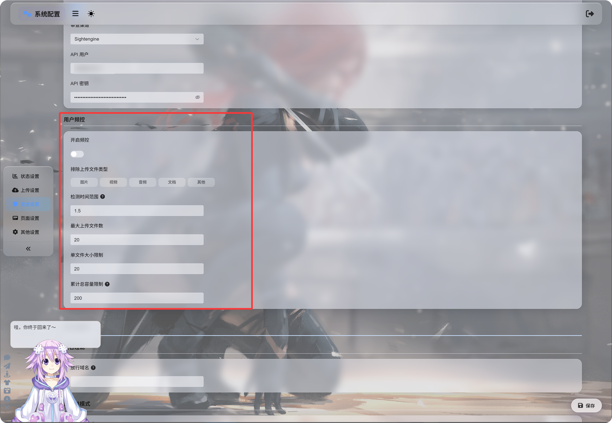

# ユーザーレート制限

ユーザーレート制限は、通常ユーザーまたは訪問者がホームページからファイルをアップロードできる頻度を制御します。公開アップロードページの悪用を防ぐために役立ちます。

この機能はホームページからのアップロードにのみ影響します。管理者アップロードと API Tokens を使ったアップロードは、ユーザーレート制限の対象外です。

## 設定場所

管理パネルを開き、次の場所へ移動します。

```text
System Settings -> Security Settings -> Upload Management -> User Rate Limits
```



## レート制限を有効化する

`レート制限を有効化` をオンにすると、ImgBed はアップロード元 IP アドレスに基づいて最近のアップロードを追跡します。

既定値:

| 設定 | 既定値 | 説明 |
| --- | --- | --- |
| 検出ウィンドウ | 1.5 時間 | アップロード記録をどこまでさかのぼって数えるか。 |
| 最大ファイル数 | 20 | 検出ウィンドウ内で許可される最大ファイル数。 |
| 単一ファイルサイズ上限 | 20 MB | 1 ファイルの最大サイズ。 |
| 合計アップロードサイズ上限 | 200 MB | 検出ウィンドウ内の合計アップロードサイズ上限。 |

たとえば、1.5 時間のウィンドウ、20 ファイル、1 ファイルあたり 20 MB、合計 200 MB の場合、同じ IP からのアップロードはいずれかの設定済み上限を超えた時点でブロックされます。

## ファイル種類を除外する

`除外するアップロードファイル種類` は、通常ユーザーまたは訪問者が選択されたファイルカテゴリをアップロードできないようにします。

利用できるカテゴリ:

| 種類 | 説明 |
| --- | --- |
| 画像 | jpg, png, webp, gif などの画像ファイル |
| 動画 | mp4, webm, mov などの動画ファイル |
| 音声 | mp3, flac, wav などの音声ファイル |
| ドキュメント | pdf, txt, md, docx などのドキュメントファイル |
| その他 | 上記以外のファイル。例: zip, rar, exe, apk |

既定ではどの種類も選択されていません。つまり、すべて許可されています。

種類をクリックして強調表示されると、その種類はブロックされます。

`その他` を選択すると、zip や rar ファイルをアップロードする訪問者はブロックされ、このファイル種類はサポートされていないと通知されます。

## ブロックメッセージ

制限に達すると、ユーザーには状況に応じたメッセージが表示されます。


| シナリオ | メッセージの意味 |
| --- | --- |
| 単一ファイルが大きすぎる | ファイルが大きすぎるため、アップロード前に圧縮する必要があります。 |
| ファイル種類がブロックされている | このファイル種類はサポートされていません。そのファイルを削除して再試行してください。 |
| アップロード頻度が高すぎる | 最近のアップロードが多すぎます。再試行できる時間が表示されます。 |
| 合計サイズが大きすぎる | 最近の合計アップロードサイズが大きすぎます。再試行できる時間が表示されます。 |

## 有効化すべき場合

ホームページのアップロードが公開アクセス可能な場合は、ユーザーレート制限を有効にしてください。

一般的な理由:

- スクリプトによる一括アップロードを懸念している。
- 訪問者による大きなアップロードを制限したい。
- 通常ユーザーには画像だけをアップロードさせ、アーカイブやインストーラーは避けたい。
- リソース使用量を制御しながら公開アップロードを利用可能にしておきたい。

サイトを自分だけで使う場合、または管理者だけがアップロードできる場合は、無効のままで構いません。
