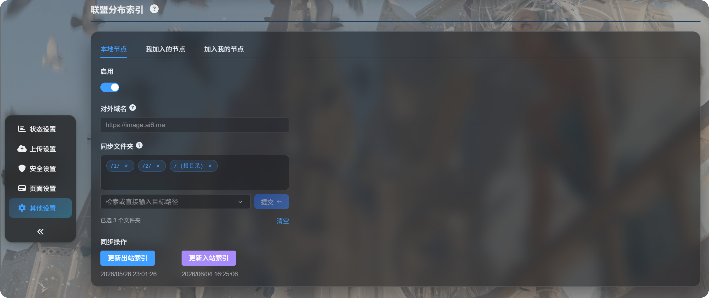
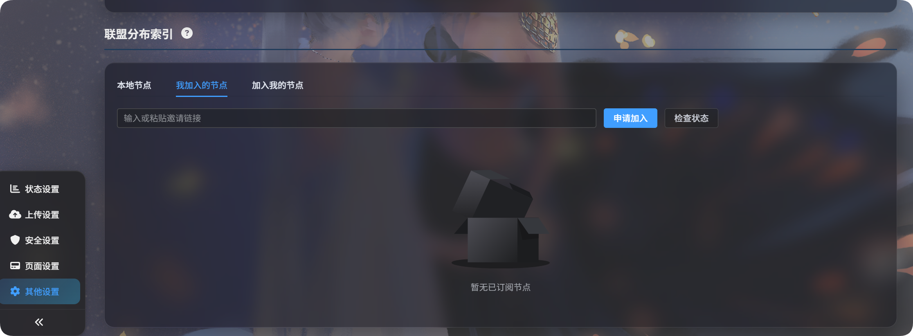
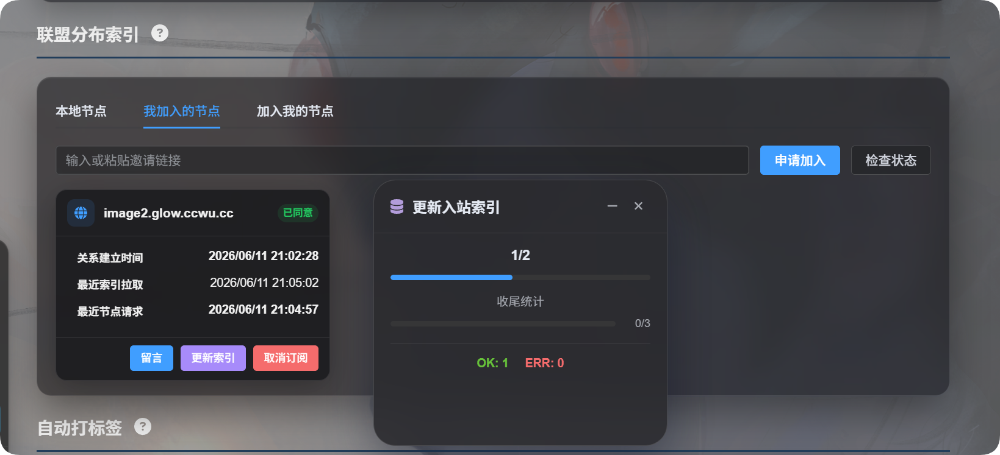
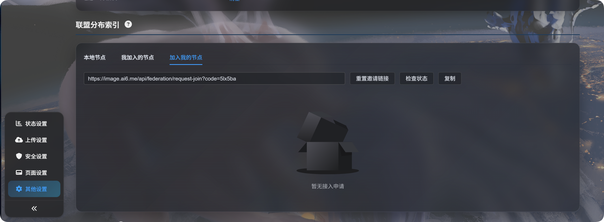
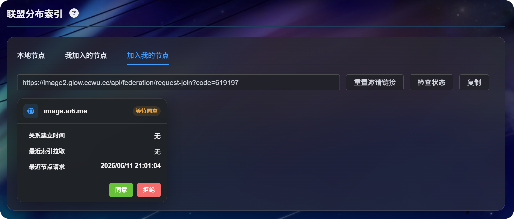
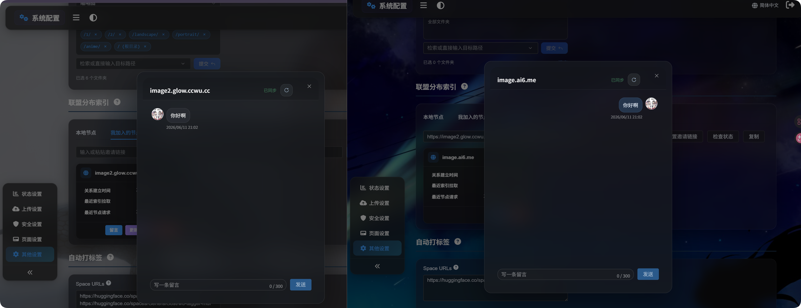
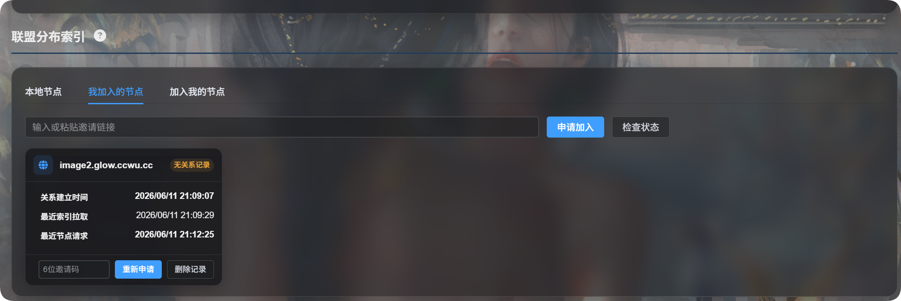

# ဖက်ဒရေးရှင်း ဖြန့်ဝေညွှန်းကိန်း

ဖက်ဒရေးရှင်း ဖြန့်ဝေညွှန်းကိန်းသည် ImgBed ဆိုက်များစွာအကြား ဖိုင်စာရင်းများကို အပြန်အလှန် မျှဝေနိုင်စေသည်။

ရိုးရှင်းစွာဆိုရလျှင်:

- သင့်ဆိုက်မှ ရွေးထားသောဖိုင်တွဲများကို အခြားသူများနှင့် မျှဝေနိုင်သည်။
- အခြားနိုဒ်တစ်ခုသို့ ဝင်ရောက်ချိတ်ဆက်ပြီး ထိုနိုဒ်က မျှဝေထားသောဖိုင်စာရင်းကို သင့်စီမံခန့်ခွဲရေးပန်နယ်ထဲသို့ ထပ်တူပြုနိုင်သည်။
- ဖက်ဒရေးရှင်းဖိုင်များကို အဓိကအားဖြင့် ကြည့်ရှုခြင်း၊ ရှာဖွေခြင်းနှင့် လင့်ခ်ဖွင့်ခြင်းအတွက် အသုံးပြုသည်။ ၎င်းတို့ကို သင့်ကိုယ်ပိုင်သိုလှောင်ရာထဲသို့ ပြန်လည်အပ်လုဒ်မတင်ပါ။

## မည်သည့်နေရာတွင် သတ်မှတ်ရမည်နည်း

ဖွင့်ပါ:

```text
System Settings -> Other Settings -> Federated Distributed Index
```



ဤစာမျက်နှာတွင် တက်ဘ်သုံးခုရှိသည်။

| တက်ဘ် | ရည်ရွယ်ချက် |
| --- | --- |
| ဒေသတွင်းနိုဒ် | သင့်နိုဒ်ကို ဖွင့်ရန်၊ အများသုံးဒိုမိန်းကို အတည်ပြုရန်၊ မျှဝေမည့်ဖိုင်တွဲများကို ရွေးရန်နှင့် အထွက်ညွှန်းကိန်းကို အပ်ဒိတ်လုပ်ရန် |
| ကျွန်ုပ် ဝင်ထားသောနိုဒ်များ | သင်ဝင်ထားသော အခြား ImgBed နိုဒ်များကို စီမံရန် |
| ကျွန်ုပ်ထံ ဝင်လာသောနိုဒ်များ | သင့်နိုဒ်သို့ ဝင်လိုသူများ၏ တောင်းဆိုချက်များကို စီမံရန် |

## ပထမဆုံး သတ်မှတ်ခြင်း

1. `Local Node` ကို ဖွင့်ပါ။
2. `Enable` ကို ဖွင့်ပါ။
3. `Sync folders` အောက်တွင် မျှဝေမည့်ဖိုင်တွဲများကို ရွေးပါ။
4. `Update Outbound Index` ကို နှိပ်ပါ။
5. ImgBed က ဒိုမိန်းပြောင်းလဲမှုကို တွေ့ရှိပါက ဆက်မလုပ်မီ လက်ရှိဒိုမိန်း မှန်ကန်ကြောင်း အတည်ပြုပါ။

ထပ်တူပြုဖိုင်တွဲများကို အများအပြား ရွေးနိုင်သည်။

ထပ်တူပြုဖိုင်တွဲစာရင်း အလွတ်ဖြစ်ပါက ဖိုင်တွဲအားလုံးကို မျှဝေမည်။

## ဒေသတွင်းနိုဒ်

### အများသုံးဒိုမိန်း

အများသုံးဒိုမိန်းသည် အခြားနိုဒ်များက သင့်နိုဒ်ကို ဝင်ရောက်ရန် အသုံးပြုသည့် ဆိုက် URL ဖြစ်သည်။

ImgBed သည် ၎င်းကို အလိုအလျောက် သိရှိသည်။ လက်ဖြင့် ရိုက်ထည့်ရန် မလိုပါ။ ညွှန်းကိန်းကို ပထမဆုံးအကြိမ် အပ်ဒိတ်လုပ်သောအခါ ImgBed သည် လက်ရှိဝင်ရောက် URL သည် တရားဝင်အသုံးပြုနေသော ဒိုမိန်း ဟုတ်မဟုတ် အတည်ပြုရန် မေးသည်။

နောက်ပိုင်းတွင် ဒိုမိန်းပြောင်းပါက ညွှန်းကိန်းကို အပ်ဒိတ်လုပ်သည့်အခါ ထပ်မံအတည်ပြုရန် မေးမည်။

### ထပ်တူပြုဖိုင်တွဲများ

ထပ်တူပြုဖိုင်တွဲများသည် ဖက်ဒရေးရှင်းနိုဒ်များနှင့် မည်သည့်ဖိုင်များကို မျှဝေမည်ကို ဆုံးဖြတ်သည်။

ဥပမာ၊ သင်အောက်ပါတို့ကိုသာ ရွေးထားပါက:

```text
/1/
/2/
```

အခြားနိုဒ်များသည် ထိုဖိုင်တွဲနှစ်ခုအတွင်းရှိ ဖိုင်များကိုသာ မြင်နိုင်မည်။

### အထွက်ညွှန်းကိန်းကို အပ်ဒိတ်လုပ်ခြင်း

ဤလုပ်ဆောင်ချက်သည် အခြားနိုဒ်များက သင့်ထံမှ ထပ်တူပြုနိုင်သည့် ဖိုင်စာရင်းကို အပ်ဒိတ်လုပ်သည်။

အောက်ပါအချိန်များတွင် အသုံးပြုပါ:

- ဖက်ဒရေးရှင်းကို ပထမဆုံးအကြိမ် ဖွင့်သောအခါ။
- မျှဝေလိုသော ဖိုင်များကို အပ်လုဒ်တင်ပြီးသောအခါ။
- ထပ်တူပြုဖိုင်တွဲများကို ပြောင်းသောအခါ။
- အများသုံးဒိုမိန်းကို ပြောင်းပြီး အတည်ပြုရန် လိုသောအခါ။

## ကျွန်ုပ် ဝင်ထားသောနိုဒ်များ

`Nodes I Joined` သည် အခြားနိုဒ်များကို စာရင်းသွင်းထားသောနေရာဖြစ်သည်။



### အခြားနိုဒ်တစ်ခုသို့ ဝင်ရန် တောင်းဆိုခြင်း

1. အခြားပိုင်ရှင်ထံမှ ဖိတ်ကြားလင့်ခ်ကို တောင်းပါ။
2. ၎င်းကို ထည့်သွင်းအကွက်ထဲသို့ ကူးထည့်ပါ။
3. `Request to Join` ကို နှိပ်ပါ။
4. အခြားပိုင်ရှင်က ၎င်းတို့၏ စီမံခန့်ခွဲရေးပန်နယ်တွင် အတည်ပြုသည်အထိ စောင့်ပါ။

အတည်ပြုပြီးနောက် နိုဒ်အခြေအနေသည် အတည်ပြုပြီး ဖြစ်လာသည်။

### အဝင်ညွှန်းကိန်းကို အပ်ဒိတ်လုပ်ခြင်း

`Update Inbound Index` သည် သင်ဝင်ထားသောနိုဒ်များမှ ဖိုင်စာရင်းများကို ထပ်တူပြုသည်။

အောက်ပါအချိန်များတွင် အသုံးပြုပါ:

- အခြားပိုင်ရှင်က သင့်တောင်းဆိုချက်ကို မကြာသေးမီက အတည်ပြုထားသောအခါ။
- အခြားပိုင်ရှင်က မျှဝေထားသောအကြောင်းအရာ အပ်ဒိတ်ဖြစ်ပြီးကြောင်း ပြောသောအခါ။
- သင်ဝင်ထားသော ဖက်ဒရေးရှင်းဖိုင်စာရင်းအားလုံးကို ပြန်လည်အသစ်လုပ်လိုသောအခါ။

နိုဒ်တစ်ခုတည်းကိုသာ အပ်ဒိတ်လုပ်ရန် ထိုနိုဒ်ကတ်ပေါ်ရှိ `Update Index` ကို နှိပ်ပါ။



### စာရင်းသွင်းမှု ပယ်ဖျက်ခြင်း

နိုဒ်တစ်ခုကို ဆက်လက်ထပ်တူမပြုလိုတော့ပါက `Unsubscribe` ကို နှိပ်ပါ။

စာရင်းသွင်းမှု ပယ်ဖျက်ပြီးနောက် ထိုနိုဒ်၏ ဖက်ဒရေးရှင်းညွှန်းကိန်းကို သင့်ဒေသတွင်းဆိုက်မှ ဖယ်ရှားမည်။

## ကျွန်ုပ်ထံ ဝင်လာသောနိုဒ်များ

`Nodes Joining Me` သည် အခြားသူများထံမှ တောင်းဆိုချက်များကို ကိုင်တွယ်သောနေရာဖြစ်သည်။



### ဖိတ်ကြားလင့်ခ် ဖန်တီးခြင်း

1. ဒေသတွင်းနိုဒ်ကို ဖွင့်ထားကြောင်း သေချာပါစေ။
2. ImgBed က အများသုံးဒိုမိန်းကို အတည်ပြုနိုင်စေရန် `Update Outbound Index` ကို အနည်းဆုံး တစ်ကြိမ် နှိပ်ပါ။
3. `Nodes Joining Me` ကို ဖွင့်ပါ။
4. `Reset Invitation Link` ကို နှိပ်ပါ။
5. ဖိတ်ကြားလင့်ခ်ကို ကူးယူပြီး အခြားပိုင်ရှင်ထံ ပို့ပါ။

ဖိတ်ကြားလင့်ခ် အလွတ်ဖြစ်ပါက ပုံမှန်အားဖြင့် အများသုံးဒိုမိန်းကို မအတည်ပြုရသေးခြင်းကြောင့် ဖြစ်သည်။ `Local Node` သို့ ပြန်သွားပြီး `Update Outbound Index` ကို နှိပ်ပါ။

### ဝင်ရောက်တောင်းဆိုချက်များ ကိုင်တွယ်ခြင်း

တစ်စုံတစ်ယောက်က တောင်းဆိုချက် ပေးပို့သောအခါ ၎င်းသည် `Nodes Joining Me` စာရင်းထဲတွင် ပေါ်လာသည်။

| လုပ်ဆောင်ချက် | အဓိပ္ပါယ် |
| --- | --- |
| အတည်ပြု | အခြားနိုဒ်ကို သင့်မျှဝေထားသော ဖိုင်စာရင်း ထပ်တူပြုခွင့်ပြုသည် |
| ငြင်းပယ် | ဝင်ရောက်တောင်းဆိုချက်ကို ငြင်းပယ်သည် |
| ဖျက် | ပြီးဆုံးပြီးသော မှတ်တမ်းကို ဖယ်ရှားသည် |
| အခြေအနေ စစ်ဆေး | အခြားဘက်က ဤချိတ်ဆက်မှုကို ဆက်လက်ထိန်းထားသေးသလား စစ်ဆေးသည် |

အတည်ပြုပြီးနောက်လည်း အခြားဘက်တွင် သင့်မျှဝေထားသောဖိုင်များ ပေါ်လာရန် `Update Inbound Index` ကို နှိပ်ရန် လိုသေးသည်။



## မက်ဆေ့ချ်များ

ချိတ်ဆက်မှုကို အတည်ပြုပြီးနောက် နိုဒ်ကတ်ပေါ်ရှိ `Message` ကို နှိပ်ပါ။

မက်ဆေ့ချ်များသည် ဖက်ဒရေးရှင်းချိတ်ဆက်မှုအကြောင်း ဆက်သွယ်ရန်အတွက်သာ အသုံးပြုသည်။ ၎င်းတို့သည် ဖိုင်များ၊ တဂ်များ၊ ဖိုင်တွဲများ သို့မဟုတ် ခွင့်ပြုချက်များကို မပြောင်းလဲပါ။



## ဖက်ဒရေးရှင်းဖိုင်များကို ကြည့်ခြင်း

ထပ်တူပြုခြင်း ပြီးဆုံးပြီးနောက် စီမံခန့်ခွဲရေးဖိုင်စာရင်းသို့ ပြန်သွားပါ။

စာမျက်နှာအပေါ်ပိုင်းတွင် ဒေသတွင်းဖိုင်များနှင့် ဖက်ဒရေးရှင်းဖိုင်များအကြား ပြောင်းနိုင်သည်။ ဖက်ဒရေးရှင်းဖိုင်များထဲတွင် ထပ်တူပြုထားသောအကြောင်းအရာများကို ကြည့်ရှုနိုင်သည်။

ဖက်ဒရေးရှင်းဖိုင်များကို အဓိကအားဖြင့် ကြည့်ရှုခြင်း၊ ရှာဖွေခြင်း၊ အစမ်းကြည့်ခြင်းနှင့် လင့်ခ်ကူးယူခြင်းအတွက် အသုံးပြုသည်။ ၎င်းတို့သည် ဒေသတွင်းဖိုင်များ မဟုတ်သောကြောင့် သင့်ကိုယ်ပိုင်ဆိုက်မှ ရွှေ့ခြင်း၊ ဖျက်ခြင်း၊ တဂ်ပြန်တပ်ခြင်း သို့မဟုတ် အရန်သိမ်းခြင်း မပြုနိုင်ပါ။


## မေးလေ့ရှိသော မေးခွန်းများ

### ချိတ်ဆက်မှုမှတ်တမ်း မရှိသောကြောင့် ပြန်လည်တောင်းဆိုရန် မေးတာ ဘာကြောင့်လဲ

ပုံမှန်အားဖြင့် အခြားဘက်က သင့်ကို ဖျက်ပြီး မှတ်တမ်းကို ဖယ်ရှားထားသောကြောင့် သင့်ချိတ်ဆက်မှုကို မတွေ့နိုင်တော့ခြင်း ဖြစ်သည်။ ဝင်ရောက်တောင်းဆိုချက်အသစ် ပေးပို့ပါ။



### ဝင်ပြီးနောက် ဖိုင်များ မမြင်ရတာ ဘာကြောင့်လဲ

အောက်ပါတို့ကို စစ်ဆေးပါ:

1. အခြားပိုင်ရှင်က သင့်တောင်းဆိုချက်ကို အတည်ပြုထားသည်။
2. အခြားပိုင်ရှင်က `Update Outbound Index` ကို နှိပ်ထားသည်။
3. သင် `Update Inbound Index` ကို နှိပ်ထားသည်။
4. အခြားပိုင်ရှင်၏ ထပ်တူပြုဖိုင်တွဲများတွင် ၎င်းတို့မျှဝေလိုသော ဖိုင်တွဲများ ပါဝင်သည်။

### ဒိုမိန်းပြောင်းလဲမှု တွေ့ရှိပါက ဘာလုပ်သင့်သလဲ

သင်သည် လက်ရှိ စီမံခန့်ခွဲရေးပန်နယ်ကို တရားဝင်ဒိုမိန်းမှ ဖွင့်ထားပါက အတည်ပြုပြီး ဆက်လုပ်ပါ။

ယာယီလိပ်စာကို အသုံးပြုနေပါက ပယ်ဖျက်ပါ။ ထို့နောက် တရားဝင်ဒိုမိန်းဖြင့် စီမံခန့်ခွဲရေးပန်နယ်ကို ပြန်ဖွင့်ပြီး ထပ်စမ်းပါ။

### ထပ်တူပြုဖိုင်တွဲစာရင်း အလွတ်ဆိုတာ ဘာကို ဆိုလိုသလဲ

ထပ်တူပြုဖိုင်တွဲစာရင်း အလွတ်ဆိုသည်မှာ ဖိုင်တွဲအားလုံးကို မျှဝေမည်ဟု ဆိုလိုသည်။

ဖိုင်တွဲအချို့ကိုသာ မျှဝေလိုပါက ထိုဖိုင်တွဲများကို လက်ဖြင့် ရွေးပါ။

### အထွက်နှင့် အဝင်ညွှန်းကိန်း အပ်ဒိတ်များ၏ ကွာခြားချက်

| ခလုတ် | ရိုးရှင်းသော အဓိပ္ပါယ် |
| --- | --- |
| Update Outbound Index | အခြားသူများက ကျွန်ုပ်ထံမှ ထပ်တူပြုနိုင်သည့်အရာများကို အပ်ဒိတ်လုပ်သည် |
| Update Inbound Index | ကျွန်ုပ်က အခြားသူများထံမှ ထပ်တူပြုထားသည့်အရာများကို အပ်ဒိတ်လုပ်သည် |
