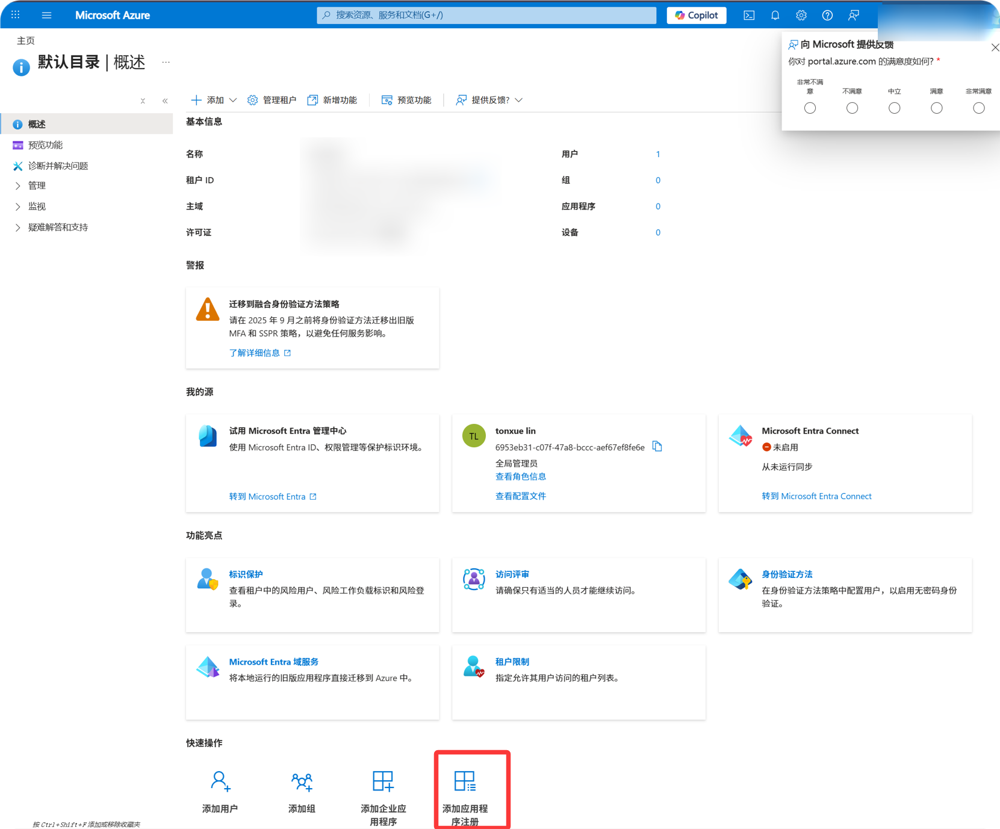
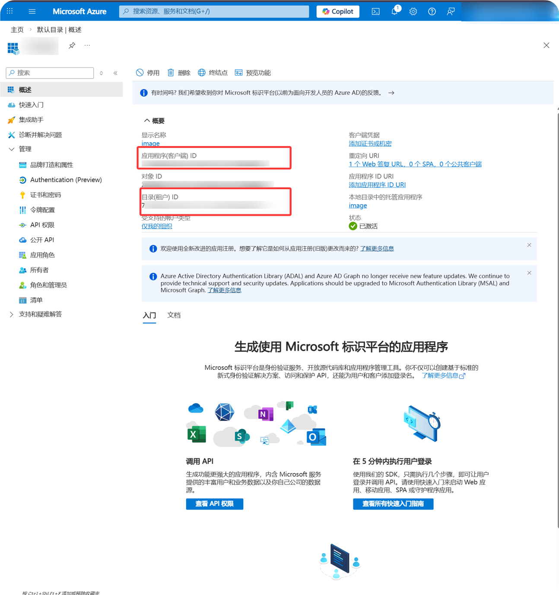
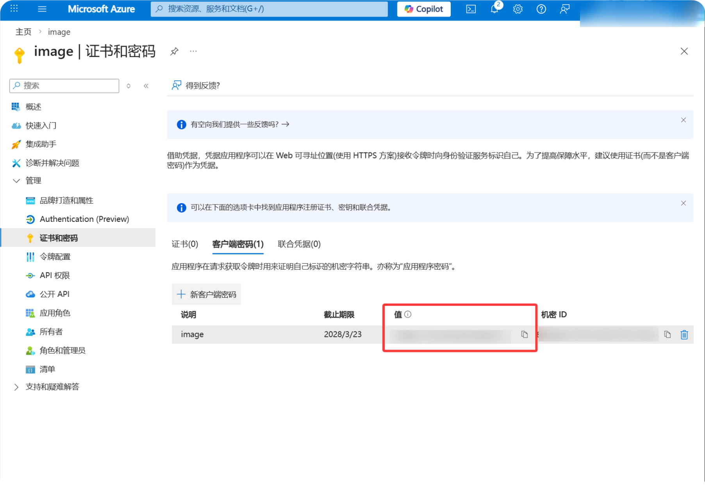
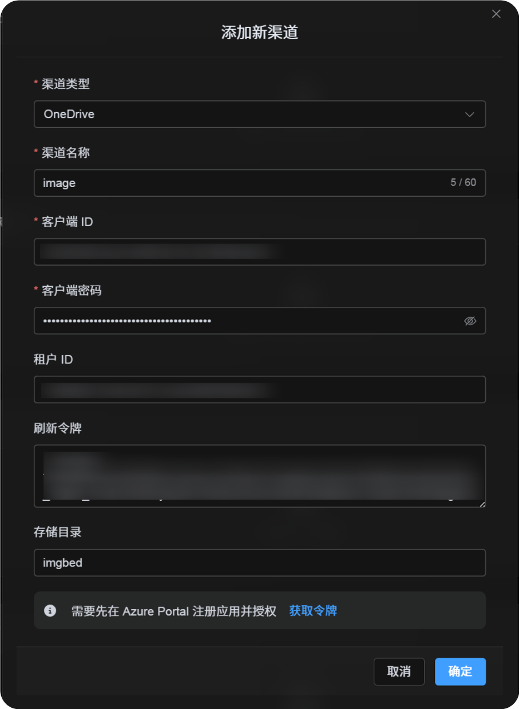
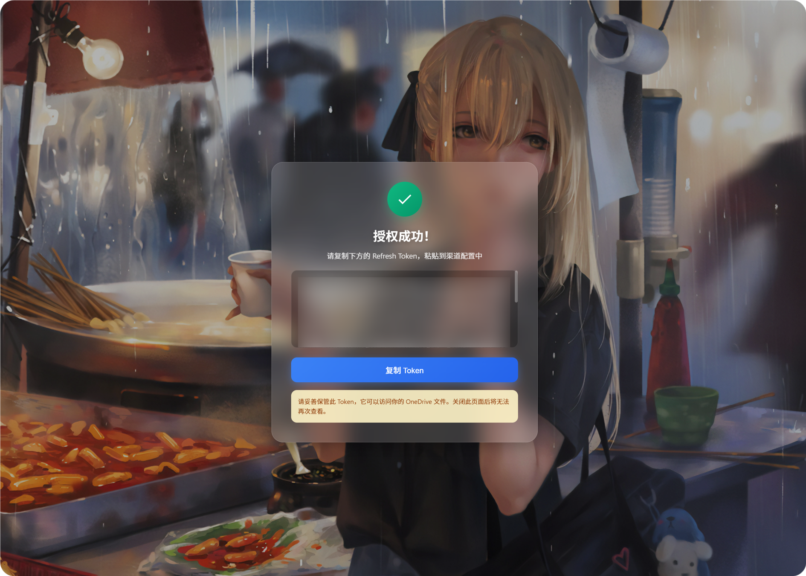

# OneDrive Channel ထည့်သွင်းခြင်း

## စမလုပ်ခင် လိုအပ်တာတွေ

| လိုအပ်ချက် | ဘာကြောင့်လိုလဲ |
| --- | --- |
| Microsoft account | Microsoft admin pages ကို access လုပ်ရန်နှင့် OneDrive ကို authorize လုပ်ရန် |
| သင့် ImgBed domain | OAuth callback URL အတွက် |
| App registration | `Client ID` နဲ့ `Client Secret` ဖန်တီးရန် |
| OneDrive account | file storage location အဖြစ်သုံးရန် |

## Setup Steps

### Step 1: Microsoft Entra ID ဖွင့်ပါ

1. `portal.azure.com` ကိုဖွင့်ပါ။
2. အပေါ် search မှာ `Microsoft Entra ID` ရှာပါ။
3. target page ကို dropdown မှာမတွေ့လျှင် ဒီကိုရွေးပါ:

```text
Continue searching in Microsoft Entra ID
```

4. `Microsoft Entra ID` ကိုဖွင့်ပါ။
5. `App registrations` ကိုဖွင့်ပါ။
6. `New registration` ကိုနှိပ်ပါ။

### Step 2: App Register လုပ်ပါ

`New registration` page မှာ:

| Field | What To Enter |
| --- | --- |
| Name | မှတ်မိလွယ်တဲ့အမည်၊ ဥပမာ `imgbed-onedrive` |
| Supported account types | အောက်က table အတိုင်းရွေးပါ |
| Redirect URI type | `Web` |
| Redirect URI | `https://your-domain.com/api/oauth/onedrive/callback` |

Account type guidance:

| သင့် Scenario | Supported Account Types |
| --- | --- |
| Personal OneDrive ပဲသုံးမယ် | personal Microsoft account option ကိုရွေးပါ။ |
| personal နဲ့ work/school accounts နှစ်မျိုးလုံး | personal နဲ့ organizational accounts နှစ်မျိုးလုံး support လုပ်တဲ့ option ကိုရွေးပါ။ |
| Company သို့မဟုတ် school OneDrive ပဲသုံးမယ် | organizational account option ကိုရွေးပါ။ |

form ဖြည့်ပြီး register ကိုနှိပ်ပါ။



### Step 3: App Information Copy လုပ်ပါ

app ဖန်တီးပြီးနောက် overview page မှ values တွေကို copy လုပ်ပါ:

| Microsoft Field | ImgBed Field |
| --- | --- |
| `Application (client) ID` | `Client ID` |
| `Directory (tenant) ID` | organizational accounts အတွက် `Tenant ID` |



### Step 4: Client Secret ဖန်တီးပါ

1. `Certificates & secrets` ကိုဖွင့်ပါ။
2. `New client secret` ကိုနှိပ်ပါ။
3. description တစ်ခုထည့်ပါ။
4. expiration period ရွေးပါ။
5. ဖန်တီးပြီးတာနဲ့ `Value` ကိုချက်ချင်း copy လုပ်ပါ။



### Step 5: API Permissions ထည့်ပါ

1. `API permissions` ကိုဖွင့်ပါ။
2. `Add a permission` ကိုနှိပ်ပါ။
3. `Microsoft Graph` ကိုရွေးပါ။
4. `Delegated permissions` ကိုရွေးပါ။
5. ဒီ permissions တွေထည့်ပါ:

| Permission | Purpose |
| --- | --- |
| `Files.ReadWrite.All` | files upload လုပ်ရန်၊ folders ဖန်တီးရန်၊ files delete လုပ်ရန် |
| `offline_access` | ImgBed က `Refresh Token` ရယူနိုင်ရန် |
| `User.Read` | account နဲ့ quota information ဖတ်ရန် |

### Step 6: ImgBed မှာ OneDrive Channel ဖြည့်ပါ

Upload Settings မှာ `OneDrive` ကိုရွေးပြီး:

| ImgBed Field | What To Enter |
| --- | --- |
| Channel name | မှတ်မိလွယ်တဲ့အမည်၊ ဥပမာ `Main OneDrive` |
| Client ID | Microsoft `Application (client) ID` |
| Client Secret | copy လုပ်ထားတဲ့ `Client Secret Value` |
| Tenant ID | အောက်က table အတိုင်း |
| Refresh Token | အခုခဏဗလာထားပါ |
| Root directory | Optional။ default က `imgbed`။ |
| Note | Optional |



`Tenant ID` ဖြည့်နည်း:

| ရွေးထားတဲ့ Account Type | ImgBed `Tenant ID` |
| --- | --- |
| Personal accounts | `consumers` |
| Personal + organizational accounts | `common` |
| Current organization only | `Directory (tenant) ID` |

### Step 7: Refresh Token ရယူပါ

1. ImgBed မှာ `Get Token` ကိုနှိပ်ပါ။
2. connect လုပ်ချင်တဲ့ Microsoft account ထဲ sign in ဝင်ပါ။
3. authorization prompt ကို approve လုပ်ပါ။
4. callback page မှာ `Refresh Token` ပြပါမယ်။
5. အဲဒါကို copy လုပ်ပါ။
6. ImgBed ကိုပြန်သွားပြီး `Refresh Token` field ထဲ paste လုပ်ပါ။



### Step 8: Channel Save လုပ်ပါ

fields အားလုံးဖြည့်ပြီးနောက် channel ကို save လုပ်ပါ။

## Quick Flow

```text
portal.azure.com ဖွင့်ပါ
-> Microsoft Entra ID ရှာပါ
-> App registrations ဖွင့်ပါ
-> app အသစ် register လုပ်ပါ
-> Name / Supported account types / Web redirect URI ဖြည့်ပါ
-> Register
-> Application (client) ID copy လုပ်ပါ
-> Authentication မှာ callback URL စစ်ပါ
-> Certificates & secrets မှာ Client Secret ဖန်တီးပါ
-> API permissions ထည့်ပါ
-> ImgBed မှာ Client ID / Client Secret / Tenant ID ဖြည့်ပါ
-> Get Token ကိုနှိပ်ပါ
-> callback page မှ Refresh Token copy လုပ်ပါ
-> ImgBed မှာ paste လုပ်ပြီး save လုပ်ပါ
```

## References

1. Microsoft Entra app registration: https://learn.microsoft.com/en-us/entra/identity-platform/quickstart-register-app
2. Microsoft identity platform authorization code flow: https://learn.microsoft.com/en-us/entra/identity-platform/v2-oauth2-auth-code-flow
3. Microsoft Graph user authentication: https://learn.microsoft.com/en-us/graph/auth-v2-user
