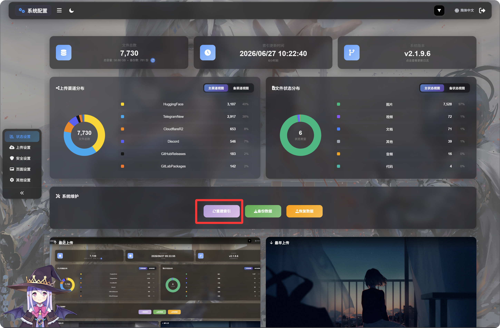

# Uploadinstellingen

Met uploadinstellingen verbind je ImgBed met je eigen opslagkanalen. Na configuratie worden geüploade afbeeldingen en bestanden opgeslagen in de gekozen dienst. ImgBed beheert daarna toeganglinks, bestandsrecords, previews, openbare galerijfuncties, de willekeurige-afbeelding-API, WebDAV-toegang en bijbehorende workflows.

Welk kanaal het beste past, hangt af van je gebruik. Voor een eenvoudige start zijn Telegram, Discord of GitHub Releases geschikt. Als capaciteit, snelheid en stabiliteit op lange termijn belangrijker zijn, kies dan Cloudflare R2, S3, OneDrive, Google Drive, Dropbox, Yandex, pCloud of je eigen WebDAV-service.

## Voor je begint

> Voordat je ImgBed voor het eerst gebruikt, moet je de initialisatiepagina openen en op "Index opnieuw opbouwen" klikken om de vereiste D1-tabellen aan te vullen en fouten in latere functies te voorkomen.
>
> 

- Bereid het opslagaccount of de API-gegevens voor die je wilt gebruiken.
- Controleer of je ImgBed-domein bereikbaar is, omdat OAuth-kanalen callback-URL's nodig hebben.
- Upload na het toevoegen van een kanaal eerst een testafbeelding om te bevestigen dat opslaan en openen werkt.

## Kanaallijst

- [Telegram](./telegram.md)
- [Cloudflare R2](./cloudflare-r2.md)
- [S3](./s3.md)
- [WebDAV](./webdav.md)
- [Discord](./discord.md)
- [Hugging Face](./huggingface.md)
- [GitHub Releases](./github-releases.md)
- [GitLab Packages](./gitlab-packages.md)
- [OneDrive](./onedrive.md)
- [Google Drive](./google-drive.md)
- [Dropbox](./dropbox.md)
- [Yandex](./yandex.md)
- [pCloud](./pcloud.md)

## Wat dit hoofdstuk behandelt

- Welke informatie elk uploadkanaal vooraf nodig heeft.
- Hoe je apps maakt, sleutels kopieert of tokens autoriseert op externe platforms.
- Hoe je de kanaalconfiguratie invult in ImgBed en controleert of uploaden werkt.
