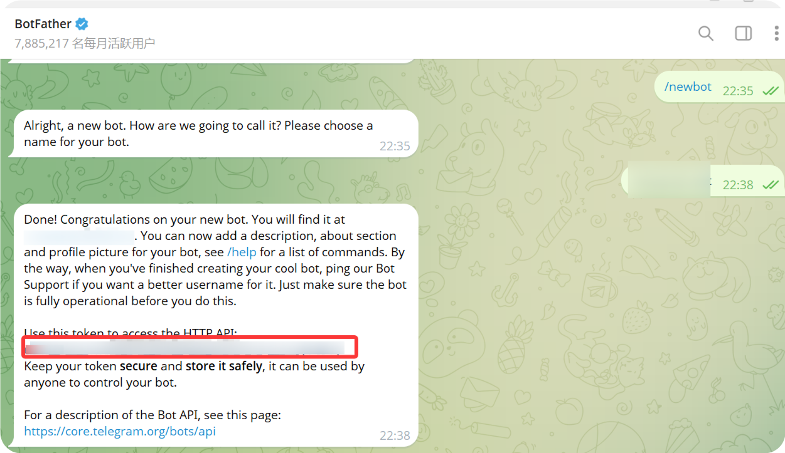
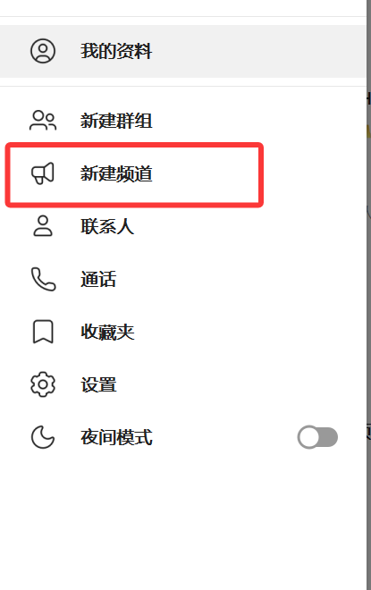
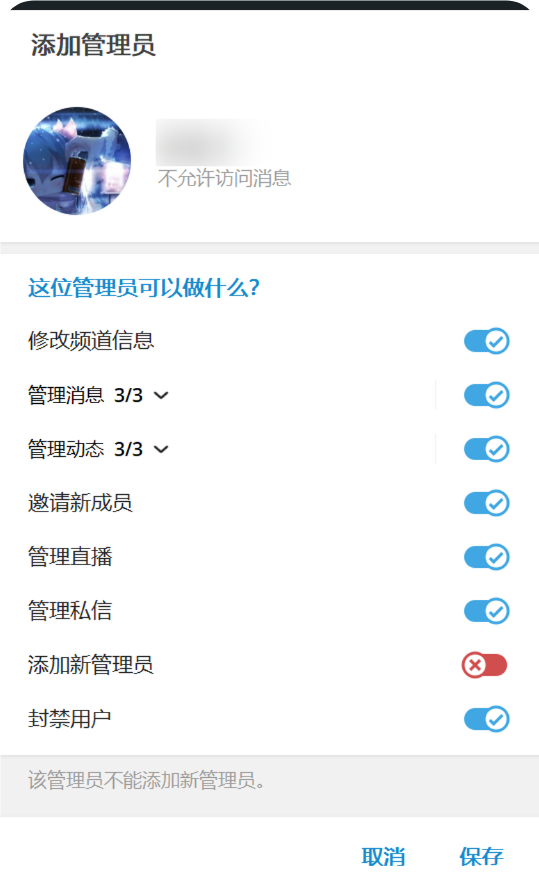
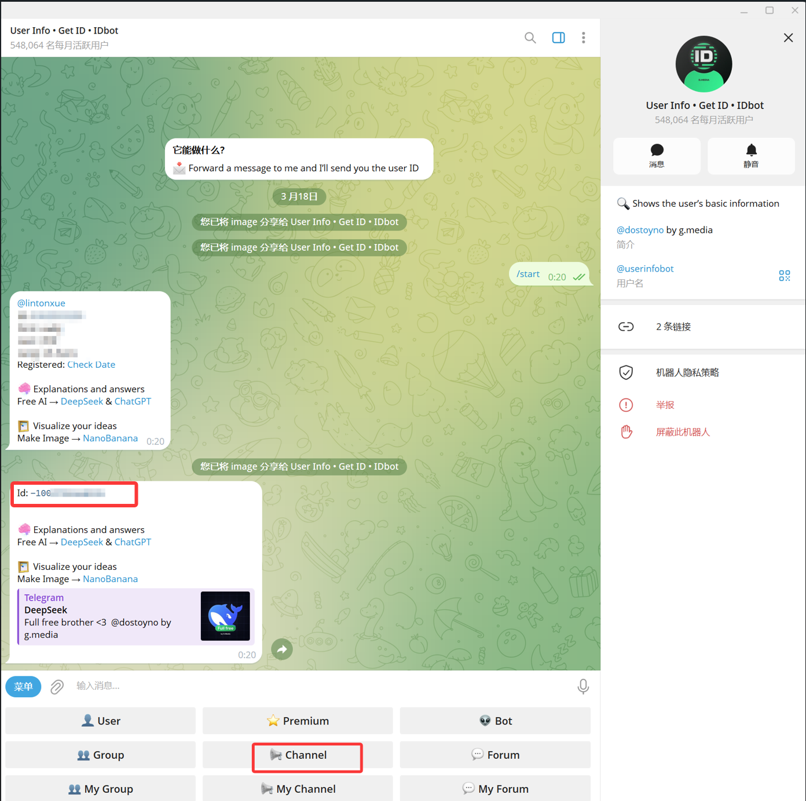
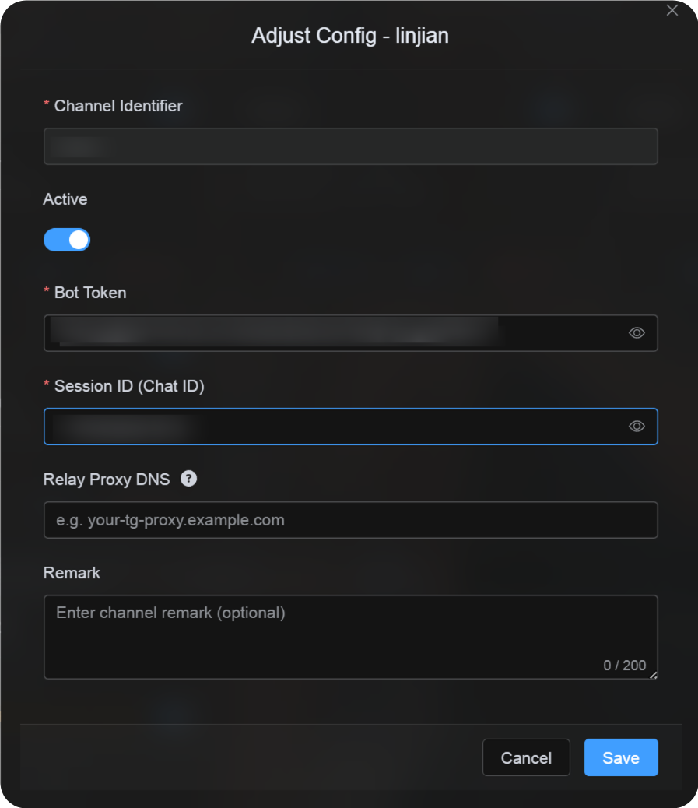

# Een Telegram-kanaal toevoegen

## Wat je vooraf nodig hebt

| Vereiste | Doel |
| --- | --- |
| Telegram-account | Voor het maken van de bot en het opslagkanaal. |
| `@BotFather` | Voor het maken van een Telegram-bot. |
| Telegram-kanaal | De uiteindelijke opslagplek voor bestanden. |
| `@userinfobot` | Voor het opzoeken van de `Chat ID` van het kanaal. |

## Waar je het toevoegt

1. Open Systeeminstellingen.
2. Ga naar Uploadinstellingen.
3. Klik rechtsboven op Kanaal toevoegen.
4. Selecteer `Telegram`.

## Veldreferentie

| Veld | Functie | Verplicht |
| --- | --- | --- |
| Kanaalnaam | Een herkenbare naam, bijvoorbeeld `Telegram Primary`. | Ja |
| Actief | Schakelt dit kanaal in of uit. | Aanbevolen |
| Bot Token | Het token van je Telegram-bot. | Ja |
| Session ID (Chat ID) | De ID van het Telegram-kanaal. | Ja |
| Relay Proxy URL (optioneel) | Alleen gebruiken als Telegram-toegang instabiel is. Vul de volledige proxy-URL in, inclusief `https://`. | Nee |
| Opmerking | Notities voor later beheer. | Nee |

## Instelstappen

### 1. Maak een Telegram-bot

1. Open Telegram en zoek naar `@BotFather`.
2. Open de chat en klik op `Start`.
3. Stuur `/newbot`.
4. Volg de aanwijzingen en vul een weergavenaam voor de bot in.
5. Vul daarna een botgebruikersnaam in. Deze moet meestal eindigen op `bot`.
6. Na het aanmaken stuurt `@BotFather` een bot token terug.

Dit token vul je in ImgBed in als `Bot Token`.



### 2. Maak een kanaal

1. Klik in Telegram op Nieuw kanaal.
2. Vul een kanaalnaam in.
3. Rond het aanmaken af.

Zowel openbare als privékanalen kunnen worden gebruikt.



### 3. Voeg de bot toe aan het kanaal

1. Open het kanaal dat je net hebt gemaakt.
2. Open de kanaalinstellingen.
3. Voeg een lid of beheerder toe.
4. Zoek de gebruikersnaam van je bot.
5. Voeg de bot toe aan het kanaal.

Voor de betrouwbaarste uploads geef je de bot beheerdersrechten.



### 4. Haal de Channel ID op met User Info - Get ID - IDbot

1. Zoek in Telegram naar `@userinfobot`. De weergavenaam is meestal `User Info - Get ID - IDbot`.
2. Open de chat en klik op `Start`.
3. Kies `Channel` uit de opties van de bot.
4. Selecteer in de berichtkiezer het doelkanaal en stuur het naar `@userinfobot`.
5. Wanneer `@userinfobot` het resultaat terugstuurt, kopieer je het nummer bij `Id: -100...`.

Het nummer dat begint met `-100` is de `Session ID (Chat ID)` die ImgBed nodig heeft.



### 5. Vul het Telegram-kanaal in ImgBed in

Ga terug naar het configuratievenster en vul in:

| UI-veld | Waarde |
| --- | --- |
| Channel Identifier | Een eigen kanaalnaam, bijvoorbeeld `TelegramPrimary`. |
| Actief | Aanbevolen. |
| Bot Token | Het token van `@BotFather`. |
| Session ID (Chat ID) | Het `-100...`-nummer dat `@userinfobot` teruggaf. |
| Relay Proxy URL (optioneel) | Alleen indien nodig, bijvoorbeeld `https://your-tg-proxy.example.com`. |
| Opmerking | Optionele notities. |

Klik op Opslaan wanneer je klaar bent.



## Controleren

| Controle | Hoe je controleert |
| --- | --- |
| Kanaalkaart verschijnt | Na opslaan moet in Uploadinstellingen een Telegram-kanaalkaart zichtbaar zijn. |
| Kanaal kan aan | De Actief-schakelaar blijft ingeschakeld. |
| Configuratie is opgeslagen | De detailweergave toont dat Bot Token en Chat ID zijn opgeslagen. |
| Upload werkt | Upload een testafbeelding en controleer of die in het doelkanaal van Telegram verschijnt. |

## Snelle checklist

```text
Create a bot with @BotFather
-> Save the Bot Token
-> Create a Telegram channel
-> Add the bot to the channel and grant administrator permissions
-> Search for @userinfobot and choose Channel
-> Forward any message from the channel to @userinfobot
-> Copy the returned Id: -100...
-> Enter the Bot Token and Chat ID in ImgBed
-> Save and upload a test image
```

## Referenties

1. Telegram bots: https://core.telegram.org/bots
2. Telegram Bot API: https://core.telegram.org/bots/api
