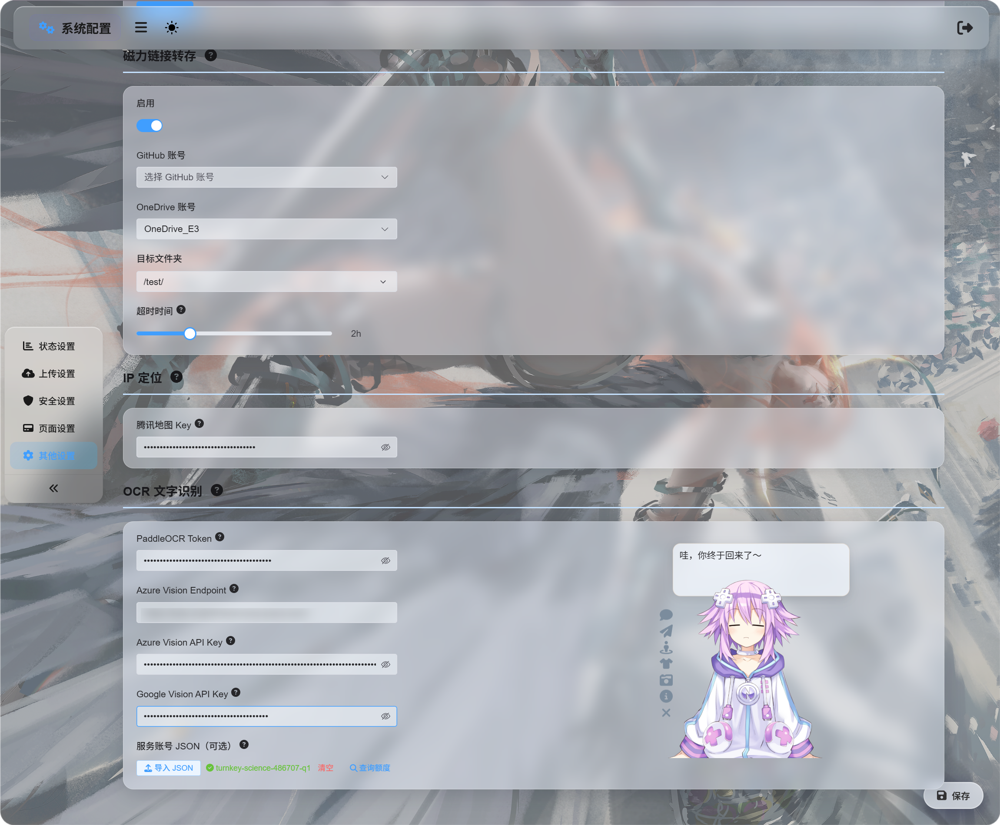
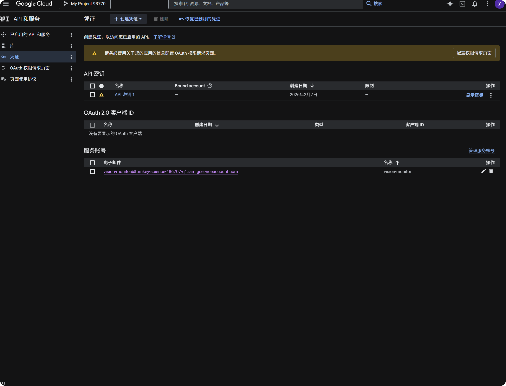
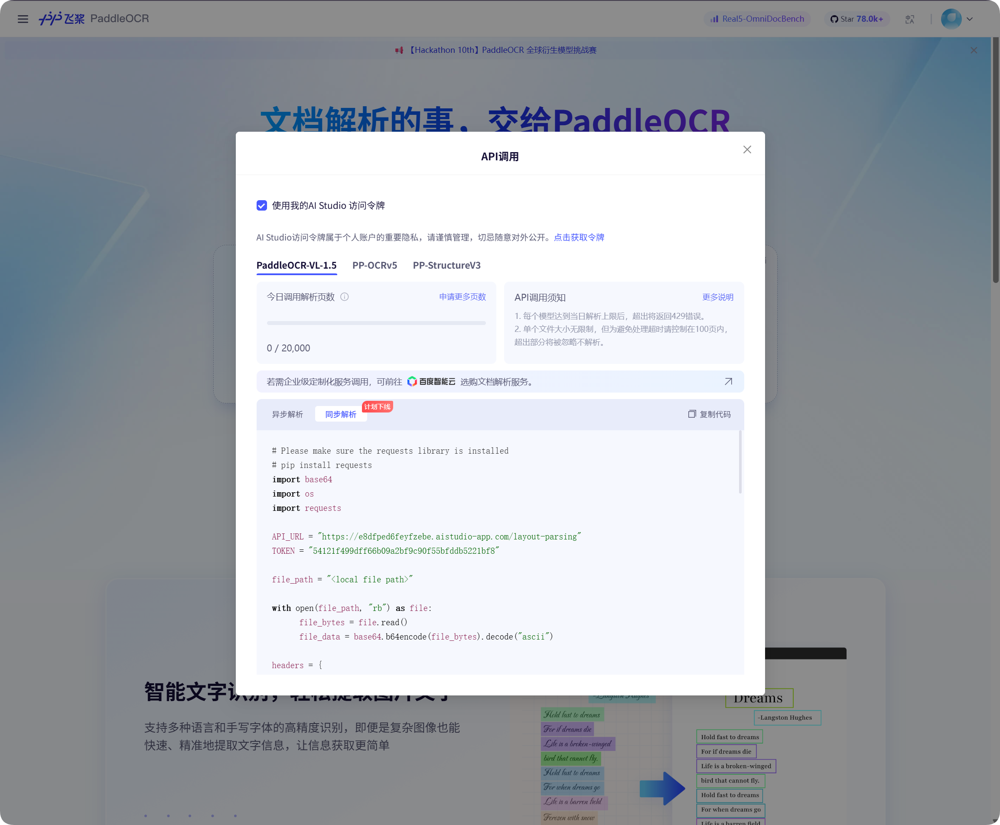
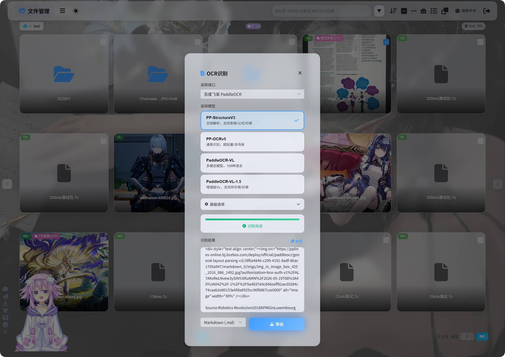
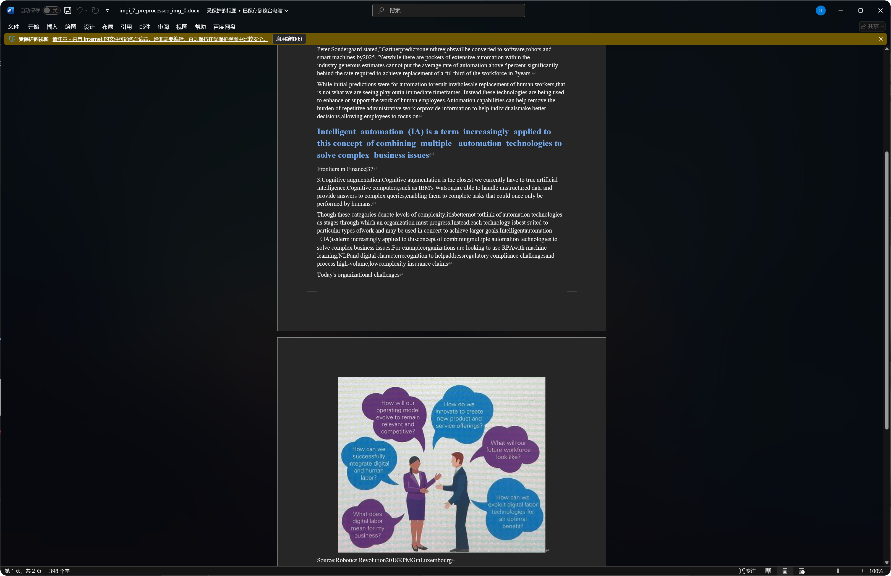

# OCR

OCR wyciąga tekst z obrazów, skanów i zrzutów ekranu dokumentów.

Po rozpoznaniu możesz skopiować wynik, wyeksportować go jako `Markdown`, `PDF` lub `Word`, albo pobrać kilka formatów razem w paczce.

## Co potrafi OCR

| Funkcja | Opis |
| --- | --- |
| Rozpoznawanie tekstu z obrazu | Wyciąga tekst z obrazów, screenshotów i skanów. |
| Rozpoznawanie układu dokumentu | Lepsze dla tabel, formuł, pieczątek i mieszanych układów tekst-obraz. |
| Wiele usług | Obsługuje Baidu PaddleOCR, Microsoft Azure Vision i Google Vision. |
| Kopiowanie wyników | Pozwala skopiować rozpoznany tekst po przetworzeniu. |
| Eksport plików | Eksportuje `Markdown`, `PDF` i `Word`. |
| Pakowanie zbiorcze | Po rozpoznaniu wielu plików pobiera wyniki jako paczkę. |

## Najpierw skonfiguruj usługi OCR

Otwórz:

```text
System Settings -> Other Settings -> OCR
```



Wypełnij dane usług, których chcesz użyć:

| Usługa | Co wpisać | Najlepsze do |
| --- | --- | --- |
| Baidu PaddleOCR | `PaddleOCR Token` | Zalecany pierwszy wybór. Dobry dla dokumentów, obrazów, tabel i mieszanych układów. |
| Microsoft Azure Vision | `Azure Vision Endpoint` i `Azure Vision API Key` | Przydatne, jeśli używasz już usług chmurowych Microsoft. |
| Google Vision | `Google Vision API Key`. Service account `JSON` służy tylko do zapytania o limit. | Przydatne, jeśli używasz Google Cloud. |

Po wpisaniu danych zapisz ustawienia.

Do pierwszego testu możesz skonfigurować tylko jedną usługę. Nie potrzebujesz wszystkich trzech.

## Konfiguracja Google Vision

Konfiguracja Google ma dwie części:

| Cel | Wymaganie |
| --- | --- |
| Używanie OCR | Włącz `Cloud Vision API`, potem utwórz `API Key`. |
| Zapytanie o użycie | Utwórz service account, nadaj `Monitoring Viewer`, potem pobierz service account `JSON`. |



### Używanie Google do OCR

1. Otwórz Google Cloud Console.
2. Przejdź do `APIs & Services`.
3. Otwórz `Library`, wyszukaj `Cloud Vision API` i włącz.
4. Wróć do `Credentials`.
5. Utwórz `API Key`.
6. Otwórz API Key i skopiuj go.
7. Wklej do `Google Vision API Key` w ImgBed.
8. Zapisz.

Potem możesz wybrać Google Vision w oknie OCR.

### Zapytanie o użycie Google

Zapytanie o limit nie jest wymagane do rozpoznawania.

Pokazuje tylko orientacyjnie, ile wywołań Google Vision użyto w ostatnich 30 dniach.

1. W Google Cloud Console otwórz `IAM & Admin`.
2. Otwórz `Service Accounts`.
3. Utwórz service account, np. `vision-monitor`.
4. Nadaj mu rolę `Monitoring Viewer`.
5. Otwórz szczegóły service account i utwórz klucz.
6. Wybierz `JSON`.
7. Pobierz wygenerowany plik JSON.
8. Wróć do ImgBed i zaimportuj go jako service account `JSON` (opcjonalnie).
9. Po udanym imporcie kliknij zapytanie o limit.

Po imporcie ImgBed pokazuje nazwę projektu, do którego należy service account. Podczas zapytania odczytuje dane Google monitoring i pokazuje liczbę wywołań w bieżącym miesiącu.

W skrócie:

| Element | Cel |
| --- | --- |
| `Google Vision API Key` | Wykonuje rozpoznawanie OCR. |
| Service account `JSON` | Odpytuje liczbę użytych wywołań Google Vision. |
| Rola `Monitoring Viewer` | Pozwala service account czytać dane użycia. |

## Pobieranie tokenu Baidu PaddleOCR

Baidu PaddleOCR wymaga access token.



Otwórz okno wywołania `API` na stronie Baidu PaddleOCR, kliknij pobranie tokenu i skopiuj go.

Wróć do ImgBed, wklej do `PaddleOCR Token` i zapisz.

## Rozpoczęcie rozpoznawania

W Zarządzaniu plikami wybierz obraz lub zrzut ekranu dokumentu i kliknij `OCR`.



W oknie wybierz usługę rozpoznawania i model.

Popularne modele PaddleOCR:

| Model | Najlepsze do |
| --- | --- |
| `PP-StructureV3` | Zalecany domyślnie. Dobry dla dokumentów, tabel, formuł, pieczątek i mieszanych układów. |
| `PP-OCRv5` | Proste obrazy, zwykły tekst i lekkie rozpoznawanie. |
| `PaddleOCR-VL` | Wielojęzyczne, złożone obrazy i treści podobne do wykresów. |
| `PaddleOCR-VL-1.5` | Bardziej złożone strony dokumentów i odtwarzanie układu. |

Jeśli nie masz pewności, zacznij od `PP-StructureV3`.

## Opcje zaawansowane

| Opcja | Opis |
| --- | --- |
| Korekcja orientacji | Użyj, gdy obraz jest obrócony lub przekrzywiony. |
| Prostowanie dokumentu | Użyj dla fotografowanych dokumentów z krzywizną lub perspektywą. |
| Wykrywanie układu | Użyj, gdy chcesz zachować nagłówki, akapity, tabele i strukturę obrazu. |
| Rozpoznawanie wykresów | Użyj, gdy obraz zawiera wykresy lub złożone struktury. |
| Upiększ `Markdown` | Sprawia, że eksportowany Markdown jest czytelniejszy. |

Dla zwykłych screenshotów zostaw minimalne opcje. Dla skanów dokumentów włącz więcej opcji dokumentowych.

## Wyniki

Po zakończeniu rozpoznawania okno pokaże wynik.

Możesz go skopiować bezpośrednio albo wybrać format eksportu.


Dla stron dokumentów eksportowany `PDF` może zachować wygląd strony i jednocześnie pozwolić na wyszukiwanie tekstu. To przydatne do archiwizacji skanów i późniejszego odnajdywania treści.

## Wybór formatu eksportu

| Format | Najlepsze do |
| --- | --- |
| `Markdown (.md)` | Notatki, systemy dokumentacji i późniejsza edycja. |
| `PDF (.pdf)` | Zachowanie wyglądu strony i wyników skanowania. |
| `Word (.docx)` | Dalsza edycja układu, tekstu i przekazanie innym. |
| Eksport wszystkiego | Zapisuje wiele formatów i oryginalny obraz, dobre dla ważnych archiwów. |

Jeśli potrzebujesz tylko tekstu, eksportuj Markdown.

Jeśli potrzebujesz wyglądu strony, użyj PDF lub Word.

## Wynik Word

Wyeksportowane dokumenty Word można otwierać i edytować w pakietach biurowych.



Niektóre dokumenty zawierają w wyniku Word rozpoznane obrazy, nagłówki i akapity.

Jakość rozpoznania zależy od ostrości oryginału, wyboru modelu i złożoności dokumentu.

## Najlepsze typy plików do OCR

| Typ pliku | Rekomendacja |
| --- | --- |
| Wyraźne screenshoty | Rozpoznawaj bezpośrednio. |
| Skany | Preferuj `PP-StructureV3`. |
| Fotografowane dokumenty | Włącz korekcję orientacji i prostowanie dokumentu. |
| Tabele, formuły, pieczątki | Preferuj modele strukturalne. |
| Proste obrazy z krótkim tekstem | `PP-OCRv5` zwykle wystarczy. |

Wyraźniejsze obrazy z prostszym tekstem zwykle dają lepsze wyniki.

## Typowe przypadki

| Przypadek | Znaczenie |
| --- | --- |
| Rozpoznawanie się nie udaje | Sprawdź, czy token lub key usługi został zapisany. |
| Rozpoznawanie jest wolne | Złożone dokumenty i duże obrazy wymagają więcej czasu. |
| Tabela jest niepełna | Spróbuj modelu strukturalnego. |
| Tekst ma błędy | Rozmycie, odblaski i przekrzywienie zwiększają liczbę błędów. Spróbuj wyraźniejszego obrazu. |
| Wynik Word zawiera wiele obrazów | Modele strukturalne mogą zachować część rozpoznanych obrazów. To normalne. |

### Zapytanie o limit Google nie działa

Sprawdź:

1. Zaimportowano service account `JSON`.
2. Service account ma rolę `Monitoring Viewer`.
3. `Cloud Vision API` jest włączone dla projektu.

Jeśli potrzebujesz tylko OCR, a nie zapytania o użycie, możesz pominąć service account JSON i wypełnić tylko `Google Vision API Key`.

## Szybki przebieg

```text
Otwórz System Settings
-> Otwórz Other Settings
-> Wpisz dane usługi OCR
-> Zapisz
-> Wróć do Zarządzania plikami
-> Wybierz plik i kliknij OCR
-> Wybierz model
-> Poczekaj na rozpoznanie
-> Skopiuj wynik albo eksportuj Markdown / PDF / Word
```
