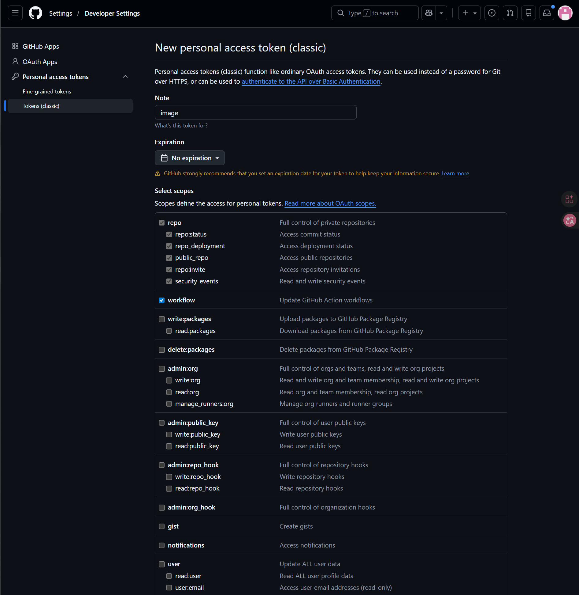
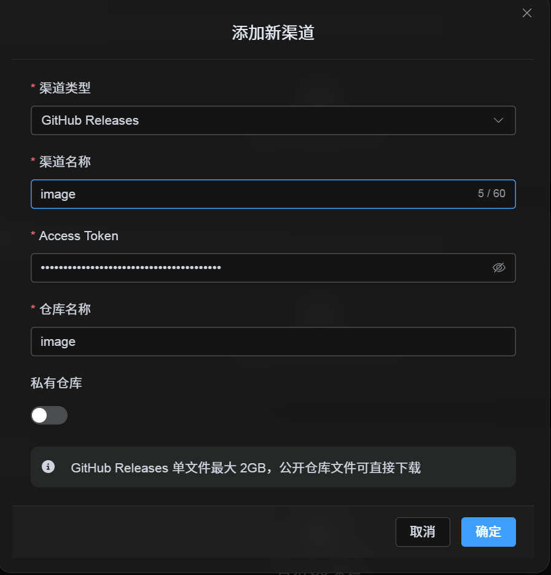

# د GitHub Releases Channel اضافه کول

## د پیل مخکې اړتیاوې

یوازې درې شیانو ته اړتیا لرئ:

| اړتیا | موخه |
| --- | --- |
| GitHub account | د access token جوړولو او repository مالکیت لپاره. |
| GitHub Access Token | د ImgBed لپاره GitHub API access، releases جوړول او files upload کول. |
| Repository name | یوازې repository name لیکلی شئ، لکه `image`. |

## Setup Steps

### Step 1: GitHub ته Sign in او Access Token جوړول

1. GitHub ته sign in شئ.
2. په پورته ښي لوري کې avatar کلیک او `Settings` پرانیزئ.
3. له left sidebar څخه `Developer settings` پرانیزئ.
4. `Personal access tokens` پرانیزئ.
5. `Tokens (classic)` پرانیزئ.
6. `Generate new token (classic)` کلیک کړئ.
7. token ته پېژندل کېدونکی نوم ورکړئ.
8. د خپل maintenance preference له مخې expiration date وټاکئ.
9. `repo` او `workflow` scopes وټاکئ.
10. token چې جوړ شي، سملاسي یې copy او خوندي کړئ.



## Step 2: په ImgBed کې GitHub Releases Channel ډک کړئ

په Upload Settings کې د `GitHub Releases` له ټاکلو وروسته:

| UI Field | What to Enter |
| --- | --- |
| Channel name | ستاسې ټاکلی نوم، لکه `GitHubPrimary`. |
| Access Token | همدا GitHub Personal Access Token چې جوړ مو کړی. |
| Repository name | short repo name لکه `image`، یا full path لکه `username/image`. |
| Private repository | د اړتیا له مخې on یا off کړئ. |
| Remark | اختیاري، لکه `Primary upload channel`. |



## Step 3: Channel Save کړئ

له fields ډکولو وروسته Save کلیک کړئ.

system دا کارونه خپله ترسره کوي:

| System Behavior | Description |
| --- | --- |
| Short repository name | ImgBed current GitHub account پېژني او value full repository path ته expand کوي. |
| Full repository path | ImgBed د `username/repository` path هماغسې کاروي لکه داخل شوی. |
| Repository check | که current personal account path وي، ImgBed repository اتومات جوړوي که موجود نه وي. که full path manual ورکړئ، هماغه path کاروي. |
| Public/private state | repository visibility د current switch له مخې synchronized کېږي. |

## Quick Checklist

GitHub Releases داسې کار کوي:

```text
GitHub ته sign in شئ
-> Access Token جوړ کړئ
-> ImgBed ته بېرته ولاړ شئ او token او repository name ولیکئ
-> Save
-> که یوازې repo name ورکړئ، ImgBed current username اتومات اضافه کوي
-> که username/repo ورکړئ، هماغه کاروي
-> test image upload کړئ
```
