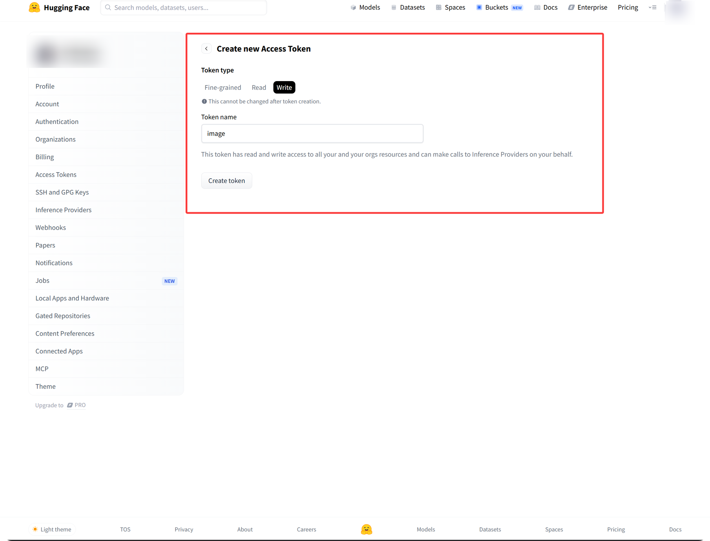
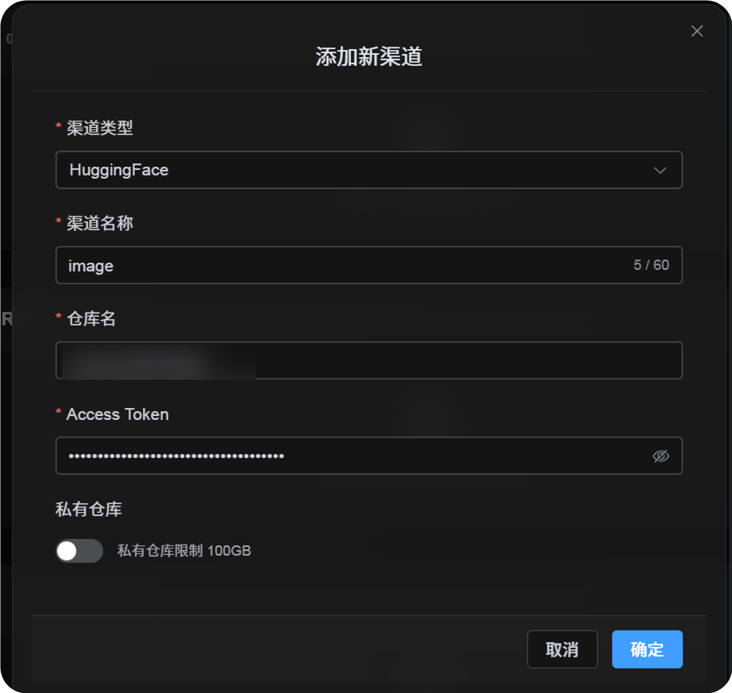

# د Hugging Face چینل اضافه کول

## د پیل مخکې اړتیاوې

یوازې درې شیانو ته اړتیا لرئ:

| اړتیا | موخه |
| --- | --- |
| Hugging Face حساب | د لاسرسی ټوکن جوړولو او ریپازېټري مالکیت لپاره. |
| Hugging Face User لاسرسی ټوکن | د ImgBed لپاره Hugging Face API لاسرسی، repositories جوړول او فایلونه اپلوډ کول. |
| د ریپازېټري نوم | یوازې ریپازېټري name لیکلی شئ، لکه `image`. |

## د تنظیم ګامونه

### ګام 1: Hugging Face ته ننوځئ او لاسرسی ټوکن جوړول

1. Hugging Face ته ننوځئ شئ.
2. په پورته ښي لوري کې avatar کلیک او `Settings` پرانیزئ.
3. له کیڼ اړخ پټه څخه `Access Tokens` پرانیزئ.
4. نوی ټوکن جوړ کړئ.
5. ټوکن ته پېژندل کېدونکی نوم ورکړئ.
6. `write` permission وټاکئ.
7. ټوکن چې جوړ شي، سملاسي یې کاپي او خوندي کړئ.



## ګام 2: په ImgBed کې Hugging Face چینل ډک کړئ

په د اپلوډ تنظیمات کې د `Hugging Face` له ټاکلو وروسته:

| د UI فیلډ | څه داخل کړئ |
| --- | --- |
| د چینل نوم | ستاسې ټاکلی نوم، لکه `hf-primary`. |
| د ریپازېټري نوم | لنډ repo نوم لکه `image`، یا بشپړه لاره لکه `username/image`. |
| لاسرسی ټوکن | همدا Hugging Face User لاسرسی ټوکن چې جوړ مو کړی. |
| شخصي ریپازېټري | د اړتیا له مخې on یا off کړئ. |
| یادښت | اختیاري، لکه `Primary upload channel`. |



## ګام 3: چینل خوندي کړئ

له fields ډکولو وروسته خوندي کلیک کړئ.

system دا کارونه خپله ترسره کوي:

| د سیستم چلند | توضیح |
| --- | --- |
| لنډ ریپازېټري نوم | ImgBed اوسنی Hugging Face حساب پېژني او ارزښت بشپړ ریپازېټري لارې ته غځوي. |
| Full ریپازېټري path | ImgBed د `username/repository` path هماغسې کاروي لکه داخل شوی. |
| د ریپازېټري کتنه | که د اوسني شخصي حساب لاره وکاروئ، ImgBed هڅه کوي ریپازېټري جوړه کړي که موجوده نه وي. که بشپړه لاره په لاسي ډول ورکړئ، ImgBed هماغه لاره کاروي. |
| ریپازېټري type | دا چینل د `dataset` ریپازېټري کاروي. |
| عام/شخصي حالت | د ریپازېټري لید د اوسني switch له مخې همغږي کېږي. |

## چټک چک‌لېست

```text
Sign in to Hugging Face
-> Create an Access Token
-> Select write permission
-> Return to ImgBed and enter the token and repository name
-> Save
-> If only a repo name is entered, ImgBed adds the current username automatically
-> If username/repo is entered, ImgBed uses it as-is
-> ImgBed checks or creates the dataset repository
-> Upload a test image
```
