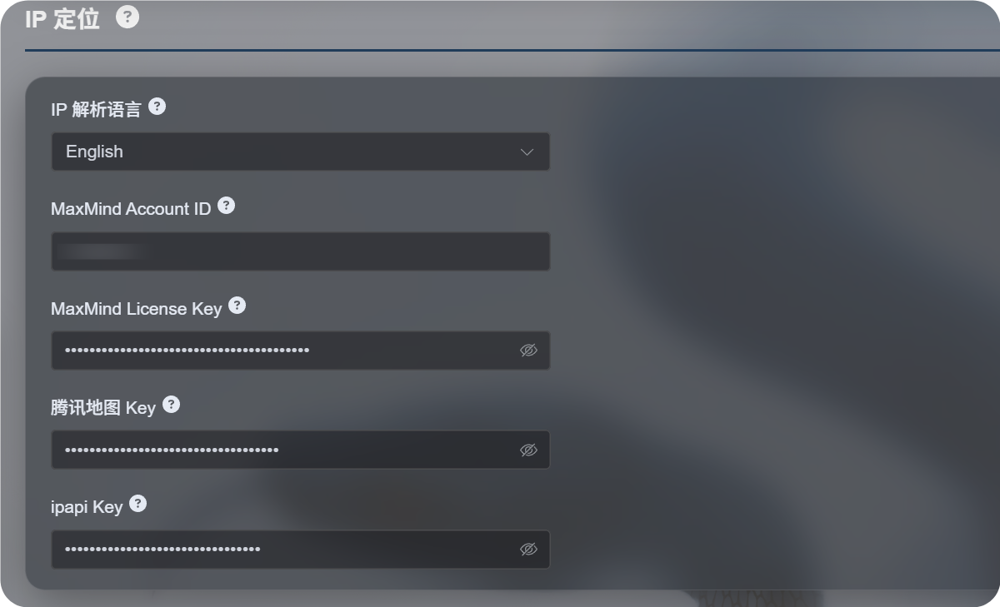
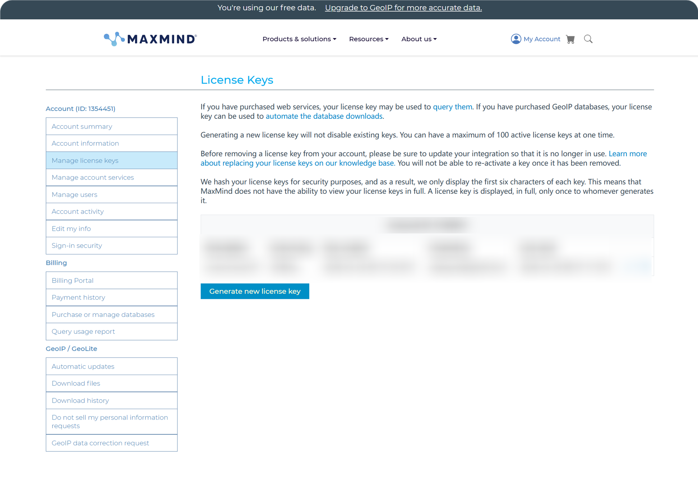
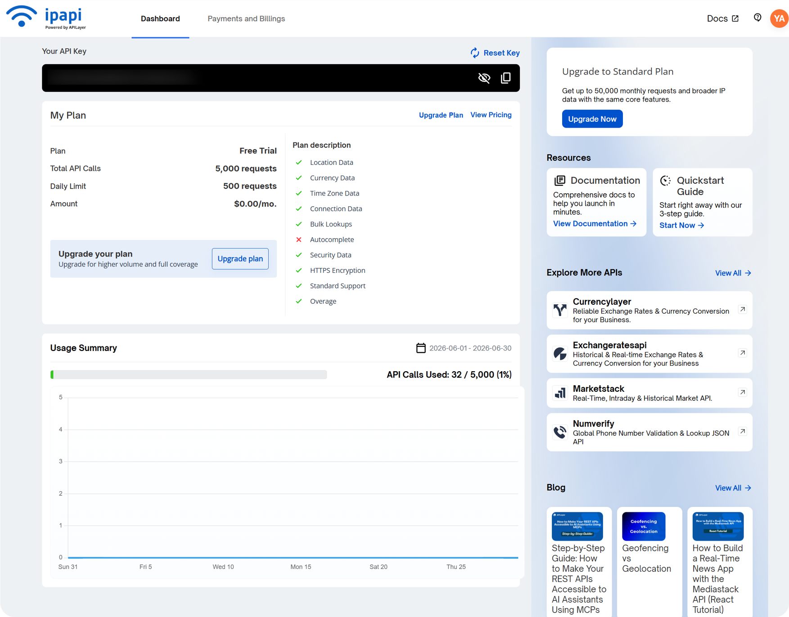
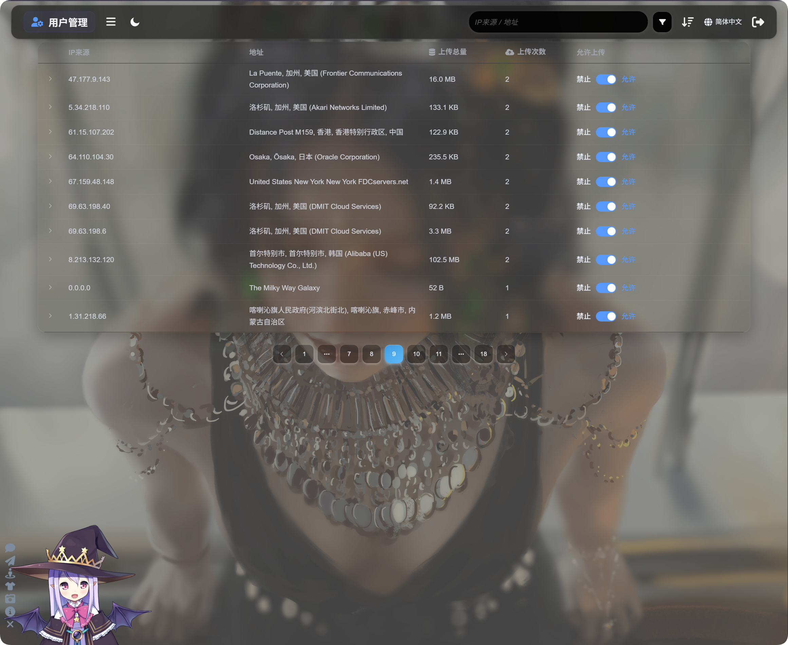
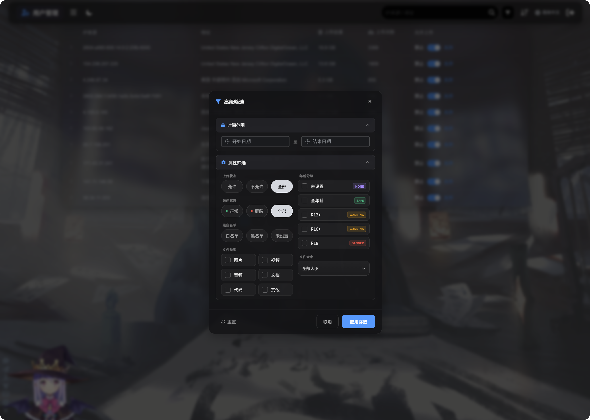
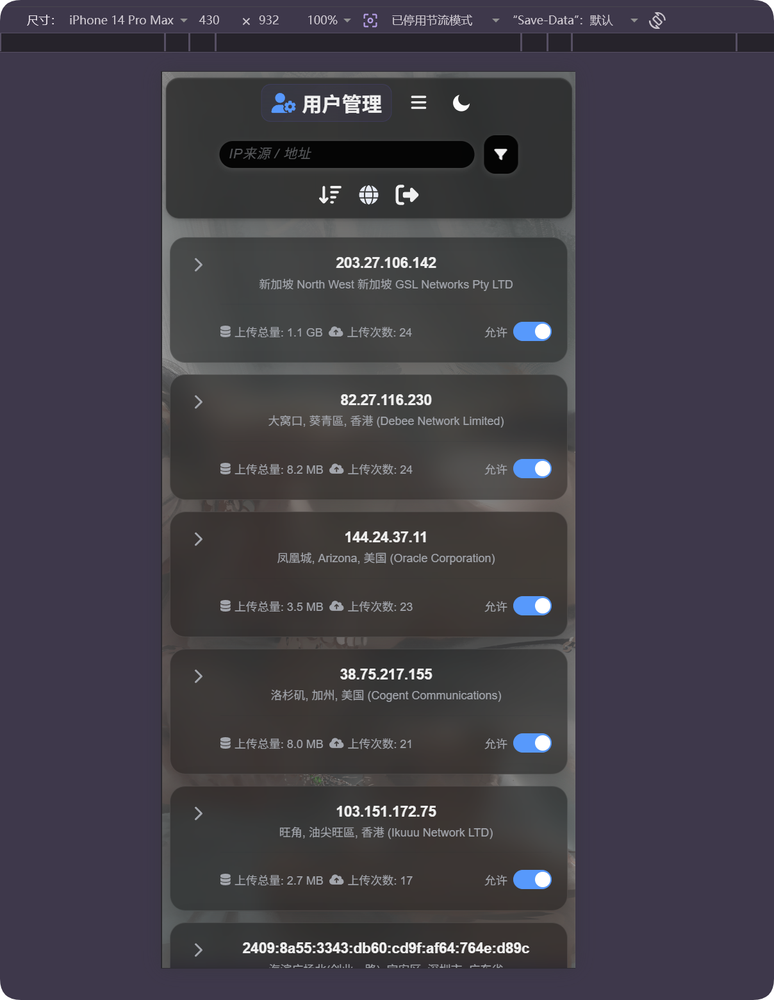

# Geolocalização por IP e gerenciamento de usuários

A geolocalização por IP transforma IPs de uploads, dispositivos de login e outros logs em localizações aproximadas.

Com ela configurada, o painel mostra melhor a origem de uploads e acessos. O gerenciamento de usuários também permite bloquear ou restaurar permissão de upload para IPs suspeitos.

## Onde configurar

```text
Configurações do sistema -> Outras configurações -> Geolocalização por IP
```



## Configurações disponíveis

| Configuração | Descrição |
| --- | --- |
| Idioma da localização | Define o idioma das localizações exibidas |
| MaxMind Account ID | ID da conta para MaxMind GeoLite Web Service |
| MaxMind License Key | Chave de licença da MaxMind |
| Tencent Map Key | Útil para endereços da China continental |
| ipapi Key | Chave da APILayer ipapi com suporte multilíngue |

Preencha apenas os serviços que você precisa. Sem chaves, o ImgBed tenta fontes gratuitas integradas, mas elas podem ser menos estáveis ou precisas.

## Recomendação para português

Para mostrar localizações em português ou em vários idiomas, configure MaxMind e, se precisar de resultados multilíngues melhores, adicione ipapi.

## Configurar MaxMind

A MaxMind precisa de:

```text
MaxMind Account ID
MaxMind License Key
```

Encontre o Account ID no painel da MaxMind, crie uma License Key e cole os dois valores no ImgBed.



## Configurar ipapi

Copie a API Key no console do ipapi.



Cole em `ipapi Key` no ImgBed e salve.

## Gerenciamento de usuários

O gerenciamento de usuários abre na parte superior do painel administrativo.



Ele mostra atividade agrupada por IP.

| Campo | Descrição |
| --- | --- |
| IP | IP de origem |
| Localização | Local aproximado resolvido pelo IP |
| Tamanho total enviado | Soma dos arquivos enviados por esse IP |
| Número de uploads | Quantidade de envios |
| Upload permitido | Desative para bloquear novos uploads desse IP |

Abra a seta à esquerda para ver os arquivos enviados por esse IP. Você verá nome, prévia, tamanho, resultado de moderação, status e horário do upload.



## Dicas de operação

- Antes de bloquear um IP, confira os arquivos enviados.
- Use busca e ordenação para encontrar IPs recentes, muito ativos ou com consumo alto.
- Localização por IP é estimativa. Use como sinal de apoio, não como prova absoluta.


