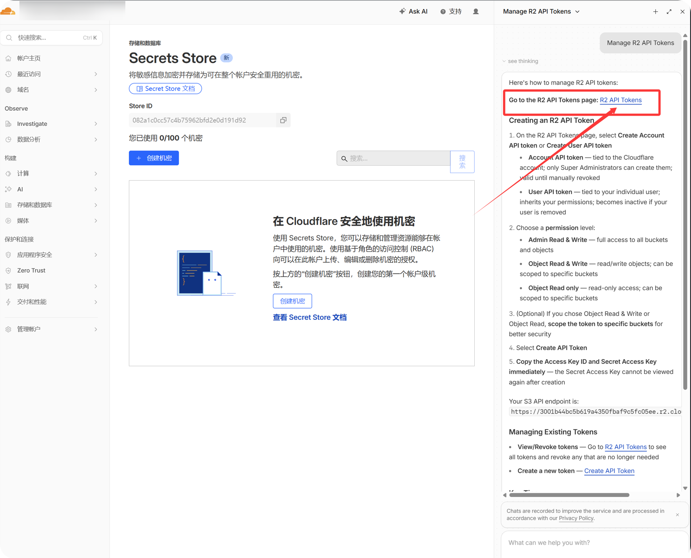
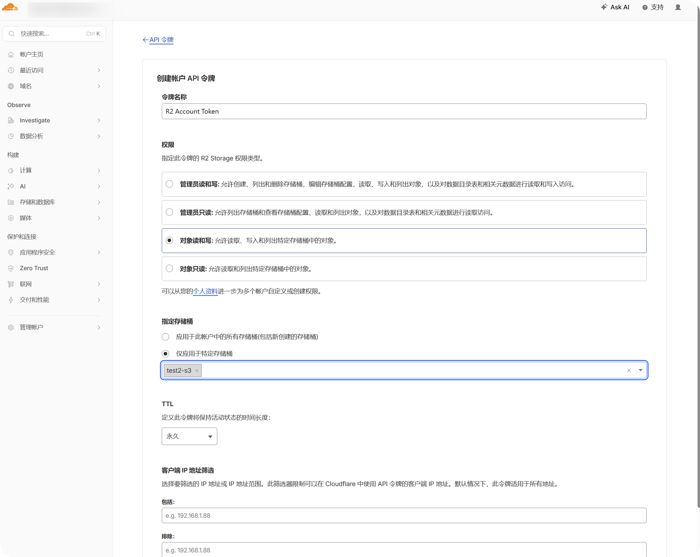
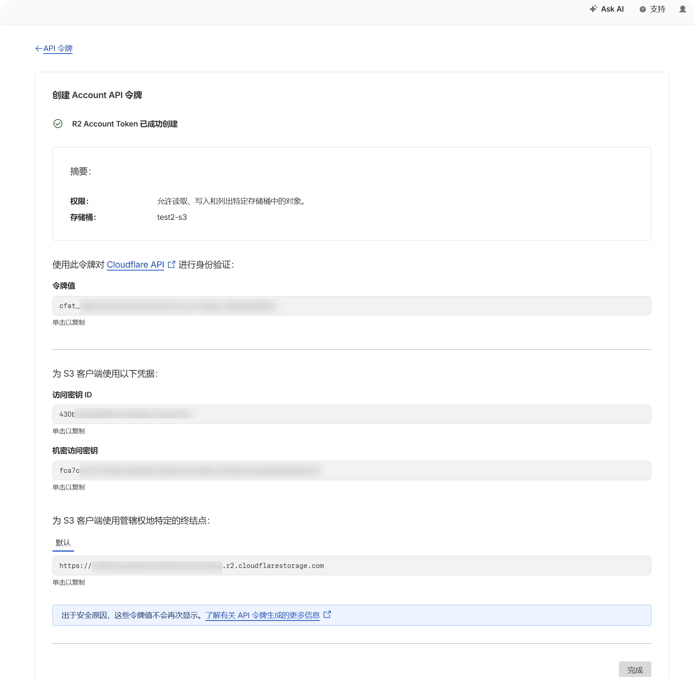
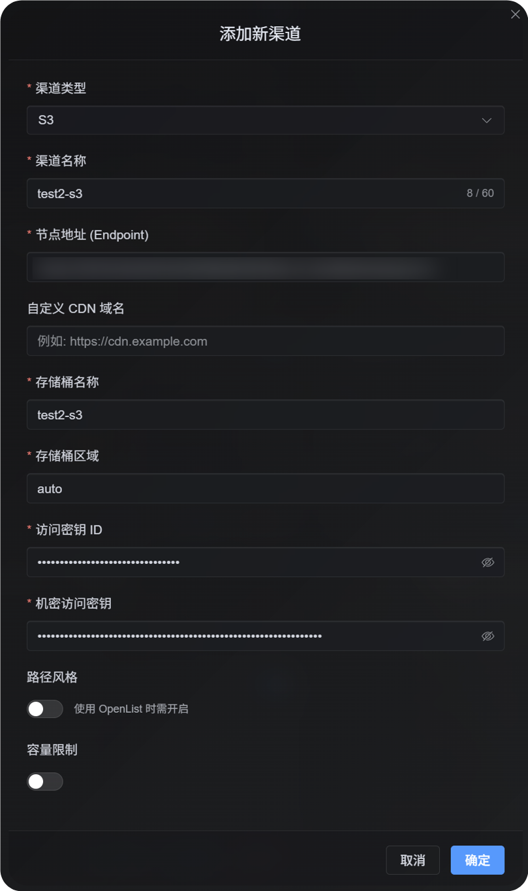
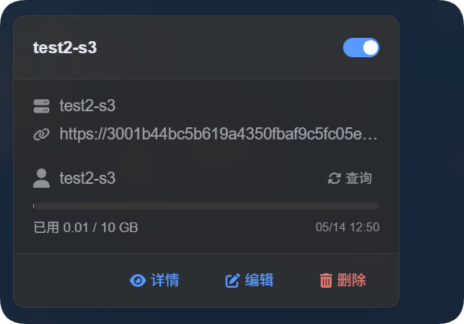

# Adicionar um canal S3

## Melhor uso

Use o canal S3 quando:

- Você quiser conectar qualquer serviço de armazenamento de objetos compatível com S3, como Cloudflare R2, Backblaze B2, MinIO, AWS S3 ou outro provedor compatível.
- Você preferir o modelo padrão de configuração S3: `Endpoint`, Access Key e Secret Key.
- Você não quiser usar o canal nativo de binding Cloudflare R2, ou seu provedor de armazenamento não for Cloudflare R2.

## O que você precisa antes de começar

| Requisito | Finalidade |
| --- | --- |
| S3 Endpoint | Endpoint da API S3 do serviço de armazenamento de objetos. |
| Bucket name | Bucket em que os arquivos serão armazenados. |
| Region | Região de armazenamento. Para Cloudflare R2, normalmente é `auto`. |
| Access Key ID | ID da access key S3. |
| Secret Access Key | Secret access key S3. |
| CDN domain | Domínio personalizado opcional para acesso aos arquivos. |

Exemplo para Cloudflare R2 pela API S3:

```text
Endpoint: https://your-account-id.r2.cloudflarestorage.com
Bucket: your-r2-bucket-name
Region: auto
Access Key ID: copied from the Cloudflare R2 API token
Secret Access Key: copied from the Cloudflare R2 API token
```

## Onde adicionar

1. Abra Configurações do sistema.
2. Acesse Configurações de upload.
3. Clique em Adicionar canal no canto superior direito.
4. Selecione `S3`.

## Referência de campos

| Campo | O que faz | Obrigatório |
| --- | --- | --- |
| Nome do canal | Um nome amigável para este canal S3, como `s3test` ou `R2-S3`. | Sim |
| Habilitar canal | Controla se este canal participa da seleção de upload. | Recomendado |
| Endpoint | Endpoint completo do serviço S3, incluindo `https://`. | Sim |
| Custom CDN domain | Opcional. Quando definido, os links de arquivo gerados preferem este domínio. | Não |
| Bucket name | Nome do bucket, como `s3test` ou `img-r2`. | Sim |
| Bucket region | Região. Para Cloudflare R2, normalmente é `auto`. | Sim |
| Access Key ID | ID da access key S3. | Sim |
| Secret Access Key | Secret access key S3. | Sim |
| Path-style access | Chave de compatibilidade. Desativado por padrão. Alguns serviços MinIO, OpenList ou S3 self-hosted podem exigir isso. | Não |
| Limite de cota | Controla se este canal S3 participa da seleção de upload com base na capacidade. | Não |
| Limite de capacidade | Obrigatório depois que o limite de cota é habilitado, por exemplo `10 GB`. | Obrigatório quando o limite de cota está habilitado |
| Limiar | Interrompe gravações quando o uso atinge esta porcentagem, por exemplo `90%`. | Obrigatório quando o limite de cota está habilitado |
| Observação | Notas para sua própria manutenção. | Não |

## Criar chaves de API S3 do Cloudflare R2

1. Abra o Cloudflare Dashboard.
2. Acesse `R2 Object Storage`.
3. Encontre `Manage R2 API Tokens` ou a entrada de gerenciamento de token de API.



4. Crie um token de API R2 que possa acessar o bucket de destino.



5. Copie o `Access Key ID` e o `Secret Access Key` gerados.



6. Volte para a página do bucket R2 e confirme o nome do bucket.
7. Registre o endpoint da API S3 da conta. Ele normalmente tem esta aparência:

```text
https://your-account-id.r2.cloudflarestorage.com
```

## Etapas de configuração

1. Abra Configurações de upload.
2. Clique em Adicionar canal.
3. Selecione `S3`.
4. Informe um nome de canal que você reconheça, por exemplo `s3test`.
5. Informe o endpoint da API S3 em `Endpoint`.
6. Se você usar uma CDN personalizada, informe-a em `Custom CDN domain`; caso contrário, deixe em branco.
7. Informe o nome do bucket.
8. Informe a região. Para o exemplo do Cloudflare R2, use `auto`.
9. Informe Access Key ID e Secret Access Key.
10. Deixe path-style access desativado, a menos que seu provedor exija isso explicitamente.
11. Se quiser controle de capacidade, habilite o limite de cota e informe o limite de capacidade e o limiar.
12. Clique em Salvar.



## Como verificar

| Verificação | Como verificar |
| --- | --- |
| O cartão do canal aparece | Depois de salvar, a página Configurações de upload deve mostrar um cartão de canal S3. |
| O canal está habilitado | O switch no canto superior direito do cartão deve permanecer ligado. |
| Os campos principais foram salvos | A visualização de detalhes deve mostrar Endpoint, Bucket, Region, path-style access e campos relacionados. |
| O upload funciona | Envie uma imagem de teste e confirme que o objeto aparece no bucket de destino. |
| O link abre | O link da imagem retornado após o upload deve abrir normalmente. |
| A exibição de capacidade funciona | Se o limite de cota estiver habilitado, o cartão deve mostrar a capacidade usada e o limite configurado. |

As estatísticas de capacidade do S3 são calculadas a partir dos registros locais de arquivos do ImgBed, não por consulta em tempo real ao bucket do provedor. Depois de salvar uma configuração S3, o sistema recalcula o ledger de cota a partir dos registros D1 atuais.



## FAQ

### Devo habilitar path-style access?

Normalmente, não.

Habilite somente quando seu provedor compatível com S3 não oferecer suporte a URLs virtual-hosted-style, ou quando a documentação do provedor exigir explicitamente path-style access. Alguns endpoints MinIO, S3 self-hosted e compatíveis com OpenList podem precisar disso.

### Para que serve o CDN domain?

Se você colocar uma CDN ou um domínio de acesso personalizado na frente do bucket, informe-o aqui.

Depois de configurado, os links de arquivo gerados preferem esse domínio. Se você não usa CDN, deixe em branco.

### Por que o upload falha?

Verifique estes itens primeiro:

1. O Endpoint inclui a URL completa com `https://`.
2. O nome do bucket está correto.
3. A Region corresponde ao requisito do provedor.
4. Access Key ID e Secret Access Key foram copiados por completo.
5. A chave tem permissão de gravação no bucket de destino.
6. O provedor não exige path-style access, ou path-style access foi habilitado se necessário.

## Lista de verificação rápida

```text
Prepare S3 Endpoint, Bucket, Region, Access Key, and Secret Key
-> Open Upload Settings
-> Add Channel
-> Select S3
-> Enter Endpoint / Bucket / Region / Access Key / Secret Key
-> Enter a CDN domain if needed
-> Leave path-style access off by default
-> Enable quota limit if needed
-> Save
-> Upload a test image and check the result
```
