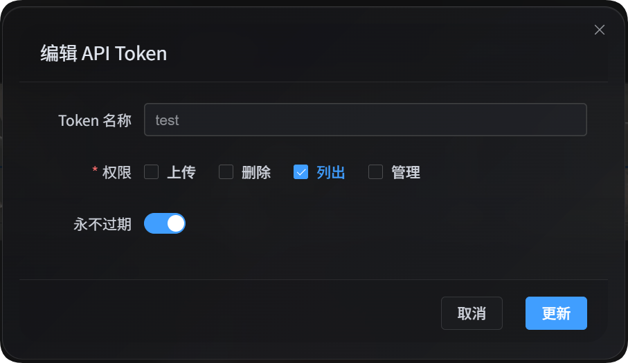

# Списки и фильтрация через API Token

Скрипт списков через API Token предназначен для скриптов, автоматизации и сторонних программ, которым нужно читать данные ImgBed. Он использует только право `list`: не загружает файлы, не удаляет файлы, не меняет настройки и не блокирует или разрешает загрузку для какого-либо IP.



Основные задачи:

| Возможность | Описание |
| --- | --- |
| Список в управлении файлами | Читает список файлов из панели администратора и поддерживает расширенные параметры фильтрации из управления файлами |
| Список в управлении пользователями | Читает статистику загрузок пользователей/IP и поддерживает параметры фильтрации из управления пользователями |
| Список каналов загрузки | Читает обезличенные каналы загрузки, подканалы, объем и сведения о балансировке нагрузки |
| Таблица статистики каталогов | Читает статистику каталогов и сведения о постраничном выводе каталогов |

## Подготовка

В панели администратора откройте:

```text
System Settings -> Security Settings -> API Token
```

При создании или редактировании API Token убедитесь, что для него разрешен просмотр списков. Этому скрипту нужно только право `list`.

Token можно также поместить в переменную окружения:

```powershell
$env:IMGBED_API_TOKEN="your API Token"
```

## Скачать скрипт

| Скрипт | Назначение |
| --- | --- |
| <a href="/tools/imgbed-token-list.mjs" download>Скачать скрипт списков и фильтрации</a> | Список в управлении файлами, список в управлении пользователями, список каналов загрузки, таблица статистики каталогов |

Требуется Node.js 18 или новее.

## Общие параметры

| Параметр | Обязателен | Описание |
| --- | --- | --- |
| `--base-url <url>` | Да | Адрес ImgBed, например `https://image.ai6.me` |
| `--token <token>` | Да | API Token; можно использовать `IMGBED_API_TOKEN` |
| `--retries <n>` | Нет | Повторы при временных ошибках; по умолчанию `3` |
| `--timeout-ms <n>` | Нет | Таймаут одного запроса; по умолчанию `180000` |
| `--output <pretty\|json>` | Нет | Формат вывода; по умолчанию `pretty`. Для программной обработки лучше использовать `json` |
| `--save-response <path>` | Нет | Сохранить итоговый результат в JSON |
| `-h` / `--help` | Нет | Показать справку скрипта |

## Список в управлении файлами

Показать файлы из управления файлами:

```powershell
node imgbed-token-list.mjs `
  --base-url "https://your-domain" `
  --token "your API Token" `
  --files `
  --count 10
```

Вывести JSON:

```powershell
node imgbed-token-list.mjs `
  --base-url "https://your-domain" `
  --token "your API Token" `
  --files `
  --count 10 `
  --output json
```

Прочитать только количество по текущим условиям фильтрации:

```powershell
node imgbed-token-list.mjs `
  --base-url "https://your-domain" `
  --token "your API Token" `
  --file-summary `
  --dir "photos/2026" `
  --recursive
```

### Параметры управления файлами

| Параметр | Описание |
| --- | --- |
| `--files` | Показать файлы |
| `--file-summary` | Прочитать только статистику количества |
| `--start <n>` | Смещение постраничного вывода |
| `--count <n>` | Количество возвращаемых результатов |
| `--dir <path>` | Указать каталог |
| `--recursive` | Включить файлы из подкаталогов |
| `--search <text>` | Поиск по ключевому слову |
| `--channel <key>` | Фильтр по основному каналу загрузки, например `github`, `s3`, `yandex` |
| `--channel-scope <primary\|backup\|all>` | Область фильтра канала: основной канал, резервный канал или все |
| `--channel-name-groups <value>` | Фильтр групп подканалов; передается в существующий параметр сервера без изменений |
| `--list-type <csv>` | Тип списка; часто используются `None,White,Block` |
| `--include-tags <csv>` | Теги, которые должны присутствовать |
| `--exclude-tags <csv>` | Теги, которые нужно исключить |
| `--time-start <ms>` | Начало времени загрузки, метка времени в миллисекундах |
| `--time-end <ms>` | Конец времени загрузки, метка времени в миллисекундах |
| `--file-exts <csv>` | Включить только указанные расширения, например `jpg,png,pdf` |
| `--exclude-file-exts <csv>` | Исключить указанные расширения |
| `--file-status-categories <csv>` | Категории файлов: `image,audio,video,document,code,other` |
| `--upload-ip <ip>` | Фильтр по префиксу IP загрузки |
| `--age-ratings <csv>` | Возрастная классификация: `none,all-ages,r12,r16,r18` |
| `--orientation <csv>` | Фильтр ориентации; передается в существующие значения сервера без изменений |
| `--read-source <csv>` | Фильтр источника чтения; передается в существующие значения сервера без изменений |
| `--access-status <normal\|blocked>` | Состояние публичного доступа |
| `--min-width <n>` | Минимальная ширина |
| `--max-width <n>` | Максимальная ширина |
| `--min-height <n>` | Минимальная высота |
| `--max-height <n>` | Максимальная высота |
| `--min-file-size <mb>` | Минимальный размер файла; единица соответствует существующему MB-параметру сервера |
| `--max-file-size <mb>` | Максимальный размер файла; единица соответствует существующему MB-параметру сервера |

### Примеры управления файлами

Найти PDF:

```powershell
node imgbed-token-list.mjs `
  --base-url "https://your-domain" `
  --token "your API Token" `
  --files `
  --search "pdf" `
  --file-status-categories "document" `
  --count 20
```

Фильтр по IP загрузки и каналу:

```powershell
node imgbed-token-list.mjs `
  --base-url "https://your-domain" `
  --token "your API Token" `
  --files `
  --upload-ip "103.62" `
  --channel yandex `
  --channel-scope primary
```

Сохранить полный результат:

```powershell
node imgbed-token-list.mjs `
  --base-url "https://your-domain" `
  --token "your API Token" `
  --files `
  --count 100 `
  --output json `
  --save-response ".\files.json"
```

## Список в управлении пользователями

Показать статистику загрузок пользователей/IP:

```powershell
node imgbed-token-list.mjs `
  --base-url "https://your-domain" `
  --token "your API Token" `
  --users `
  --count 20
```

Найти конкретный IP или местоположение:

```powershell
node imgbed-token-list.mjs `
  --base-url "https://your-domain" `
  --token "your API Token" `
  --users `
  --search "43.198.183.56"
```

Посмотреть подробности файлов, загруженных с конкретного IP:

```powershell
node imgbed-token-list.mjs `
  --base-url "https://your-domain" `
  --token "your API Token" `
  --user-detail `
  --ip "43.198.183.56" `
  --count 20
```

Показать IP, которым запрещена загрузка:

```powershell
node imgbed-token-list.mjs `
  --base-url "https://your-domain" `
  --token "your API Token" `
  --blocked-ips
```

### Параметры управления пользователями

| Параметр | Описание |
| --- | --- |
| `--users` | Показать статистику загрузок пользователей/IP |
| `--user-detail` | Показать подробности файлов, загруженных с конкретного IP |
| `--blocked-ips` | Показать IP, которым запрещена загрузка |
| `--ip <ip>` | Обязателен для `--user-detail` |
| `--start <n>` | Смещение постраничного вывода |
| `--count <n>` | Количество возвращаемых результатов |
| `--sort <value>` | Сортировка: `timeDesc`, `timeAsc`, `countDesc`, `countAsc`, `totalSizeDesc`, `totalSizeAsc` |
| `--search <text>` | Поиск IP или местоположения |
| `--upload-status <allowed\|blocked>` | Разрешена ли загрузка |
| `--start-time <ms>` | Начало периода статистики, метка времени в миллисекундах |
| `--end-time <ms>` | Конец периода статистики, метка времени в миллисекундах |
| `--file-status-categories <csv>` | Фильтр категории файла |
| `--age-ratings <csv>` | Фильтр возрастной классификации |
| `--min-file-size <mb>` | Минимальный размер файла |
| `--max-file-size <mb>` | Максимальный размер файла |
| `--list-type <csv>` | Тип списка; часто используются `None,White,Block` |
| `--access-status <normal\|blocked>` | Состояние публичного доступа |

### Примеры управления пользователями

Показать пользователей, которым запрещена загрузка:

```powershell
node imgbed-token-list.mjs `
  --base-url "https://your-domain" `
  --token "your API Token" `
  --users `
  --upload-status blocked
```

Поиск по ключевому слову местоположения:

```powershell
node imgbed-token-list.mjs `
  --base-url "https://your-domain" `
  --token "your API Token" `
  --users `
  --search "Hong Kong"
```

Сортировка по количеству загрузок:

```powershell
node imgbed-token-list.mjs `
  --base-url "https://your-domain" `
  --token "your API Token" `
  --users `
  --sort countDesc `
  --count 50
```

## Список каналов загрузки

Показать обезличенную конфигурацию каналов загрузки:

```powershell
node imgbed-token-list.mjs `
  --base-url "https://your-domain" `
  --token "your API Token" `
  --channels
```

Результат содержит:

| Поле | Описание |
| --- | --- |
| `type` | Основной канал загрузки, например `github`, `s3`, `yandex` |
| `name` | Имя подканала или аккаунта |
| `enabled` | Включен ли канал |
| `load_balance_enabled` | Включена ли балансировка нагрузки для этого основного канала |
| `quota_enabled` | Включена ли проверка объема |
| `quota_limit_bytes` | Лимит объема |
| `quota_used_bytes` | Использованный объем |
| `quota_checked_at` | Время проверки объема |
| `tag_json` | Несекретные теги, например публичный или приватный репозиторий |
| `created_at` / `updated_at` | Время создания и обновления |

Этот API не возвращает ключи, токены обновления, временные токены, пароли и другую чувствительную конфигурацию.

## Таблица статистики каталогов

Показать статистику каталогов:

```powershell
node imgbed-token-list.mjs `
  --base-url "https://your-domain" `
  --token "your API Token" `
  --directories `
  --limit 20
```

Показать полные пути каталогов и найти по префиксу:

```powershell
node imgbed-token-list.mjs `
  --base-url "https://your-domain" `
  --token "your API Token" `
  --directories `
  --scope full `
  --search-prefix "test" `
  --include-parents `
  --limit 10
```

### Параметры статистики каталогов

| Параметр | Описание |
| --- | --- |
| `--directories` | Показать таблицу статистики каталогов |
| `--dir <path>` | Каталог, с которого начинается список |
| `--scope <direct\|full>` | `direct` показывает только прямые подкаталоги, `full` показывает полные пути |
| `--search-prefix <path>` | Поиск по префиксу каталога |
| `--include-parents` | В режиме `full` также включить родительские каталоги |
| `--limit <n>` | Количество возвращаемых результатов; сервер возвращает максимум `100` |
| `--cursor <path>` | Курсор следующей страницы |

## Формат вывода

Формат `pretty` по умолчанию удобен для чтения человеком:

```powershell
node imgbed-token-list.mjs --base-url "https://your-domain" --token "your API Token" --users --count 5
```

Если результат будет обрабатывать другая программа, используйте `--output json`:

```powershell
node imgbed-token-list.mjs --base-url "https://your-domain" --token "your API Token" --users --count 5 --output json
```

Можно также сохранить полный результат:

```powershell
node imgbed-token-list.mjs `
  --base-url "https://your-domain" `
  --token "your API Token" `
  --users `
  --count 5 `
  --output json `
  --save-response ".\users.json"
```

## Частые вопросы

### Этот скрипт меняет данные?

Нет. Этот скрипт вызывает только API чтения. Он не загружает, не удаляет и не перемещает файлы, не редактирует конфигурацию и не блокирует или разрешает загрузку для какого-либо IP.

### Почему требуется право `list`?

Список в управлении файлами, список в управлении пользователями, обезличенный список каналов и статистика каталогов относятся к возможностям чтения, поэтому достаточно права `list` у API Token.

### Как посмотреть доступные параметры?

Выполните:

```powershell
node imgbed-token-list.mjs --help
```

Скрипт покажет все действия и параметры.

