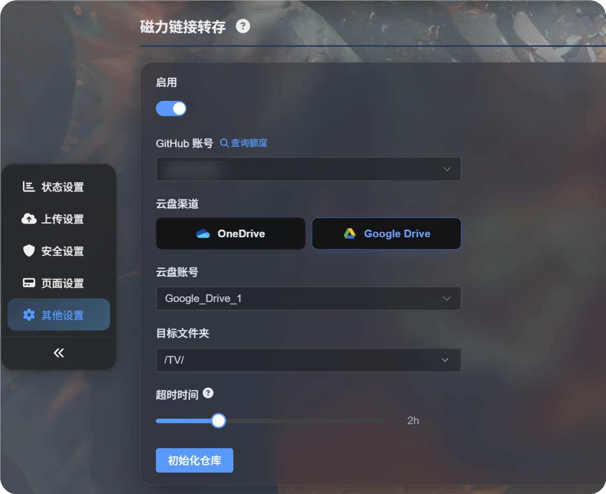
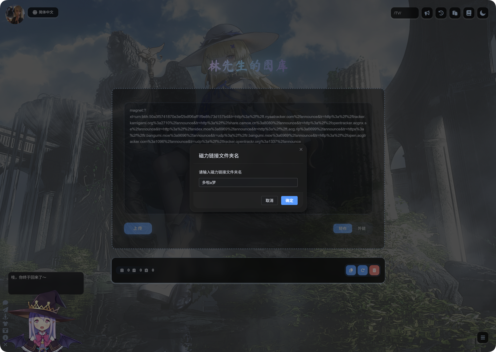

# மக்னெட் பரிமாற்றம்

மக்னெட் பரிமாற்றம் மக்னெட் இணைப்பிலிருந்து கோப்புகளை பதிவிறக்கம் செய்து, நீங்கள் தேர்வு செய்த கிளவுட் சேமிப்பு சேனலுக்கு அவற்றை தானாக பதிவேற்றுகிறது.

அனிமே அத்தியாயங்கள், வீடியோக்கள், காப்பகக் கோப்புகள் மற்றும் இதற்கு ஒத்த கோப்புகளை மாற்றுவதற்கு இது பயனுள்ளது. மக்னெட் இணைப்பை ஒட்டினால், ImgBed பின்னணி பதிவிறக்க பணியை உருவாக்கும். பதிவிறக்கம் முடிந்த பிறகு, கோப்பு ImgBed-க்கு பதிவேற்றப்பட்டு இறுதி இணைப்பு பதிவேற்ற பட்டியலில் தோன்றும்.

## எங்கு பயன்படுத்துவது

மக்னெட் பரிமாற்ற நுழைவிடம் முகப்பு பக்கத்தின் பதிவேற்ற பகுதியில் உள்ளது.

மக்னெட் இணைப்பை உள்ளீட்டு பெட்டியில் ஒட்டி, `Transfer` தேர்வு செய்து, பின்னர் பதிவேற்றவும்.

## முதல் பயன்பாட்டுக்கு முன்

முதலில் நிர்வாக பலகையில் மக்னெட் பரிமாற்றத்தை அமைக்கவும்.

பொதுவாக உங்களுக்கு தேவையானவை:

1. பதிவிறக்க பணியை இயக்க GitHub கணக்கு.
2. Google Drive அல்லது OneDrive போன்ற கிளவுட் பதிவேற்ற சேனல்.
3. இலக்கு பதிவேற்ற அடைவு.
4. பணியின் நேரவரம்பு.

அமைப்புகள் தயாரான பிறகு, முகப்பு பக்கத்துக்கு திரும்பி மக்னெட் இணைப்பை ஒட்டி பரிமாற்றத்தை தொடங்கவும்.

## மக்னெட் இணைப்பை பதிவேற்றுதல்

1. முகப்பு பக்க பதிவேற்ற பெட்டியில் மக்னெட் இணைப்பை ஒட்டவும்.
2. முறை `Transfer` என அமைந்துள்ளதா உறுதிப்படுத்தவும்.
3. பதிவேற்ற பொத்தானைக் கிளிக் செய்யவும்.
4. ImgBed மக்னெட் பணியை உருவாக்கும் வரை காத்திருக்கவும்.
5. பணி தொடங்கிய பிறகு, முன்னேற்றத்தை பார்க்க கீழ் வலது மூலையில் உள்ள `Magnet Tasks` மிதக்கும் பலகையை பயன்படுத்தவும்.

பதிவிறக்கம் மற்றும் பதிவேற்றம் நேரம் எடுக்கலாம். வேகம் மக்னெட் வளம், GitHub இயக்க சூழல் மற்றும் தேர்ந்தெடுத்த கிளவுட் சேமிப்பு சேனலை சார்ந்தது.

## முடிந்த பிறகு

பணி முடிந்த பிறகு, பதிவேற்ற பட்டியல் கோப்பு பெயரையும் இணைப்பையும் காட்டும்.

வீடியோக்களுக்கு வீடியோ முன்னோட்டம், படங்களுக்கு பட முன்னோட்டம், மற்ற கோப்புகளுக்கு சாதாரண கோப்பு ஐகான் காட்டப்படும்.

நீங்கள் நகலெடுக்கலாம்:

| இணைப்பு வகை | பயன்பாட்டு நிலை |
| --- | --- |
| மூல இணைப்பு | கோப்பை நேரடியாக அணுகுதல் |
| Markdown | Markdown பதிவுகள் அல்லது குறிப்புகள் |
| HTML | வலைப் பக்க குறியீடு |
| BBCode | BBCode ஆதரிக்கும் மன்றங்கள் |

## மக்னெட் பணிப் பலகம்

கீழ் வலது மூலையில் உள்ள மக்னெட் பணிப் பலகம் பணி எண்ணிக்கை, பணி பெயர், முன்னேற்றம் மற்றும் இறுதி நிலையை காட்டும்.

பொதுவான நிலைகள்:

| நிலை | பொருள் |
| --- | --- |
| காத்திருக்கிறது | பணி உருவாக்கப்பட்டு இயக்கத்துக்காக காத்திருக்கிறது. |
| பதிவிறக்குகிறது | மக்னெட் வளம் பதிவிறக்கப்படுகிறது. |
| பதிவேற்றுகிறது | கோப்பு பதிவிறக்கம் முடிந்து கிளவுட் சேமிப்பகத்துக்கு பதிவேற்றப்படுகிறது. |
| முடிந்தது | பதிவேற்றம் வெற்றி பெற்றது; இணைப்பை நகலெடுக்கலாம். |
| தோல்வி | பணி வெற்றிகரமாக முடியவில்லை. செய்தியை பார்த்து மீண்டும் முயற்சிக்கவும். |

## குறிப்புகள்

- ஒரு மக்னெட் இணைப்பில் பல கோப்புகள் இருந்தால், முடிந்த முக்கிய கோப்பை காட்சிக்கு ImgBed முன்னுரிமை அளிக்கும்.
- பெரிய கோப்புகள் அதிக நேரம் எடுக்கும். பக்கத்தை புதுப்பிக்கும் முன் பணி முடியும் வரை காத்திருக்கவும்.
- மக்னெட் வளத்துக்கு கிடைக்கும் இணை முனைகள் இல்லையெனில், அது மிகவும் மெதுவாக இருக்கலாம் அல்லது தோல்வியடையலாம்.
- கிளவுட் கணக்கில் ஒதுக்கீடு இல்லாவிட்டால், அங்கீகாரம் காலாவதியானால் அல்லது பதிவேற்ற அடைவு தவறாக இருந்தால், பணி தோல்வியடையலாம்.
- பதிவேற்றம் முடிந்த பிறகு வீடியோ முன்னோட்டம் தோன்ற சில விநாடிகள் ஆகலாம்.

## அடிக்கடி கேட்கப்படும் கேள்விகள்

### மக்னெட் இணைப்பை ஒட்டிய பிறகு எதுவும் தொடங்கவில்லை

நிர்வாக பலகையில் மக்னெட் பரிமாற்றம் இயக்கப்பட்டுள்ளதா, பயன்படுத்தக்கூடிய GitHub கணக்கும் கிளவுட் சேனலும் தேர்வு செய்யப்பட்டுள்ளனவா என்பதை உறுதிப்படுத்தவும்.

### பதிவிறக்கம் எப்போதும் மெதுவாக உள்ளது

மக்னெட் வேகம் வளத்தையே சார்ந்தது. கிடைக்கும் இணை முனைகள் இல்லையெனில் பதிவிறக்கம் மிகவும் மெதுவாக இருக்கலாம் அல்லது முடியாமல் போகலாம்.

### பதிவேற்றத்திற்குப் பிறகு முன்னோட்டம் இல்லை

முதலில் கோப்பு இணைப்பு திறக்கிறதா என்பதை உறுதிப்படுத்தவும். வீடியோ கோப்புகள் உலாவியில் ஏற சிறிது நேரம் தேவைப்படலாம், அல்லது இணைப்பை நேரடியாக திறக்கலாம்.

### பணி தோல்வியடைந்தால் என்ன சரிபார்க்க வேண்டும்?

மக்னெட் இணைப்பு செல்லுபடியாகிறதா, கிளவுட் சேனல் செயல்படுகிறதா, பதிவேற்ற அடைவு சரியா என்பதைச் சரிபார்க்கவும். பின்னர் பணியை மீண்டும் சமர்ப்பிக்கவும்.
