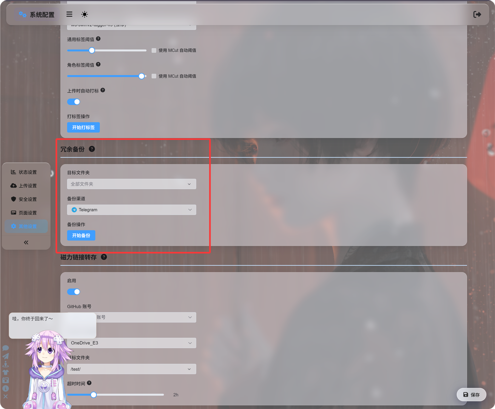
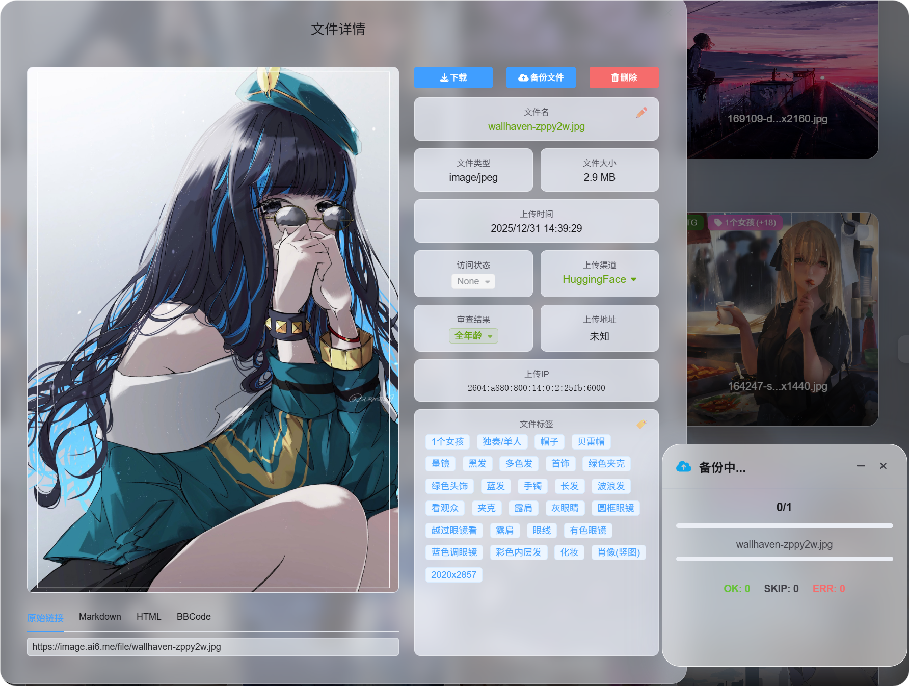
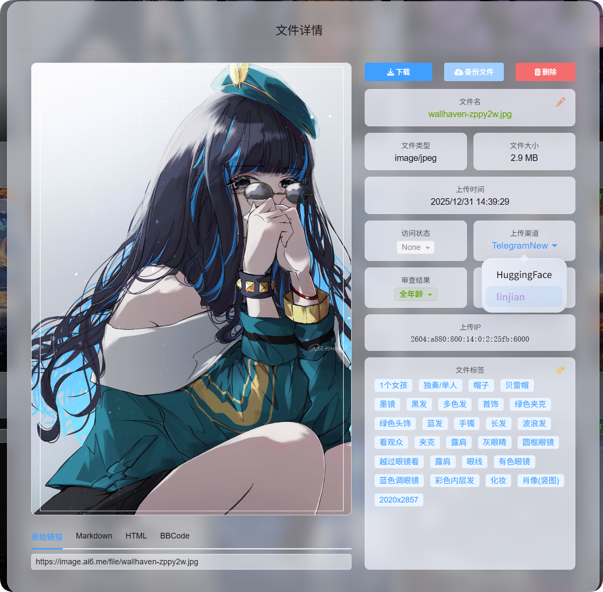

# மீள்நகல் காப்புப்பிரதி மற்றும் வாசிப்பு மூலம் மாற்றுதல்

மீள்நகல் காப்புப்பிரதி ஏற்கனவே பதிவேற்றப்பட்ட கோப்பின் கூடுதல் பிரதியை சேமிக்கிறது.

முதன்மை கோப்பும் காப்புப்பிரதி கோப்பும் வாசிப்பு மூலங்களாக பயன்படுத்தப்படலாம். பார்வையாளர்களுக்கு பொதுவாக வேறுபாடு தெரியாது. வேறுபாடு கோப்பை எந்த சேமிப்பு சேனல் வழங்குகிறது என்பதில்தான் உள்ளது.

## மீள்நகல் காப்புப்பிரதி செய்யக்கூடியவை

| அம்சம் | விளக்கம் |
| --- | --- |
| கூடுதல் பிரதியை சேமித்தல் | ஒரு சேனல் தோல்வியடையும் அபாயத்தை குறைக்க கோப்புகளை மற்றொரு பதிவேற்ற சேனலில் காப்புப்பிரதி எடுக்கிறது. |
| வாசிப்பு மூலம் மாற்றுதல் | காப்புப்பிரதி வெற்றி பெற்ற பிறகு, கோப்பு வாசிப்பை முதன்மை சேனல் மற்றும் காப்புப்பிரதி சேனலுக்கு இடையில் மாற்றுகிறது. |
| ஒற்றை கோப்பு காப்புப்பிரதி | கோப்பு விவரப் பக்கத்திலிருந்து ஒரு கோப்பை காப்புப்பிரதி எடுக்கிறது. |
| தொகுதி காப்புப்பிரதி | நிர்வாக பக்கத்தில் பல கோப்புகளை தேர்வு செய்து அவற்றை ஒன்றாக காப்புப்பிரதி எடுக்கிறது. |
| முழு அமைப்புக்கான மீள்நகல் காப்புப்பிரதி | பிற அமைப்புகளில் கோப்புறையின்படி கோப்புகளை காப்புப்பிரதி எடுக்கிறது. |

## மீள்நகல் காப்புப்பிரதி நுழைவு

திறக்கவும்:

```text
System Settings -> Other Settings -> Redundant Backup
```



ஒரு கோப்புறைக்கும் அல்லது அனைத்து கோப்புகளுக்கும் தொகுதியாக காப்புப்பிரதிகளை சேர்க்க இந்த நுழைவு சிறந்தது.

காப்புப்பிரதி சேனலை கைமுறையாக தேர்வு செய்யலாம், அல்லது தானியக்க மாற்றத்தை தேர்வு செய்து ImgBed பொருத்தமான காப்புப்பிரதி சேனலை கண்டுபிடிக்க அனுமதிக்கலாம்.

## கோப்பு விவரங்களில் இருந்து காப்புப்பிரதி

நிர்வாக பலகையில் கோப்பு விவரப் பக்கத்தை திறந்து காப்புப்பிரதி பொத்தானைக் கிளிக் செய்யவும்.



தேவைக்கேற்ப ஒரு முக்கிய கோப்பை காப்புப்பிரதி எடுக்க இது சிறந்தது.

காப்புப்பிரதி வெற்றி பெற்ற பிறகு, கோப்பு விவரப் பக்கம் கிடைக்கும் வாசிப்பு மூலங்களை காட்டும்.

## தேர்வின் அடிப்படையிலான தொகுதி காப்புப்பிரதி

நிர்வாக பலகையில் பல கோப்புகளை தேர்வு செய்து தொகுதி காப்புப்பிரதியை இயக்கவும்.


ஒரு கோப்பு குழுவை செயலாக்க இது சிறந்தது.

தேர்ந்தெடுத்த கோப்புகளுக்கான காப்புப்பிரதி, கோப்பு விவர காப்புப்பிரதி மற்றும் பிற அமைப்புகளில் உள்ள மீள்நகல் காப்புப்பிரதி அனைத்தும் அதே காப்புப்பிரதி அமைப்பை பயன்படுத்துகின்றன. அவை வெவ்வேறு நுழைவு இடங்களே.

## காப்புப்பிரதிக்குப் பிறகு வாசிப்பு மூலத்தை மாற்றுதல்

காப்புப்பிரதி முடிந்த பிறகு, கோப்பு விவரப் பக்கம் வாசிப்பு மூலத்தை மாற்ற அனுமதிக்கும்:

| வாசிப்பு மூலம் | விளக்கம் |
| --- | --- |
| முதன்மை சேனல் | மூல பதிவேற்ற சேனலிலிருந்து வாசிக்கும். |
| காப்புப்பிரதி சேனல் | காப்புப்பிரதி சேனலிலிருந்து வாசிக்கும். |



கோப்பு முதன்மை சேனலிலிருந்து வருகிறதா அல்லது காப்புப்பிரதி சேனலிலிருந்து வருகிறதா என்பதை பார்வையாளர்கள் அறிய தேவையில்லை.

நீங்கள் தேர்வு செய்யும் வாசிப்பு மூலம் பின்னர் கோப்பு அணுகலுக்கான முன்னுரிமை மூலமாக மாறும்.

## காப்புப்பிரதி எப்போது தவிர்க்கப்படும்

காப்புப்பிரதியின் போது கீழ்க்கண்ட நிலைகள் தவிர்க்கப்படும். இவை பிழைகள் அல்ல.

| நிலை | ஏன் தவிர்க்கப்படுகிறது |
| --- | --- |
| ஏற்கனவே காப்புப்பிரதி உள்ளது | ஏற்கனவே காப்புப்பிரதி உள்ள கோப்பு மீண்டும் காப்புப்பிரதி எடுக்கப்படாது. |
| முதன்மை மற்றும் காப்புப்பிரதி சேனல்கள் ஒன்றே | காப்புப்பிரதி பொருள் கொள்ள, அது மற்றொரு சேனலில் சேமிக்கப்பட வேண்டும். |
| பயன்படுத்தக்கூடிய காப்புப்பிரதி சேனல் இல்லை | பொருத்தமான மாற்று சேனல் கிடைக்கவில்லை. |

சுருக்கமாக: காப்புப்பிரதிகள் மற்றொரு சேனலுக்கு செல்ல வேண்டும்; ஏற்கனவே காப்புப்பிரதி எடுக்கப்பட்ட கோப்புகள் மீண்டும் கூடுதல் இடத்தை பயன்படுத்தாது.

## முதன்மை சேனல் மற்றும் காப்புப்பிரதி சேனல்

| பெயர் | பொருள் |
| --- | --- |
| முதன்மை சேனல் | கோப்பு முதலில் பதிவேற்றப்பட்ட சேனல். |
| காப்புப்பிரதி சேனல் | மீள்நகல் பிரதியை சேமிக்கும் சேனல். |
| முதன்மை வாசிப்பு மூலம் | கோப்பு தற்போது முதன்மை சேனலிலிருந்து வாசிக்கப்படுகிறது. |
| காப்புப்பிரதி வாசிப்பு மூலம் | கோப்பு தற்போது காப்புப்பிரதி சேனலிலிருந்து வாசிக்கப்படுகிறது. |

முதன்மை மற்றும் காப்புப்பிரதி வாசிப்பு மூலங்கள் பயனர் பார்வையில் ஒரே மாதிரி செயல்படும்.

காப்புப்பிரதி கோப்பு கிடைக்கும் நிலையில் இருந்தால், காப்புப்பிரதி வாசிப்பு மூலத்திற்கு மாற்றிய பிறகும் படங்கள், வீடியோக்கள் மற்றும் பதிவிறக்க இணைப்புகள் தொடர்ந்து இயங்கும்.

## கோப்பு நீக்கப்பட்டால் என்ன நடக்கும்

ஒரு கோப்பு நீக்கப்படும்போது, ImgBed முதன்மை கோப்பையும் காப்புப்பிரதி கோப்பையும் நீக்கும்.
