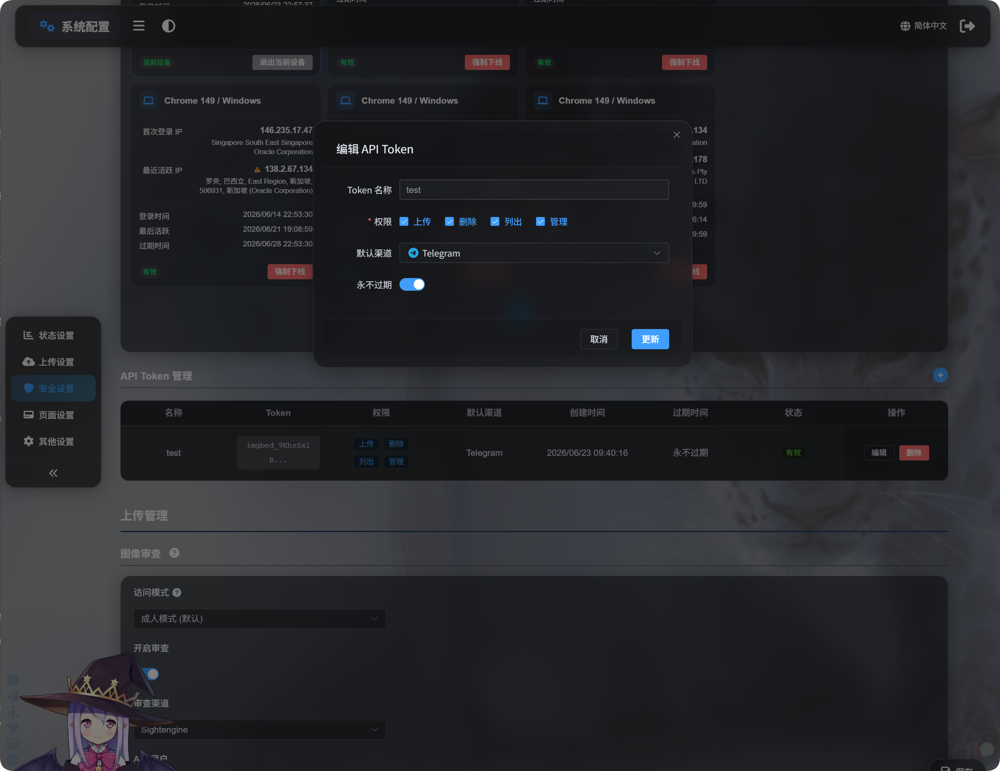

# API Token மூலம் அமைப்பு மேலாண்மை

API Token அமைப்பு மேலாண்மை தானியக்க ஸ்கிரிப்ட்கள், செயல்பாட்டு கருவிகள் அல்லது மூன்றாம் தரப்பு கட்டுப்பாட்டு பலகைகளுக்காக வடிவமைக்கப்பட்டுள்ளது. நிர்வாகப் பக்கத்தைத் திறக்காமல் பதிவேற்ற சேனல் அமைப்பு, பாதுகாப்பு அமைப்புகள், பக்க அமைப்புகள், பிற அமைப்புகள் மற்றும் இலகு கூட்டமைப்பு இணைப்புகளைப் படிக்கவும் புதுப்பிக்கவும் இது முடியும்.

மேலாண்மை அனுமதி ஸ்கிரிப்ட்களுக்கு ஏற்ற இலகு செயல்பாடுகளை மட்டுமே திறக்கும். உலாவி உறுதிப்படுத்தல், முன்தள தொகுதி பணிகள் அல்லது கூட்டமைப்பு குறியீட்டு சுத்தம் தேவைப்படும் கனரக செயல்பாடுகள் இன்னும் உலாவி நிர்வாகப் பலகையிலேயே செய்யப்பட வேண்டும்.



## தொடங்குவதற்கு முன்

நிர்வாகப் பலகையைத் திறந்து இங்கே செல்லவும்:

```text
System Settings -> Security Settings -> API Token
```

API Token உருவாக்கும் போது அல்லது திருத்தும் போது, அதற்கு மேலாண்மை அனுமதி இருப்பதை உறுதிசெய்யவும். மேலாண்மை அனுமதி தள அமைப்பை மாற்ற முடியும்; எனவே நம்பகமான ஸ்கிரிப்ட்களுக்கும் நம்பகமான பயனர்களுக்கும் மட்டுமே இதை வழங்கவும்.

மூன்று மேலாண்மை ஸ்கிரிப்ட்களும் எழுதும் செயல்பாடுகளுக்கு இயல்பாக முன்னோட்ட முறையைப் பயன்படுத்தும். முன்னோட்டத்தைப் பார்த்த பிறகு, மாற்றங்களை உண்மையாகச் சேமிக்க `--apply` சேர்க்கவும்.

Token-ஐ சூழல் மாறியிலும் வைக்கலாம்:

```powershell
$env:IMGBED_API_TOKEN="your API Token"
```

## மேலாண்மை ஸ்கிரிப்ட்களைப் பதிவிறக்குதல்

ஆவணத் தொகுப்பு மூன்று Node.js ஸ்கிரிப்ட்களை வழங்குகிறது:

| ஸ்கிரிப்ட் | நோக்கம் |
| --- | --- |
| <a href="/tools/imgbed-token-upload-settings.mjs" download>பதிவேற்ற அமைப்பு மேலாண்மை ஸ்கிரிப்டைப் பதிவிறக்கவும்</a> | பதிவேற்ற சேனல்கள், துணை சேனல்கள் மற்றும் சுமை சமநிலையை நிர்வகிக்கும். |
| <a href="/tools/imgbed-token-site-settings.mjs" download>தள அமைப்பு மேலாண்மை ஸ்கிரிப்டைப் பதிவிறக்கவும்</a> | பாதுகாப்பு அமைப்புகள், பக்க அமைப்புகள் மற்றும் பிற அமைப்புகளை நிர்வகிக்கும். |
| <a href="/tools/imgbed-token-federation.mjs" download>கூட்டமைப்பு இணைப்பு மேலாண்மை ஸ்கிரிப்டைப் பதிவிறக்கவும்</a> | இலகு கூட்டமைப்பு இணைப்பு செயல்கள், கோரிக்கைகள் மற்றும் செய்திகளை நிர்வகிக்கும். |

Node.js 18 அல்லது அதற்கு மேல் தேவை.

### பொதுவான அளவுருக்கள்

| அளவுரு | கட்டாயம் | விளக்கம் |
| --- | --- | --- |
| `--base-url <url>` | ஆம் | ImgBed தள URL, உதாரணமாக `https://image.ai6.me`. |
| `--token <token>` | ஆம் | API Token. `IMGBED_API_TOKEN` சூழல் மாறியையும் பயன்படுத்தலாம். |
| `--retries <n>` | இல்லை | தற்காலிக தோல்விகளுக்கான மீண்டும் முயற்சி எண்ணிக்கை. இயல்புநிலை `3`. |
| `--timeout-ms <n>` | இல்லை | கோரிக்கை நேரவரம்பு. இயல்புநிலை `180000`. |
| `--output <pretty\|json>` | இல்லை | வெளியீட்டு வடிவம். இயல்புநிலை `pretty`; நிரல்களுக்கு `json` பயன்படுத்தவும். |
| `--save-response <path>` | இல்லை | இறுதி JSON முடிவை கோப்பாகச் சேமிக்கும். |
| `--apply` | இல்லை | எழுதுதலை உண்மையாகச் செயல்படுத்தும். இது இல்லாமல் எழுதும் செயல்பாடுகள் முன்னோட்டத்தை மட்டும் காட்டும். |
| `-h` / `--help` | இல்லை | ஸ்கிரிப்ட் உதவியை காட்டும். |

## பதிவேற்ற அமைப்புகள்

பதிவேற்ற அமைப்பு ஸ்கிரிப்ட் பதிவேற்ற துணை சேனல்களைப் பட்டியலிடும், படிக்கும், உருவாக்கும், திருத்தும் மற்றும் நீக்கும். ஒரு மேல் நிலை பதிவேற்ற சேனலுக்கான சுமை சமநிலையையும் இயக்கவோ அணைக்கவோ முடியும்.

```powershell
node imgbed-token-upload-settings.mjs --base-url "https://your-domain" --token "your API Token" --list
```

### பதிவேற்ற அமைப்பு அளவுருக்கள்

| அளவுரு | விளக்கம் |
| --- | --- |
| `--list` | பதிவேற்ற அமைப்பு குழுக்களைப் பட்டியலிடும். |
| `--get` | மேல் நிலை சேனலையோ அதின் கீழுள்ள ஒரு துணை சேனலையோ படிக்கும். |
| `--upsert` | ஒரு துணை சேனலை உருவாக்கும் அல்லது திருத்தும். `--apply` இல்லாவிட்டால் முன்னோட்டம். |
| `--delete` | ஒரு துணை சேனலை நீக்கும். `--apply` இல்லாவிட்டால் முன்னோட்டம். |
| `--load-balance <true\|false>` | மேல் நிலை சேனலுக்கு சுமை சமநிலையை இயக்கும் அல்லது அணைக்கும். |
| `--channel <key>` | மேல் நிலை பதிவேற்ற சேனல், உதாரணமாக `s3`, `github`, அல்லது `telegram`. |
| `--channel-name <name>` | துணை சேனல் அல்லது கணக்கு பெயர். |
| `--set key=value` | ஒரு புலத்தை அமைக்கும். மீண்டும் பயன்படுத்தலாம். புள்ளி பாதைகள் ஆதரிக்கப்படுகின்றன. |
| `--patch-json <path>` | JSON கோப்பிலிருந்து புலங்களை ஒன்றிணைக்கும். |
| `--apply` | எழுதும் முடிவைச் சேமிக்கும். |

### சேனல் key-கள்

| சேனல் key | சேனல் |
| --- | --- |
| `telegram` / `tg` | Telegram |
| `discord` / `dc` | Discord |
| `cfr2` / `r2` | Cloudflare R2 |
| `s3` | S3 |
| `webdav` / `wd` | WebDAV சேமிப்பு சேனல் |
| `github` / `gh` | GitHub Releases |
| `gitlab` / `gl` | GitLab Packages |
| `huggingface` / `hf` | Hugging Face |
| `onedrive` / `od` | OneDrive |
| `googledrive` / `google` / `gd` | Google Drive |
| `dropbox` / `db` | Dropbox |
| `yandex` / `yx` | Yandex Disk |
| `pcloud` / `pd` | pCloud |

### பதிவேற்ற அமைப்பு எடுத்துக்காட்டுகள்

அனைத்து பதிவேற்ற அமைப்புகளையும் பட்டியலிடுதல்:

```powershell
node imgbed-token-upload-settings.mjs `
  --base-url "https://your-domain" `
  --token "your API Token" `
  --list
```

S3 சேனல் அமைப்பைப் படித்தல்:

```powershell
node imgbed-token-upload-settings.mjs `
  --base-url "https://your-domain" `
  --token "your API Token" `
  --get `
  --channel s3
```

ஒரு S3 துணை சேனலைப் படித்தல்:

```powershell
node imgbed-token-upload-settings.mjs `
  --base-url "https://your-domain" `
  --token "your API Token" `
  --get `
  --channel s3 `
  --channel-name "backup-s3"
```

ஒரு துணை சேனலை உருவாக்குதல் அல்லது திருத்துதல். முதலில் `--apply` இன்றி இயக்கி முன்னோட்டத்தைப் பார்க்கவும்:

```powershell
node imgbed-token-upload-settings.mjs `
  --base-url "https://your-domain" `
  --token "your API Token" `
  --upsert `
  --channel webdav `
  --channel-name "backup-webdav" `
  --set enabled=false `
  --set remark="backup test"
```

உறுதிசெய்த பிறகு சேமிக்கவும்:

```powershell
node imgbed-token-upload-settings.mjs `
  --base-url "https://your-domain" `
  --token "your API Token" `
  --upsert `
  --channel webdav `
  --channel-name "backup-webdav" `
  --set enabled=false `
  --set remark="backup test" `
  --apply
```

ஒரு துணை சேனலை நீக்குதல்:

```powershell
node imgbed-token-upload-settings.mjs `
  --base-url "https://your-domain" `
  --token "your API Token" `
  --delete `
  --channel webdav `
  --channel-name "backup-webdav" `
  --apply
```

S3 சுமை சமநிலையை இயக்குதல்:

```powershell
node imgbed-token-upload-settings.mjs `
  --base-url "https://your-domain" `
  --token "your API Token" `
  --load-balance true `
  --channel s3 `
  --apply
```

சிக்கலான புலங்களுக்கு, JSON கோப்பை எழுதி `--patch-json` உடன் வழங்கவும்:

```json
{
  "enabled": true,
  "remark": "primary account"
}
```

```powershell
node imgbed-token-upload-settings.mjs `
  --base-url "https://your-domain" `
  --token "your API Token" `
  --upsert `
  --channel s3 `
  --channel-name "primary-s3" `
  --patch-json ".\s3-channel.json" `
  --apply
```

## தள அமைப்புகள்

தள அமைப்பு ஸ்கிரிப்ட் மூன்று அமைப்பு பகுதிகளை நிர்வகிக்கும்:

| பகுதி | அளவுரு | விளக்கம் |
| --- | --- | --- |
| பாதுகாப்பு அமைப்புகள் | `security` | பயனர் அங்கீகாரம், நிர்வாகி அங்கீகாரம், உள்நுழைவு சாதனங்கள், API Token, பட மிதப்படுத்தல், பயனர் வரம்புகள், WebDAV மற்றும் பல. |
| பக்க அமைப்புகள் | `page` | உலகளாவிய பக்கம், பயனர் பக்கம், நிர்வாகி பக்கம் மற்றும் தொடர்புடைய காட்சி அமைப்புகள். |
| பிற அமைப்புகள் | `others` | சீரற்ற படம் API, பொதுப் பார்வை, உள்ளூர் கூட்டமைப்பு கணு, தானியக்க குறிச்சொற்கள், IP புவியிடம், காப்பு சேனல், OCR மற்றும் பல. |

திருத்தக்கூடிய பகுதிகள், பிரிவுகள் மற்றும் புலங்களைப் பார்க்க முதலில் `--list-sections` பயன்படுத்தவும்:

```powershell
node imgbed-token-site-settings.mjs `
  --base-url "https://your-domain" `
  --token "your API Token" `
  --list-sections
```

### தள அமைப்பு அளவுருக்கள்

| அளவுரு | விளக்கம் |
| --- | --- |
| `--list-sections` | திருத்தக்கூடிய பகுதிகள், பிரிவுகள் மற்றும் புலங்களைப் பட்டியலிடும். |
| `--get` | ஒரு அமைப்பு பிரிவைப் படிக்கும். |
| `--area <security\|page\|others>` | அமைப்பு பகுதியைத் தேர்வு செய்யும். |
| `--section <name>` | பிரிவைத் தேர்வு செய்யும். `--list-sections` காட்டும் பெயர்களைப் பயன்படுத்தவும். |
| `--set key=value` | ஒரு புலத்தை அமைக்கும். மீண்டும் பயன்படுத்தலாம். |
| `--apply` | எழுதும் முடிவைச் சேமிக்கும். |

`page` பகுதியில், `--set` பக்க அமைப்பு உருப்படி ID-களைப் பயன்படுத்தும், உதாரணமாக `starsEffect=true`. `security` மற்றும் `others` பகுதிகளில், `--set` அந்த பிரிவில் உள்ள புலப் பெயரைப் பயன்படுத்தும், உதாரணமாக `email=admin@example.com`.

### தள அமைப்பு எடுத்துக்காட்டுகள்

கணினி புதுப்பிப்பு அறிவிப்பு அமைப்புகளைப் படித்தல்:

```powershell
node imgbed-token-site-settings.mjs `
  --base-url "https://your-domain" `
  --token "your API Token" `
  --get `
  --area security `
  --section systemUpdate
```

கணினி புதுப்பிப்பு அறிவிப்பு மின்னஞ்சலை மாற்றுதல். முதலில் `--apply` இன்றி இயக்கி முன்னோட்டத்தைப் பார்க்கவும்:

```powershell
node imgbed-token-site-settings.mjs `
  --base-url "https://your-domain" `
  --token "your API Token" `
  --area security `
  --section systemUpdate `
  --set email="admin@example.com"
```

உறுதிசெய்த பிறகு சேமிக்கவும்:

```powershell
node imgbed-token-site-settings.mjs `
  --base-url "https://your-domain" `
  --token "your API Token" `
  --area security `
  --section systemUpdate `
  --set email="admin@example.com" `
  --apply
```

நிர்வாகி பக்க நட்சத்திர விளைவை மாற்றுதல்:

```powershell
node imgbed-token-site-settings.mjs `
  --base-url "https://your-domain" `
  --token "your API Token" `
  --area page `
  --section adminSettings `
  --set starsEffect=true `
  --apply
```

IP புவியிடம் மொழியை மாற்றுதல்:

```powershell
node imgbed-token-site-settings.mjs `
  --base-url "https://your-domain" `
  --token "your API Token" `
  --area others `
  --section ipGeolocation `
  --set language="en" `
  --apply
```

உள்ளூர் கூட்டமைப்பு கணு அமைப்புகள் இயக்கநிலை, ஒத்திசைவு அடைவு மற்றும் அழைப்பு குறியீடு போன்ற சாதாரண புலங்களைப் படிக்கவும் புதுப்பிக்கவும் முடியும். டொமைன் உறுதிப்படுத்தல் API Token வழியாக கையாளப்படாது. உள்ளூர் கணு டொமைன் தற்போதைய அணுகல் டொமைனிலிருந்து வேறுபடுகிறது என்று நிர்வாகப் பலகை தெரிவித்தால், உலாவி நிர்வாகப் பலகையில் உறுதிப்படுத்தலை முடிக்கவும்.

## கூட்டமைப்பு இணைப்புகள்

கூட்டமைப்பு ஸ்கிரிப்ட் உள்ளூர் கணு நிலை, வெளியேறும் கணுக்கள், உள்ளே வரும் கணுக்கள், செய்திகள், சேரும் கோரிக்கைகள், பதிவு இல்லாத மீள் விண்ணப்ப செயல்கள், ஒப்புதல், மறுப்பு மற்றும் குறியீட்டு சுத்தம் தேவையில்லாத இலகு இணைப்பு செயல்களை நிர்வகிக்கும்.

குறியீட்டு புதுப்பிப்பு, கூட்டமைப்பு குறியீட்டு நீக்கம் மற்றும் டொமைன் மாற்ற உறுதிப்படுத்தல் முழு உலாவி பணிச்சூழலை சார்ந்தவை. ஸ்கிரிப்ட் இந்த கனரக செயல்களை கையாளாது.

### இலகு மற்றும் கனரக கூட்டமைப்பு செயல்கள்

| செயல் | ஸ்கிரிப்ட் ஆதரவு | விளக்கம் |
| --- | --- | --- |
| உள்ளூர் கணு நிலையும் இணைப்புகளின் பட்டியலையும் பார்க்குதல் | ஆதரிக்கப்படுகிறது | இணைப்பு பதிவுகளை மட்டும் படிக்கும். |
| செய்திகளைப் படித்தல் மற்றும் அனுப்புதல் | ஆதரிக்கப்படுகிறது | இணைப்பு செய்திகளைப் படிக்கும் அல்லது எழுதும். |
| மற்றொரு கணுவில் சேர கோரிக்கை விடுதல் | ஆதரிக்கப்படுகிறது | அழைப்பு இணைப்பைப் பயன்படுத்தி கோரிக்கை அனுப்பும். |
| பதிவு இல்லாத இணைப்புக்கு மீண்டும் விண்ணப்பித்தல் | ஆதரிக்கப்படுகிறது | `lastResult=none` கொண்ட வெளியேறும் அட்டைகளுக்கு மட்டும்; 6 எழுத்து அழைப்பு குறியீடு தேவை. |
| வெளியேறும் நிலுவை கோரிக்கையை ரத்து செய்தல் | ஆதரிக்கப்படுகிறது | நிலுவையில் உள்ள கோரிக்கையை மட்டும் ரத்து செய்யும். |
| உள்ளே வரும் கோரிக்கையை ஏற்குதல் அல்லது மறுத்தல் | ஆதரிக்கப்படுகிறது | உங்கள் கணுவில் சேரும் கணுக்களிலிருந்து வரும் கோரிக்கைகளை கையாளும். |
| ஏற்கப்பட்ட உள்ளே வரும் இணைப்பை அகற்றுதல் | ஆதரிக்கப்படுகிறது | உள்ளே வரும் இணைப்பு பதிவை புதுப்பித்து எதிர் கணுவுக்கு அறிவிக்கும். |
| முடிவடைந்த உள்ளே வரும் பதிவை நீக்குதல் | ஆதரிக்கப்படுகிறது | முடிவடைந்த உள்ளே வரும் இணைப்பு பதிவை மட்டும் நீக்கும். |
| ஏற்கப்பட்ட வெளியேறும் சந்தாவை ரத்து செய்தல் | உலாவி மட்டும் | உள்ளூர் கூட்டமைப்பு குறியீட்டு நீக்கம் தேவை; அதை உலாவி தொகுதிகளாக இயக்கும். |
| முடிவடைந்த வெளியேறும் பதிவை நீக்குதல் | உலாவி மட்டும் | முதலில் கூட்டமைப்பு குறியீட்டு சுத்தம் தேவைப்படலாம். |
| டொமைன் மாற்றத்தை உறுதிப்படுத்துதல் அல்லது ரத்து செய்தல் | உலாவி மட்டும் | தற்போதைய டொமைன் உறுதிப்படுத்தலும் டொமைன் மாற்ற குறியீட்டு கையாளுதலும் தேவை. |
| குறியீடுகளை வெளியிடுதல், பெறுதல் அல்லது தொகுதியாக நீக்குதல் | உலாவி மட்டும் | இவை முன்தள தொகுதி பணிகள். |

### கூட்டமைப்பு அளவுருக்கள்

| அளவுரு | விளக்கம் |
| --- | --- |
| `--status` | உள்ளூர் கூட்டமைப்பு கணு நிலை, வெளியேறும் கணுக்கள் மற்றும் உள்ளே வரும் கணுக்களைப் பார்க்கும். |
| `--list` | கூட்டமைப்பு இணைப்புகளைப் பட்டியலிடும். |
| `--chat` | ஒரு இணைப்புக்கான கேச் செய்யப்பட்ட செய்திகளைப் படிக்கும். |
| `--send-message` | நிறுவப்பட்ட ஒரு இணைப்புக்கு செய்தி அனுப்பும். |
| `--join` | அழைப்பு இணைப்பு வழியாக மற்றொரு கணுவில் சேர கோரிக்கை விடும். |
| `--reapply` | பதிவு இல்லாத இணைப்புக்கு மீண்டும் விண்ணப்பிக்கும். 6 எழுத்து அழைப்பு குறியீடு தேவை. |
| `--accept` | உள்ளே வரும் கோரிக்கையை ஏற்கும். |
| `--deny` | உள்ளே வரும் கோரிக்கையை மறுக்கும். |
| `--cancel` | வெளியேறும் நிலுவை கோரிக்கையை ரத்து செய்யும், அல்லது ஏற்கப்பட்ட உள்ளே வரும் இணைப்பை அகற்றும். |
| `--delete` | முடிவடைந்த உள்ளே வரும் இணைப்பு பதிவை நீக்கும். |
| `--direction <outgoing\|incoming\|all>` | இணைப்பு திசை. `outgoing` என்பது நீங்கள் சேர்ந்த கணுக்கள்; `incoming` என்பது உங்கள் கணுவில் சேரும் கணுக்கள். |
| `--domain <url>` | இணைப்பு கணு டொமைன். |
| `--invite-link <url>` | எதிர் கணுவிலிருந்து வரும் அழைப்பு இணைப்பு. |
| `--invite-code <code>` | மீள் விண்ணப்பத்துக்கு பயன்படும் 6 எழுத்து அழைப்பு குறியீடு. |
| `--text <message>` | செய்தி உரை. |
| `--apply` | எழுதும் முடிவைச் சேமிக்கும். |

### கூட்டமைப்பு எடுத்துக்காட்டுகள்

உள்ளூர் கணு நிலையும் இரு இணைப்பு பட்டியல்களையும் பார்க்குதல்:

```powershell
node imgbed-token-federation.mjs `
  --base-url "https://your-domain" `
  --token "your API Token" `
  --status
```

வெளியேறும் கணுக்களை மட்டும் பட்டியலிடுதல்:

```powershell
node imgbed-token-federation.mjs `
  --base-url "https://your-domain" `
  --token "your API Token" `
  --list `
  --direction outgoing
```

உள்ளே வரும் கணுக்களை மட்டும் பட்டியலிடுதல்:

```powershell
node imgbed-token-federation.mjs `
  --base-url "https://your-domain" `
  --token "your API Token" `
  --list `
  --direction incoming
```

மற்றொரு கணுவில் சேர கோரிக்கை விடுதல். முதலில் `--apply` இன்றி இயக்கி முன்னோட்டத்தைப் பார்க்கவும்:

```powershell
node imgbed-token-federation.mjs `
  --base-url "https://your-domain" `
  --token "your API Token" `
  --join `
  --invite-link "https://peer-domain/federation/invite/abcdef"
```

உறுதிசெய்த பிறகு சேமிக்கவும்:

```powershell
node imgbed-token-federation.mjs `
  --base-url "https://your-domain" `
  --token "your API Token" `
  --join `
  --invite-link "https://peer-domain/federation/invite/abcdef" `
  --apply
```

பதிவு இல்லாத இணைப்புக்கு மீண்டும் விண்ணப்பித்தல்:

```powershell
node imgbed-token-federation.mjs `
  --base-url "https://your-domain" `
  --token "your API Token" `
  --reapply `
  --domain "https://peer-domain" `
  --invite-code "abc123" `
  --apply
```

உள்ளே வரும் கோரிக்கையை ஏற்குதல்:

```powershell
node imgbed-token-federation.mjs `
  --base-url "https://your-domain" `
  --token "your API Token" `
  --accept `
  --domain "https://peer-domain" `
  --apply
```

உள்ளே வரும் கோரிக்கையை மறுத்தல்:

```powershell
node imgbed-token-federation.mjs `
  --base-url "https://your-domain" `
  --token "your API Token" `
  --deny `
  --domain "https://peer-domain" `
  --apply
```

நிறுவப்பட்ட இணைப்புக்கு செய்தி அனுப்புதல்:

```powershell
node imgbed-token-federation.mjs `
  --base-url "https://your-domain" `
  --token "your API Token" `
  --send-message `
  --direction outgoing `
  --domain "https://peer-domain" `
  --text "Hello, this is a test message." `
  --apply
```

வெளியேறும் நிலுவை கோரிக்கையை ரத்து செய்தல்:

```powershell
node imgbed-token-federation.mjs `
  --base-url "https://your-domain" `
  --token "your API Token" `
  --cancel `
  --direction outgoing `
  --domain "https://peer-domain" `
  --apply
```

ஏற்கப்பட்ட உள்ளே வரும் இணைப்பை அகற்றுதல்:

```powershell
node imgbed-token-federation.mjs `
  --base-url "https://your-domain" `
  --token "your API Token" `
  --cancel `
  --direction incoming `
  --domain "https://peer-domain" `
  --apply
```

முடிவடைந்த உள்ளே வரும் பதிவை நீக்குதல்:

```powershell
node imgbed-token-federation.mjs `
  --base-url "https://your-domain" `
  --token "your API Token" `
  --delete `
  --direction incoming `
  --domain "https://peer-domain" `
  --apply
```

ஏற்கப்பட்ட வெளியேறும் சந்தா ரத்தும் வெளியேறும் பதிவு நீக்கமும் உலாவி நிர்வாகப் பலகையில் செய்யப்பட வேண்டும், ஏனெனில் இச்செயல்களுக்கு முதலில் உள்ளூர் கூட்டமைப்பு குறியீட்டை சுத்தம் செய்ய வேண்டி இருக்கலாம்.

### டொமைன் பொருந்தாமை

ஒரு இணைப்பில் உள்ளூர் கணு டொமைனும் நிலுவை டொமைனும் பொருந்தவில்லை என்றால், ஸ்கிரிப்ட் `currentDomain` மற்றும் `pendingDomain` உடன் பிழையை தெரிவிக்கும். இதை உலாவி நிர்வாகப் பலகையில் கையாளவும்; டொமைன் மாற்றங்களில் வெளியேறும் குறியீட்டு சுத்தமும் உறுதிப்படுத்தலும் அடங்கும்.

சேரும் கோரிக்கை `FEDERATION_NODE_DOMAIN_MISMATCH` திருப்பினால், அழைப்பு இணைப்பில் பயன்படுத்திய டொமைன் எதிர் கணுவின் சேமிக்கப்பட்ட உள்ளூர் டொமைனுடன் பொருந்தவில்லை. பதிலில் `currentOrigin` மற்றும் `detectedOrigin` இருக்கும். எதிர் கணுவின் தற்போது உறுதிப்படுத்தப்பட்ட டொமைனைப் பயன்படுத்தவும், அல்லது எதிர் தரப்பை தங்கள் உலாவி நிர்வாகப் பலகையில் டொமைனை முதலில் உறுதிப்படுத்தச் சொல்லவும்.

## FAQ

### என் மாற்றம் ஏன் செயல்படவில்லை?

எழுதும் கட்டளைகள் இயல்பாக முன்னோட்ட முறையில் இயங்கும். முன்னோட்டத்தைப் பார்த்த பிறகு மாற்றத்தை உண்மையாகச் சேமிக்க `--apply` சேர்க்கவும்.

### எந்த புலங்களை மாற்ற முடியும் என்பதை எப்படி அறியலாம்?

பதிவேற்ற அமைப்புகளுக்கு, உள்ள துணை சேனல் அமைப்பைப் பார்ப்பதற்கு `--get` பயன்படுத்தவும். பாதுகாப்பு அமைப்புகள், பக்க அமைப்புகள் மற்றும் பிற அமைப்புகளுக்கு, ஸ்கிரிப்ட் திருத்தக்கூடிய பகுதிகள், பிரிவுகள் மற்றும் புலங்களைப் பார்க்க `--list-sections` பயன்படுத்தவும்.

### முடிவை வேறு நிரலில் பயன்படுத்த விரும்புகிறேன்

`--output json` பயன்படுத்தவும், அல்லது `--save-response result.json` சேர்க்கவும். உங்கள் நிரல் சேமிக்கப்பட்ட JSON கோப்பை நேரடியாகப் படிக்க முடியும்.
