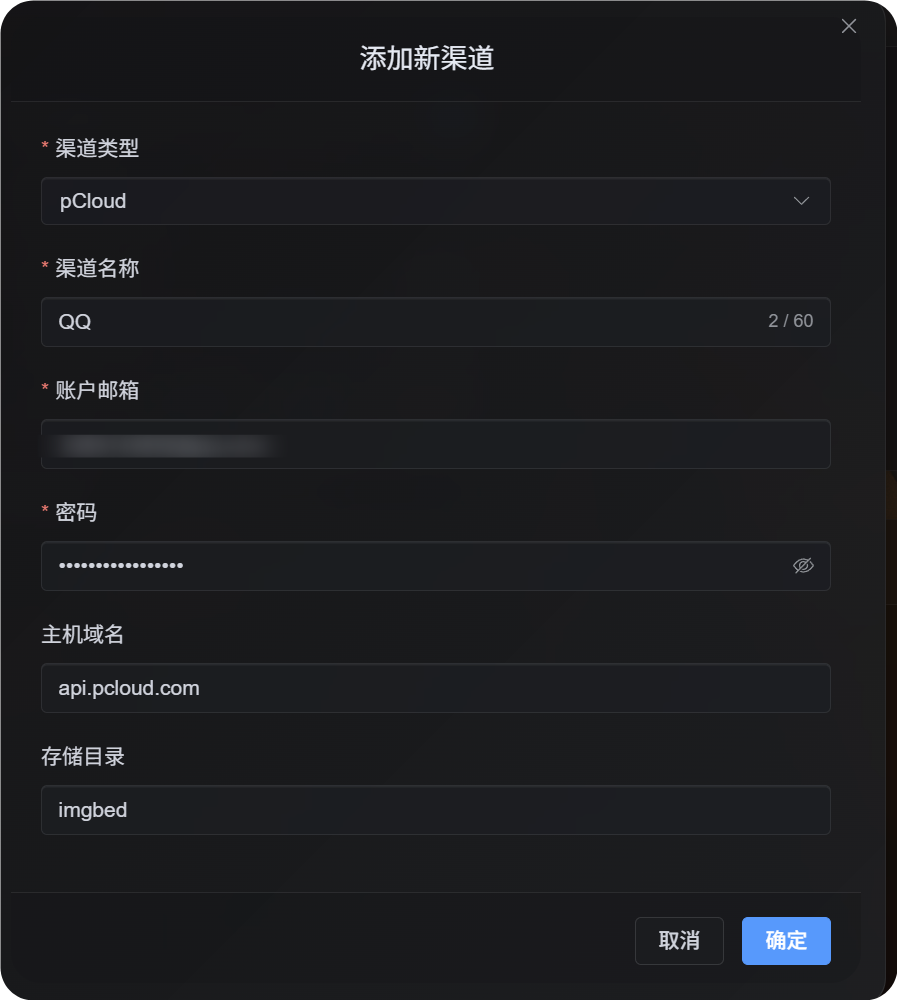
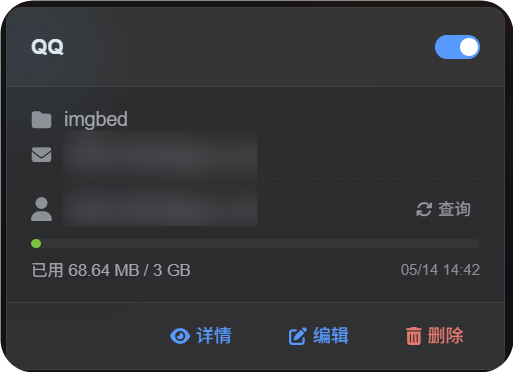

# pCloud Kanalı Ekleme

## Şu Durumlar İçin Uygun

- pCloud hesabınız var ve ImgBed'in görselleri pCloud içinde saklamasını istiyorsunuz.
- Kanal kimlik bilgisi olarak pCloud hesap e-postası ve parolasını kullanmanız sizin için uygunsa.

## Önce Gerekenler

| Gereken | Neden gerekir |
| --- | --- |
| pCloud hesap e-postası | pCloud API'ye giriş yapmak için |
| pCloud parolası | pCloud API'ye giriş yapmak için |
| API host | Varsayılan `api.pcloud.com`. AB hesapları `eapi.pcloud.com` kullanabilir. |
| Storage directory | Dosyaların saklanacağı yer. Varsayılan `imgbed`. |

## Nereden Eklenir?

1. Sistem Ayarları'nı açın.
2. Yükleme Ayarları'nı açın.
3. Sağ üst köşedeki `Add Channel` düğmesine tıklayın.
4. `pCloud` seçeneğini seçin.

## Alan Açıklamaları

| Alan | Amaç | Zorunlu |
| --- | --- | --- |
| Channel name | Bu pCloud kanalını tanımlar, örneğin `Personal pCloud` | Evet |
| Account email | pCloud giriş e-postanız | Evet |
| Password | pCloud parolanız | Evet |
| API host | pCloud API host. Varsayılan `api.pcloud.com`. | Hayır |
| Storage directory | Dosyaların saklanacağı dizin. Varsayılan `imgbed`. | Hayır |

Hesap bölgenize göre API host seçin:

| Hesap Bölgesi | API Host |
| --- | --- |
| Varsayılan / ABD | `api.pcloud.com` |
| Europe | `eapi.pcloud.com` |

## Kurulum Adımları

1. Yükleme Ayarları'nı açın.
2. `Add Channel` düğmesine tıklayın.
3. `pCloud` seçin.
4. Tanıyabileceğiniz bir kanal adı girin.
5. pCloud hesap e-postanızı girin.
6. pCloud parolanızı girin.
7. API host değerini `api.pcloud.com` bırakın veya AB hesapları için `eapi.pcloud.com` kullanın.
8. Storage directory değerini `imgbed` bırakın veya tercih ettiğiniz klasörle değiştirin.
9. Kanalı kaydedin.



## Nasıl Kontrol Edilir?

| Kontrol | Beklenen sonuç |
| --- | --- |
| Kanal kartı | Kaydettikten sonra pCloud kanal kartı görünür. |
| Kanal anahtarı | Karttaki anahtar etkin kalır. |
| E-posta gösterimi | Kart bağlı pCloud e-postasını gösterir. |
| Kota sorgusu | Başarılı sorgudan sonra kullanılan ve toplam kapasite gösterilir. |
| Test yüklemesi | Test görseli yapılandırılan pCloud depolama dizininde görünür. |



## Sorun Giderme

### Neden OAuth2 değil?

pCloud OAuth2 varsayılan olarak self-service değildir. Etkinleştirmeleri için pCloud'a e-posta göndermeniz gerekir.

Mevcut pCloud OAuth2 akışı ayrıca ImgBed'in ihtiyaç duyduğu kısa ömürlü upload link workflow'u desteklemez. Bu nedenle kanal hesap e-postası ve parolasıyla giriş kullanır.

### Hangi API Host kullanılmalı?

Varsayılan:

```text
api.pcloud.com
```

AB hesapları için:

```text
eapi.pcloud.com
```

## Kısa Akış

```text
Prepare your pCloud email and password
-> Open Upload Settings
-> Add Channel
-> Choose pCloud
-> Fill channel name / email / password
-> Keep API host as api.pcloud.com unless your account is in Europe
-> Keep storage directory as imgbed unless you need another folder
-> Save
-> Query quota
-> Upload a test image
```
