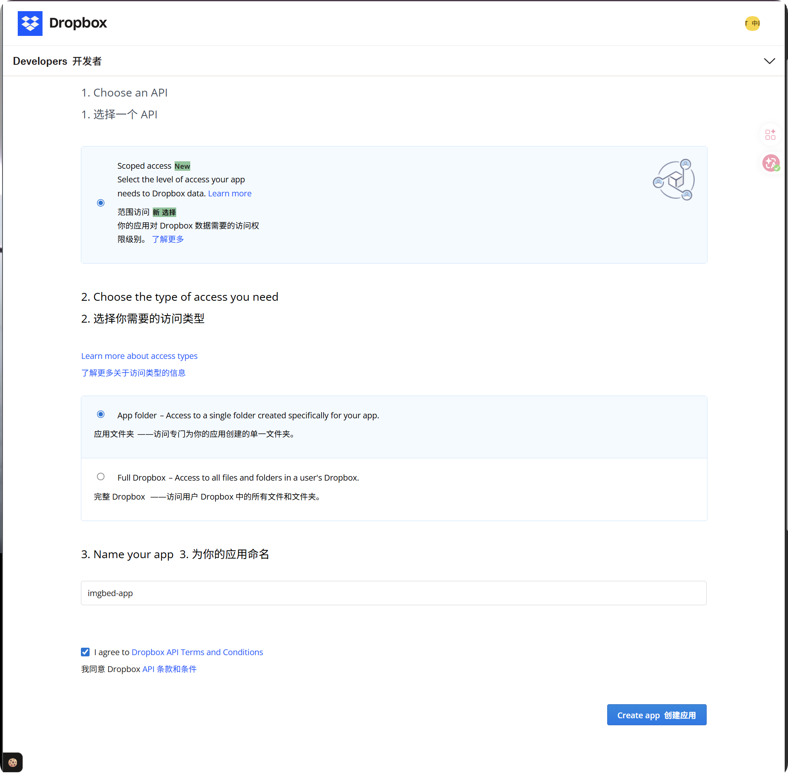
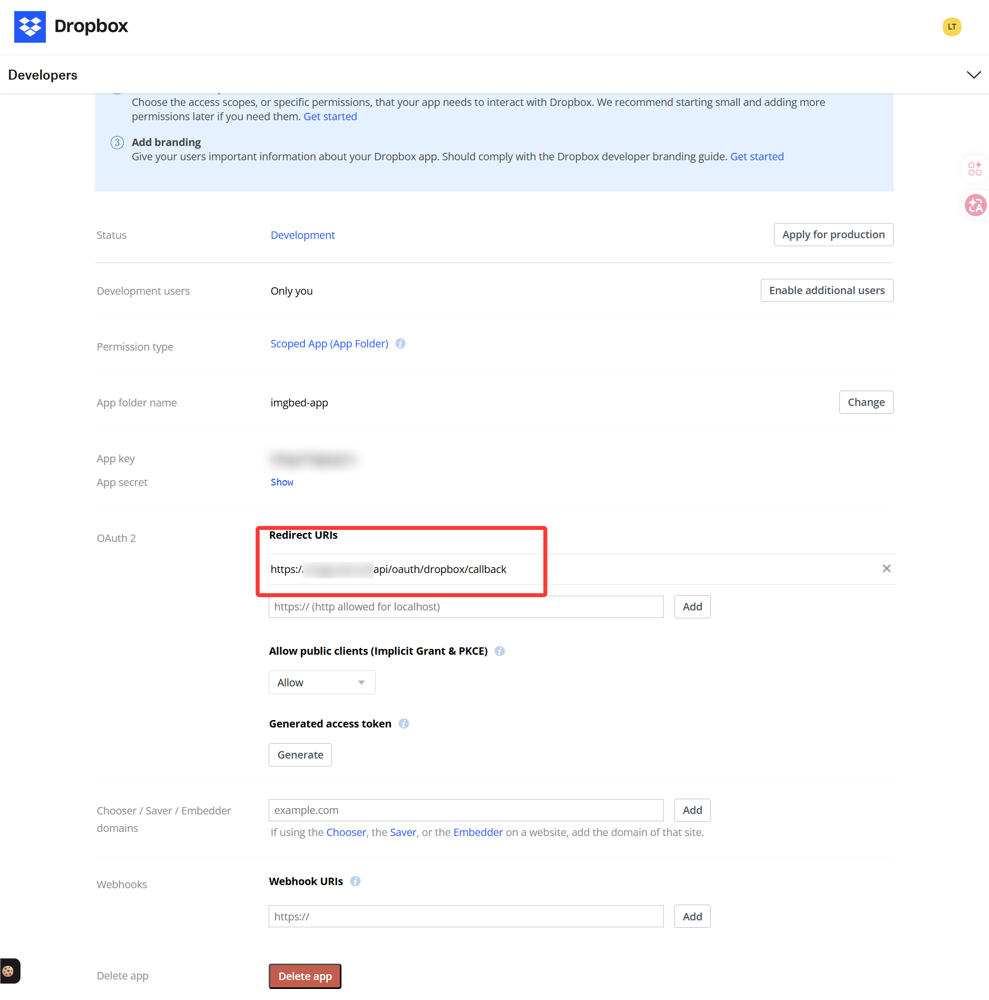
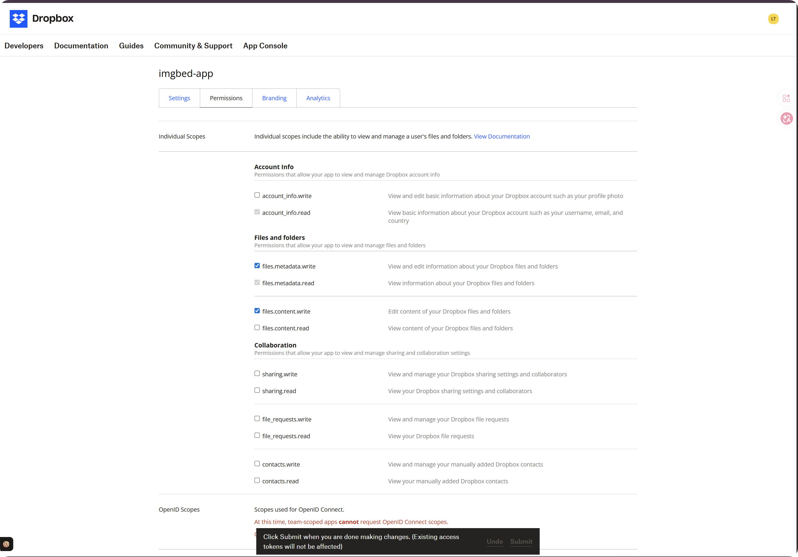
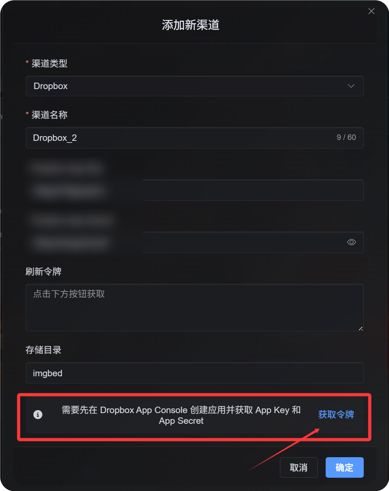
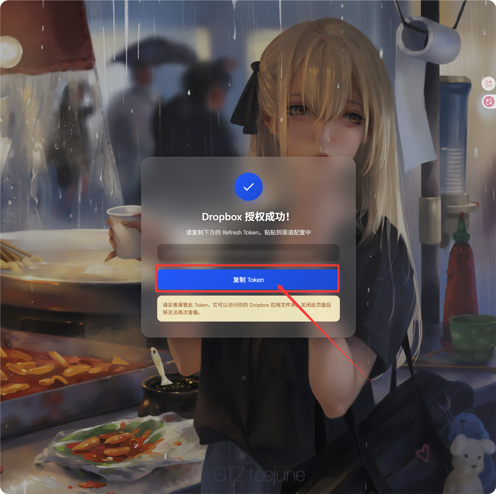
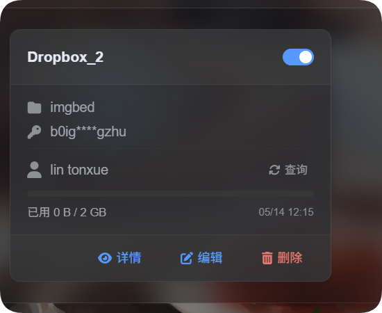

# Thêm Dropbox Channel

## Cần chuẩn bị trước

| Requirement | Vì sao cần |
| --- | --- |
| Dropbox account | Dùng để sign in và authorize app |
| Dropbox app | Dùng để generate `App Key` và `App Secret` |
| ImgBed domain của bạn | Dùng cho OAuth redirect URI |
| Available Dropbox storage | Dùng làm nơi lưu file thực tế |

## Các bước thiết lập

### Step 1: Tạo Dropbox App

1. Mở Dropbox App Console:

```text
https://www.dropbox.com/developers/apps
```

2. Tạo app mới.
3. Với access type, chọn:

```text
App folder
```

4. Đặt tên app dễ nhận biết, ví dụ `imgbed-app`.
5. Mở app details page sau khi tạo xong.

Recommended access type:

| Access Type | Recommendation |
| --- | --- |
| `App folder` | Recommended. Phù hợp với cách ImgBed lưu files. |
| `Full Dropbox` | Không recommended. ImgBed không cần access toàn bộ account. |



### Step 2: Thêm Redirect URI

Trong Dropbox app details page, tìm OAuth hoặc Redirect URI settings và thêm:

```text
https://your-domain.com/api/oauth/dropbox/callback
```

Nếu dùng admin panel từ nhiều domain, thêm từng callback URL tương ứng.



### Step 3: Configure App Permissions

Mở tab `Permissions` và enable ít nhất các scopes này:

| Scope | Required | Purpose |
| --- | --- | --- |
| `account_info.read` | Required | Đọc account và quota information |
| `files.metadata.read` | Required | Đọc file và folder metadata để check path |
| `files.metadata.write` | Required | Tạo folders và ghi metadata |
| `files.content.write` | Required | Upload files. Thiếu scope này sẽ gây lỗi `required scope 'files.content.write'`. |
| `files.content.read` | Recommended | Cho phép download, preview và temporary file links |

Sau khi chọn scopes, nhấn `Submit` ở cuối page.



Important:

| Situation | Cần làm gì |
| --- | --- |
| Bạn đổi scopes | Chạy lại token authorization flow và lấy `Refresh Token` mới. |
| Bạn chưa reauthorize | Token cũ sẽ không có permissions mới, nên uploads vẫn có thể fail. |

### Step 4: Copy App Credentials

Lưu hai giá trị này từ Dropbox app page:

| Dropbox Field | ImgBed Field |
| --- | --- |
| `App key` | `App Key` |
| `App secret` | `App Secret` |

### Step 5: Điền Dropbox Channel

Trong Upload Settings, chọn `Dropbox` và điền:

| ImgBed Field | Nhập gì |
| --- | --- |
| Channel name | Tên dễ nhận biết, ví dụ `Main Dropbox` |
| App Key | Dropbox `App key` |
| App Secret | Dropbox `App secret` |
| Refresh Token | Tạm thời để trống |
| Root directory | Optional. Mặc định là `imgbed`. |
| Note | Optional |



### Step 6: Lấy Refresh Token

1. Trong ImgBed, nhấn `Get Token`.
2. Sign in vào Dropbox account bạn muốn kết nối.
3. Approve authorization prompt.
4. Callback page sẽ hiển thị `Refresh Token`.
5. Copy token đó.
6. Quay lại ImgBed và paste vào field `Refresh Token`.



## Cách kiểm tra

| Check | Expected Result |
| --- | --- |
| Channel card | Dropbox channel xuất hiện sau khi save. |
| Channel switch | Channel có thể enabled. |
| Token saved | Detail page hiển thị `Refresh Token` đã được lưu. |
| Upload test | Test image xuất hiện trong Dropbox app folder. |

Nếu bật quota limits, nhấn quota query. Sau khi query thành công, channel card sẽ hiển thị used space, total space và last update time.



## Troubleshooting

| Problem | Fix |
| --- | --- |
| ImgBed báo configuration incomplete | Kiểm tra `App Key`, `App Secret` và `Refresh Token` đã điền đủ chưa. |
| Authorization thành công nhưng không thấy `Refresh Token` | Nhấn `Get Token` lại và đảm bảo offline authorization flow được dùng. |
| Upload fail với `required scope 'files.content.write'` | Enable `files.content.write`, nhấn `Submit`, rồi lấy `Refresh Token` mới. |
| Callback fail | Xác nhận redirect URI là `https://your-domain.com/api/oauth/dropbox/callback`. |
| Không tìm thấy files | Xác nhận Dropbox app được tạo ở mode `App folder`. |

## Quick Flow

```text
Mở Dropbox App Console
-> Tạo app
-> Chọn App folder access
-> Thêm https://your-domain.com/api/oauth/dropbox/callback
-> Enable account_info.read / files.metadata.read / files.metadata.write / files.content.write
-> Có thể enable thêm files.content.read
-> Nhấn Submit
-> Copy App Key và App Secret
-> Điền vào ImgBed
-> Nhấn Get Token
-> Copy Refresh Token từ callback page
-> Paste lại vào ImgBed và save
```

## References

1. Dropbox App Console: https://www.dropbox.com/developers/apps
2. Dropbox OAuth Guide: https://developers.dropbox.com/oauth-guide
3. Dropbox Developer Guide: https://www.dropbox.com/developers/reference/developer-guide
