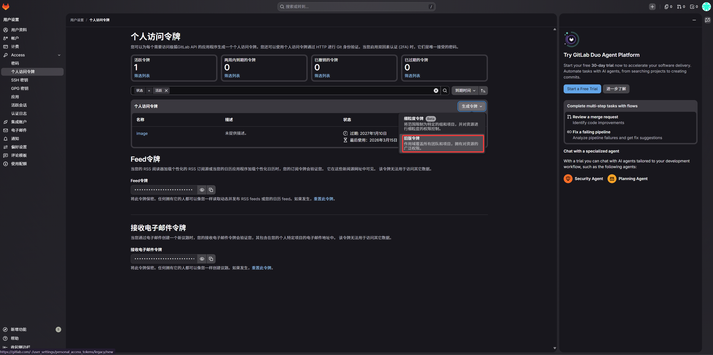
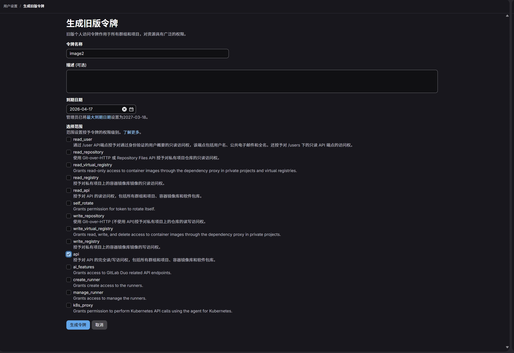
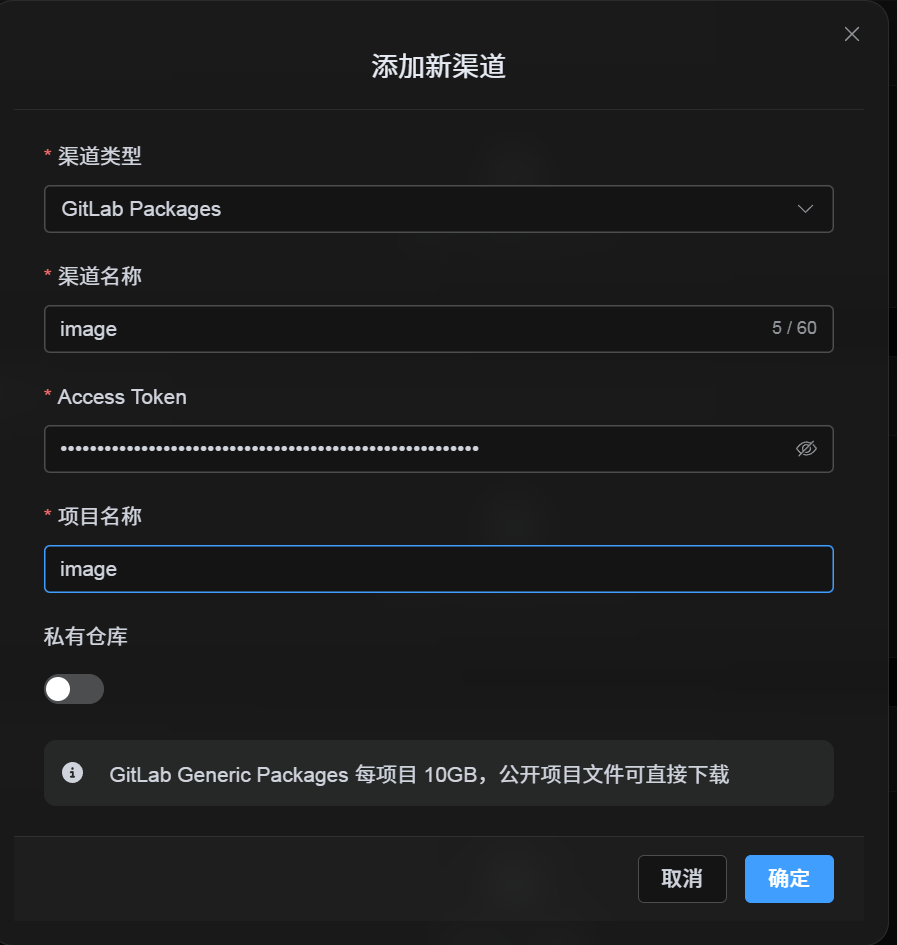

# Thêm GitLab Packages Channel

## Cần chuẩn bị gì trước khi bắt đầu

Bạn chỉ cần ba thứ:

| Yêu cầu | Mục đích |
| --- | --- |
| GitLab account | Dùng để generate access token và sở hữu project. |
| GitLab Personal Access Token | ImgBed dùng để access GitLab API, tạo projects và upload files vào Generic Packages. |
| Project name | Có thể chỉ nhập project name, ví dụ `imgbed`. |

## Các bước thiết lập

### Bước 1: Sign in vào GitLab và tạo Access Token

1. Sign in vào GitLab.
2. Nhấn avatar ở góc trên bên phải và mở `Preferences`.
3. Mở `Access Tokens` từ left sidebar.
4. Đặt tên token dễ nhận biết.
5. Chọn expiration date theo cách bạn muốn bảo trì.
6. Chọn scope `api`.
7. Sao chép và lưu token ngay sau khi tạo.





## Bước 2: Điền GitLab Packages Channel trong ImgBed

Sau khi chọn `GitLab Packages` trong Cài đặt tải lên, điền các trường như sau:

| Trường UI | Nhập gì |
| --- | --- |
| Channel name | Tên bạn chọn, ví dụ `GitLabPrimary`. |
| Access Token | GitLab Personal Access Token vừa tạo. |
| Project name | Project name ngắn như `imgbed`, hoặc đường dẫn đầy đủ như `username/imgbed`. |
| Private repository | Bật hoặc tắt theo nhu cầu. |
| Remark | Không bắt buộc, ví dụ `Primary upload channel`. |



## Bước 3: Save Channel

Sau khi điền trường, nhấn Save.

Hệ thống sẽ xử lý các chi tiết sau:

| Hành vi hệ thống | Mô tả |
| --- | --- |
| Tên project ngắn | ImgBed xác định GitLab account hiện tại và mở rộng giá trị thành đường dẫn project đầy đủ. |
| Full project path | ImgBed dùng path `username/project` đúng như bạn nhập. |
| Kiểm tra project | Nếu dùng đường dẫn personal account hiện tại, ImgBed tự tạo project khi chưa tồn tại. Nếu nhập đường dẫn đầy đủ thủ công, ImgBed dùng path đó trực tiếp. |
| Public/private state | Project visibility được sync theo switch hiện tại. |

## Danh sách kiểm tra nhanh

```text
Sign in to GitLab
-> Create an Access Token
-> Select only the api scope
-> Return to ImgBed and enter the token and project name
-> Save
-> If only a project name is entered, ImgBed adds the current username automatically
-> If username/project is entered, ImgBed uses it as-is
-> Upload a test image
```
