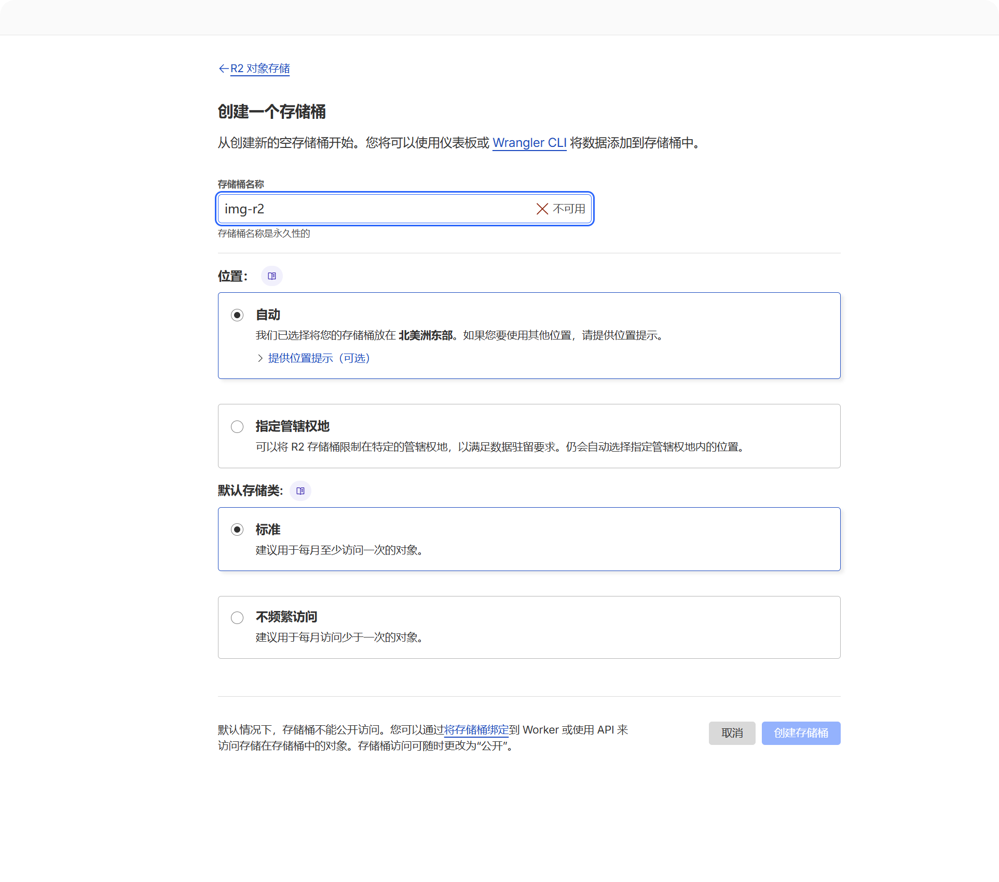
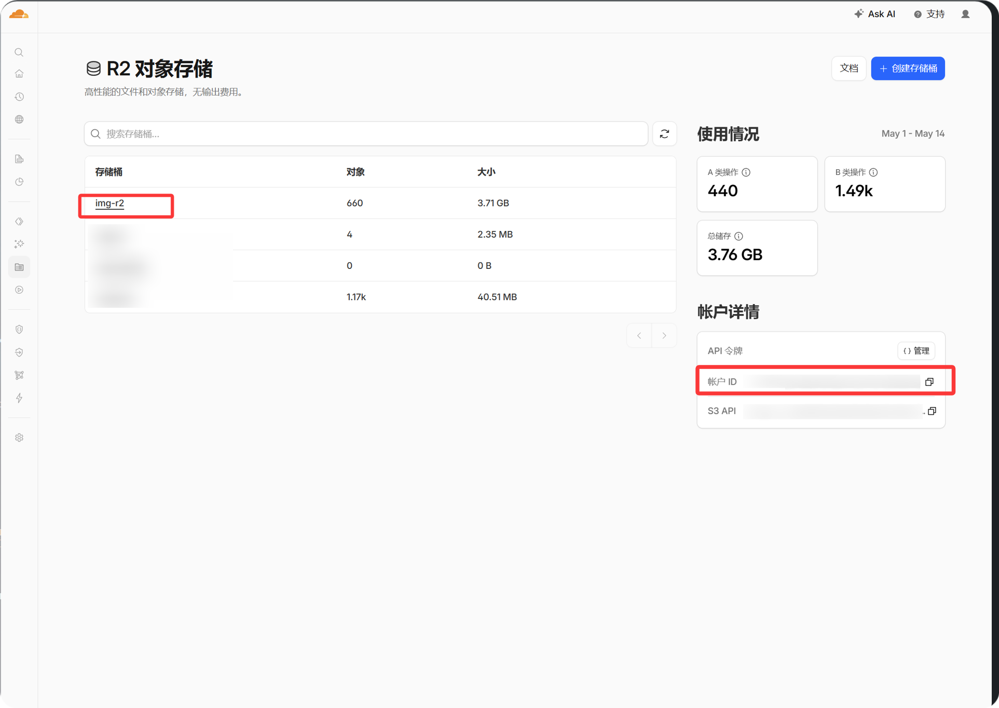
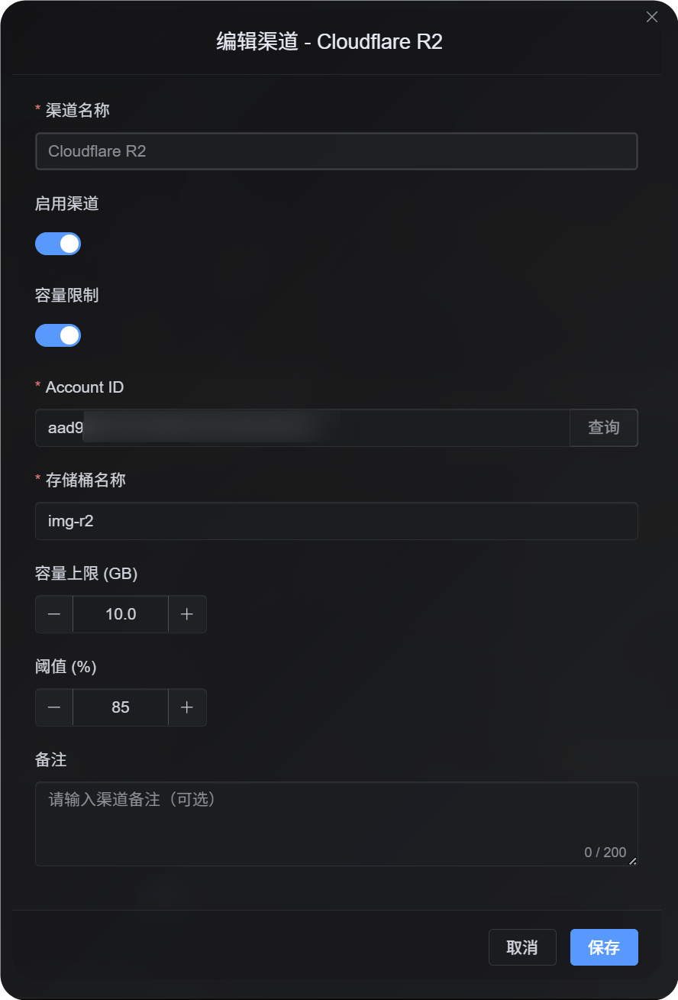

# 新增 Cloudflare R2 渠道

## 適合什麼情境

- 你的 ImgBed 已經部署在 Cloudflare Pages 或 Workers 上。
- 你想把檔案直接存到同一個 Cloudflare 帳號底下的 R2 Bucket。
- 你希望檔案讀寫都走 Worker / Pages 的 R2 Binding，設定盡量單純。

## 新增前要準備什麼

| 需要準備 | 用途 |
| --- | --- |
| Cloudflare 帳號 | 建立 R2 Bucket 與專案 Binding |
| 一個 R2 Bucket | 實際存放上傳檔案 |
| 目前部署 ImgBed 的 Pages / Worker 專案權限 | 把 Bucket 綁到執行環境 |

R2 渠道不是在 ImgBed 後台手動新增。你需要先在 Cloudflare 把 R2 Bucket 綁到專案，Binding 變數名稱必須是：

```text
img_r2
```

## 在 Cloudflare 裡設定

### 第一步：建立 R2 Bucket

1. 登入 Cloudflare Dashboard。
2. 進入 `R2 Object Storage`。
3. 建立一個新的 Bucket。
4. Bucket 名稱可以自己取，例如 `imgbed`。



### 第二步：把 Bucket 綁到 ImgBed 專案

依照你的部署方式找到 Binding 設定：

| 部署方式 | 設定位置 |
| --- | --- |
| Pages | 目前 Pages 專案 -> Settings -> Functions -> R2 bucket bindings |
| Workers | 目前 Worker 專案 -> Settings -> Bindings |

新增一筆 R2 Binding：

| 欄位 | 填寫內容 |
| --- | --- |
| Variable name | `img_r2` |
| R2 bucket | 選擇剛建立的 Bucket |

儲存 Binding 後，請重新部署一次 ImgBed，讓 Worker / Pages 執行環境真的拿到 `img_r2`。

## 回到 ImgBed 後台會看到什麼

重新部署後，打開：

```text
系統設定 -> 上傳設定
```

如果 Binding 正確，會看到固定的 `Cloudflare R2` 渠道。這個渠道由系統自動建立，不需要你再新增一張渠道卡。

常見資訊如下：

| 欄位 | 說明 |
| --- | --- |
| 渠道名稱 | `Cloudflare R2` |
| Binding 名稱 | `img_r2` |
| 啟用狀態 | 正常情況下可以直接啟用 |

## 容量限制

如果你想讓 R2 參與容量控管，可以填 Cloudflare Account ID，並設定容量上限與提醒門檻。

Account ID 可以在 Cloudflare 帳號資訊區看到。只有需要查詢或限制 R2 用量時才需要填。





## 檢查方式

| 檢查項目 | 正常狀態 |
| --- | --- |
| 後台是否出現渠道 | 上傳設定裡看得到 `Cloudflare R2` |
| Binding 名稱 | Cloudflare 裡的變數名稱是 `img_r2` |
| 是否重新部署 | 設定 Binding 後有重新部署 ImgBed |
| 測試上傳 | 上傳圖片後，R2 Bucket 裡會出現檔案 |

如果開啟檔案時出現 `R2 database binding is not configured`，通常代表執行環境沒有拿到 `img_r2` Binding。請檢查變數名稱，並重新部署專案。
