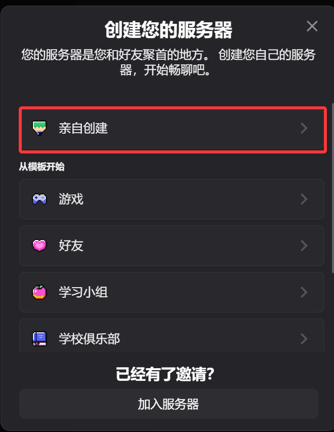
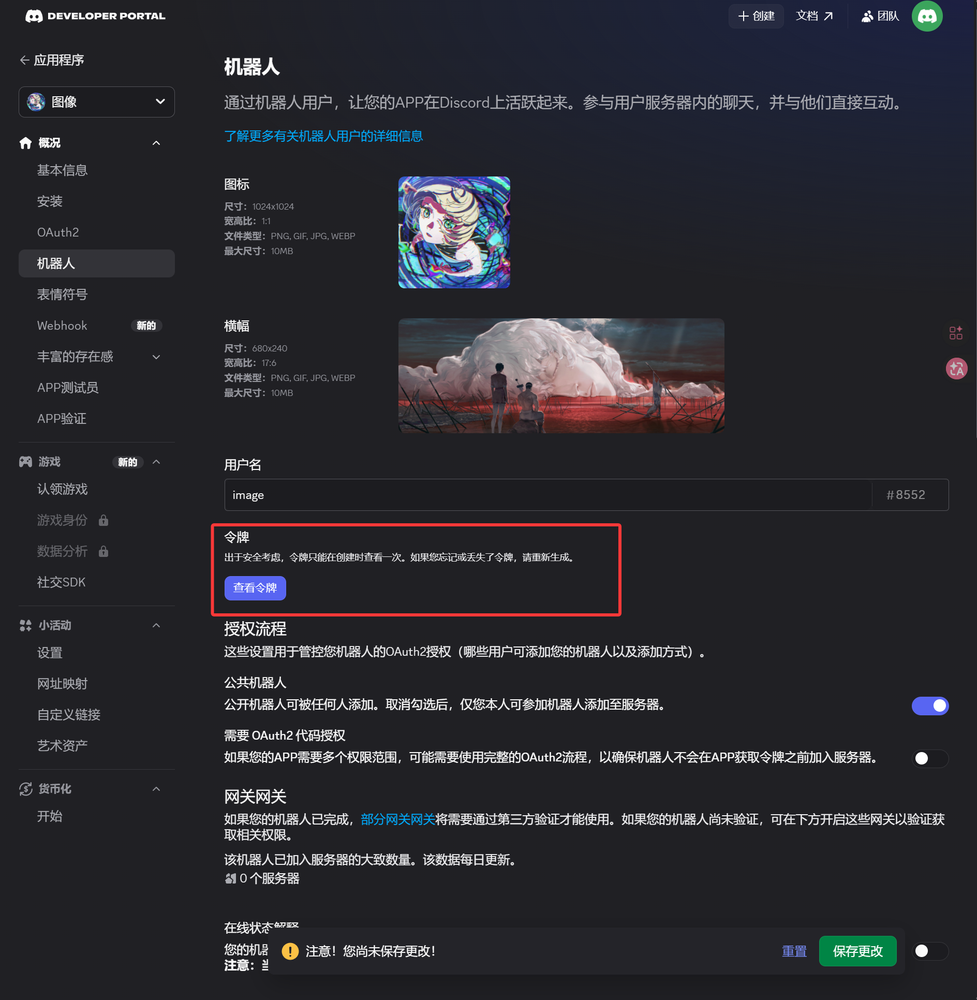
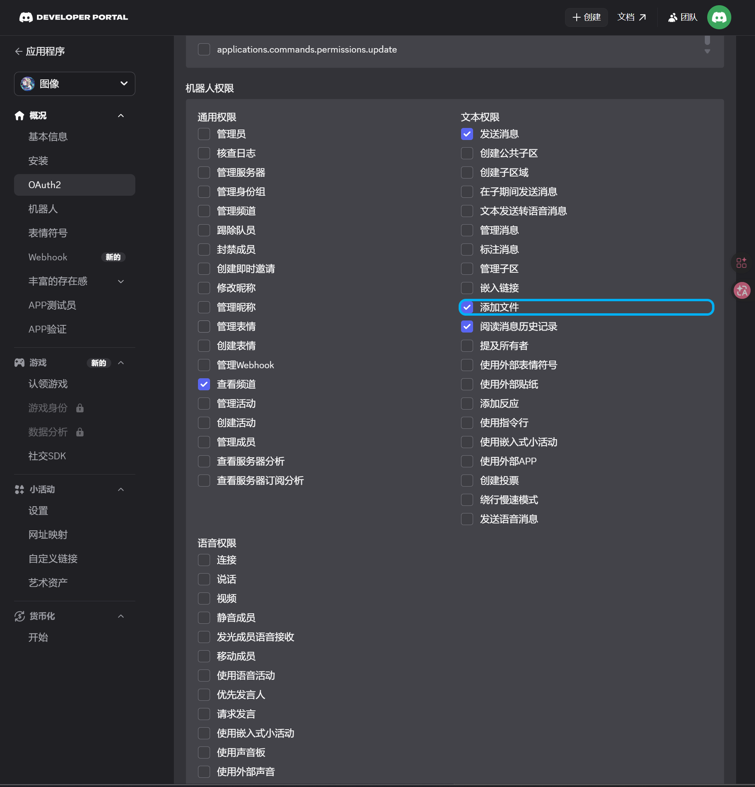
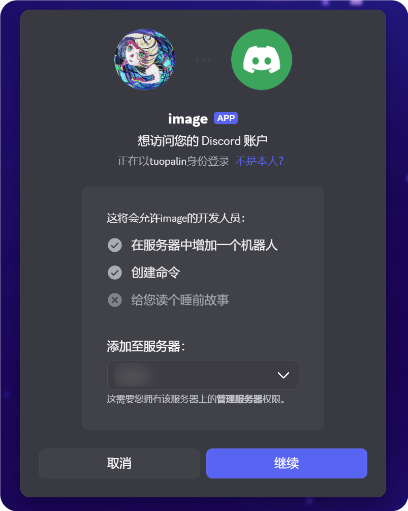
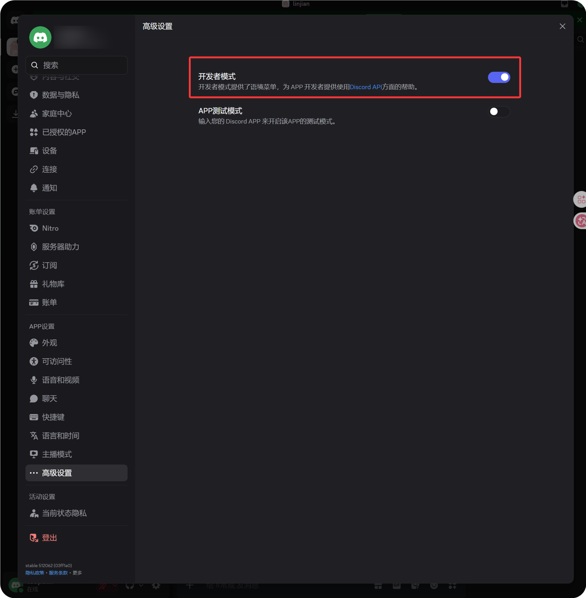
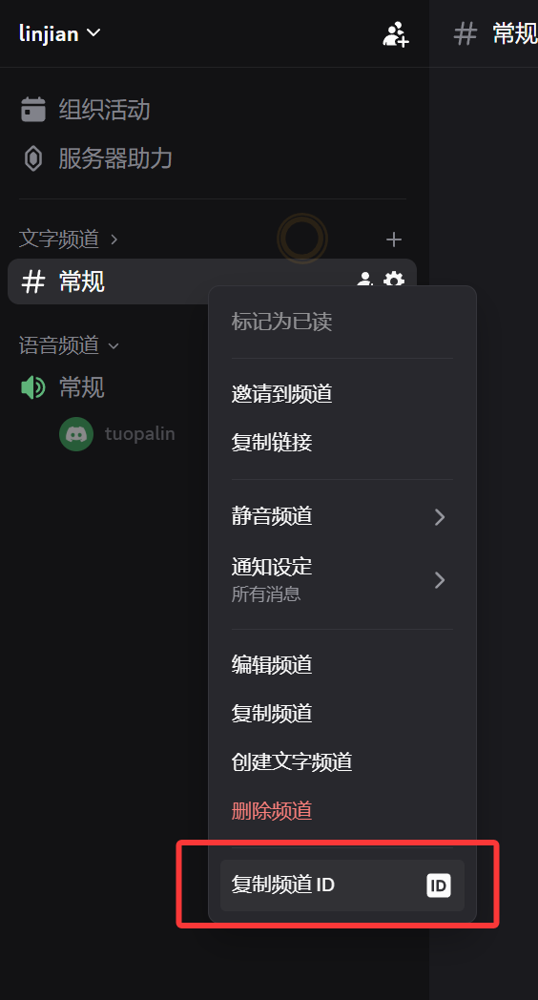
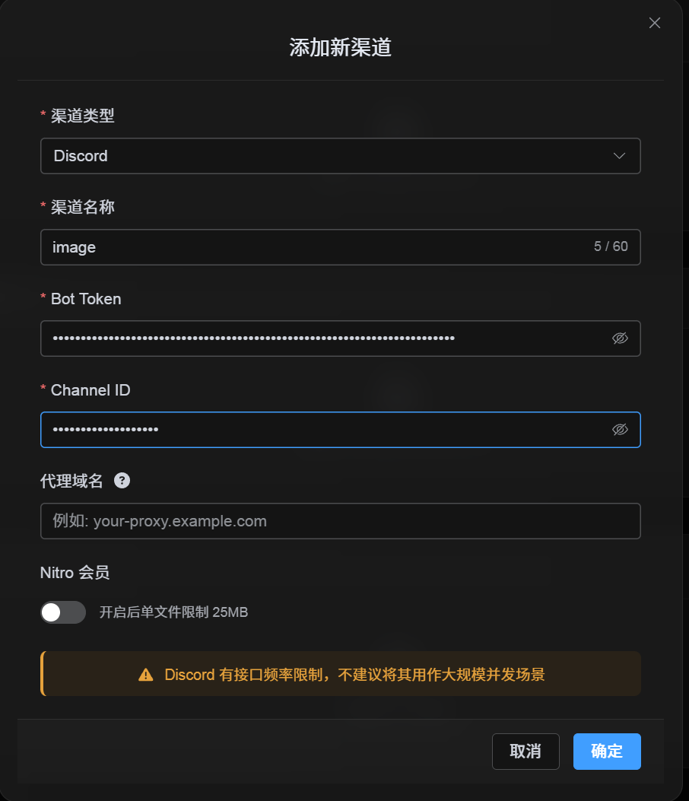

# Discord 渠道新增說明

## 新增前要準備什麼

| 需要準備 | 用途 |
| --- | --- |
| Discord 帳號 | 用于建立伺服器、頻道和開發者應用。 |
| 一個 Discord 伺服器 | 機器人需要先加入伺服器，再訪問指定頻道。 |
| 一個文字頻道 | 圖片和檔案最終會發送到這個頻道。 |
| Discord Developer Portal | 用于建立應用、機器人并獲取 `Bot Token`。 |

## 入口位置

1. 進入系統設定。
2. 打開上傳設定。
3. 點擊右上角“新增渠道”。
4. 選擇 `Discord`。

## 欄位說明

| 欄位 | 作用 | 是否必填 |
| --- | --- | --- |
| 渠道名稱 | 用于區分當前渠道，例如“Discord 主頻道”。 | 必填 |
| Bot Token | Discord 機器人令牌。 | 必填 |
| Channel ID | 目標文字頻道的 ID。 | 必填 |
| 代理地址（可選） | 僅在訪問 Discord CDN 不穩定時使用，請填寫完整代理地址，包含 `https://`. | 選填 |


## 設定步驟

### 1. 建立 Discord 伺服器和文字頻道

1. 打開 Discord。
2. 建立一個新的伺服器，或者使用你自己的現有伺服器。
3. 在伺服器中建立一個頻道。



### 2. 在 Discord Developer Portal 建立機器人

1. 打開 Discord Developer Portal：`https://discord.com/developers/applications`
2. 點擊 `New Application`。
3. 輸入應用名稱并完成建立。
4. 在左側進入 `Bot` 頁面。
5. 在 `Bot` 頁面生成或重置 Token。
6. 保存這串機器人令牌。

這串令牌就是系統設定中需要填寫的 `Bot Token`。



### 3. 在 OAuth2 頁面生成授權連結并安裝機器人

1. 打開左側 `OAuth2` 頁面。
2. 在 `范围` 中勾選 `机器人`。
3. 在權限區域勾選下面這 4 項：

| 權限 | 是否需要 |
| --- | --- |
| 查看頻道 | 需要 |
| 發送消息 | 需要 |
| 新增檔案 | 需要 |
| 讀取消息歷史記錄 | 需要 |

4. 在頁面下方確認 `集成类型` 為 `服务器安装`。
5. 複製底部 `已生成的URL`。
6. 打開這個 URL。
7. 選擇你要安裝的目標伺服器。
8. 完成授權安裝。





### 4. 開啟開發者模式并複製 Channel ID

1. 點擊 Discord 左下角頭像旁邊的齒輪，進入“使用者設定”。
2. 在左側找到“高級”。
3. 打開“開發者模式”。
4. 回到目標文字頻道。
5. 右鍵頻道名稱。
6. 點擊“複製頻道 ID”。

複製出來的這一串數字，就是系統設定中需要填寫的 `Channel ID`。





### 5. 在系統中填寫 Discord 渠道

回到系統設定彈窗後，按下表填寫：

| 頁面欄位 | 填寫內容 |
| --- | --- |
| 渠道名稱 | 自定義渠道名稱，例如 `Discord主频道` |
| Bot Token | 在 Discord Developer Portal 的 `Bot` 頁面保存的令牌 |
| Channel ID | 剛才複製的頻道 ID |
| 代理地址（可選） | 按需填寫，格式例如 `https://your-proxy.example.com`. |


填寫完成後點擊保存。



## 新增完成後怎么檢查

| 檢查項 | 檢查方式 |
| --- | --- |
| 渠道卡片是否出現 | 保存後，上傳設定頁面應顯示 Discord 渠道卡片。 |
| 渠道是否能啟用 | 開關應可正常開啟。 |
| 設定資訊是否已保存 | 詳情頁應能看到 Bot Token 和 Channel ID 已寫入。 |
| 上傳是否正常 | 上傳一張測試圖片，確認圖片已進入目標 Discord 文字頻道。 |

## 一句話流程速查

```text
Create a Discord server
-> Create a text channel
-> Create a bot in the Discord Developer Portal
-> Save the Bot Token from the Bot page
-> In OAuth2, select bot, View Channels, Send Messages, Attach Files, and Read Message History
-> Copy the generated URL and authorize the bot for the target server
-> Make sure the target text channel grants the same permissions
-> Enable Developer Mode
-> Right-click the target text channel and copy the Channel ID
-> Enter the Bot Token and Channel ID in ImgBed
-> Save and upload a test image
```
## 參考資料

1. Discord Developers Getting Started：https://docs.discord.com/developers/quick-start/getting-started
2. Discord 官方幫助：如何查找頻道 ID：https://support.discord.com/hc/en-us/articles/206346498-Where-can-I-find-my-User-Server-Message-ID
